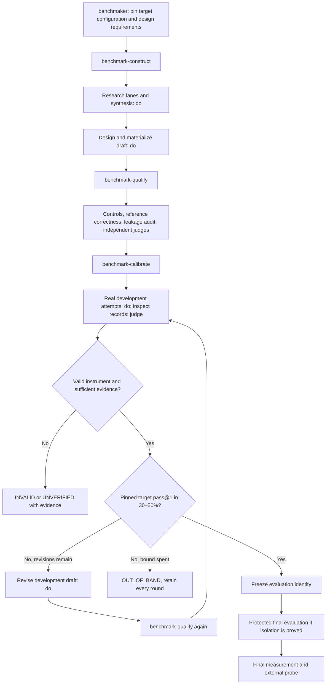

# Benchmaker rebuild cut

Dispatch B1.1.1:d1; assignment seal sha256:eea2df08bb62963a9d1c348da77da1aa098b7b055cbdf51ee92899c4914c6d5a; assigned name B1.1.1; role orch-planner.

Design baseline: `3070a3272f2572321acb1efa994090d88b630d0e`. This is a proposed design and executable handoff, not production implementation or observed live admission. Authoring owner: `C:/Users/danhm/.orchflows/lib/docs/custom-workflow-authoring.md`. Making and review carry orch-code and orch-workflow-authoring at the ticket's pins. Dependency set: `[]`; Python tooling uses the standard library, no new installation. The native Codex CLI is a declared external admission capability, not a new package dependency silently acquired.

## Proposed result and graph

Keep **benchmaker** as the only public workflow. Make it coordinate three substantial package-private workflows: **benchmark-construct**, **benchmark-qualify**, and **benchmark-calibrate**. Each composes several lower contracts, has its own journal and one independently inspectable result. No new kernel, scheduler, global registry, generic execution engine, or public export is needed.

The diagram's Q and Q2 are the same private workflow invoked on different fixed artifacts. Iteration is bounded prose inside calibration, not a call cycle. The public workflow coordinates construct → qualify → calibrate; calibration may invoke qualify after a development revision. Construct and qualify never invoke calibration or benchmaker. Each invocation supplies semantic inputs through Goal, Details and Context and uses ordinary frame/do/judge/land doors.

## Contract inventory and boundaries

| Existing contract | Fit and proposed use |
| --- | --- |
| orch-do / orch-judge | Reuse as making and independent inspection leaves. Research returns evidence-store identities; benchmark artifacts and native-run evidence collections return git identities. Never combine adapters on one ticket. |
| checkpointed-build | Reuse for this rebuild's cut, isolated waves, joined-tip judgment and outside close. Do not nest it around an already determined materialization merely to add another planner. |
| orch-build-workflow | Reuse as the enclosing authoring, review and actual disposable invocation workflow. Root owns that invocation and its external probe. |
| orch-research | Reuse for target-intent and field lanes, then synthesis over the two actual packets. Add the recurring private benchmark-evidence narrowing. |
| super-research | Do not call: public keyless source acquisition and an HTML dossier are its particular contract. Benchmaker also needs local/private licensed evidence and a construct/claim/failure register, not an HTML report. No changes to super-research. |
| benchmaker's current protocol and charter | Migrate their benchmark-quality knowledge into pinned private standards. Put workflow order in the new helpers; put manifest field definitions and optional research depth in package-local references. Preserve old paths as concise compatibility pointers, not second normative copies. |
| evolve | Remains a consumer of already frozen evaluations. No benchmaker call or calibration loop enters evolve, and its no-unfreeze rules remain binding. |
| skill-tournament | Already calls benchmaker, then evolve. Carry the target configuration and calibration policy into benchmaker, and require accepted validity plus the requested calibration status before entering a campaign. A pending/unverified package cannot become eligible by omission. |
| Existing corpus and fixture runner | Preserve as contract/harness evidence. Known-good/known-bad scripts are controls, never empirical target agents or a substitute for native attempts. Historic two-rung records retain their original interpretation and identities. |

New private boundaries, all under `example-workflows/benchmaker/`:

| Item | Required semantic inputs | Output and reason for a journal |
| --- | --- | --- |
| `workflows/benchmark-construct/SKILL.md` | target and outcome, licensed sources, rigor, construction standard, target configuration, calibration policy, package/workspace/bounds | Research synthesis plus a committed development draft with coverage, candidate-visible prompts, reference solutions and grader design. Its multi-lane evidence → design → materialization chain needs recoverable provenance and isolated construction. |
| `workflows/benchmark-qualify/SKILL.md` | fixed draft, coverage/rigor, construction standard, qualification budget, access policy | Fixed qualification, reference/grader audit and attack records, independent context identities, verdicts and gaps. It is called both initially by benchmaker and after revisions by calibration. The builder, controls qualifier, reference auditor and attacker are distinct contexts; a separate model family is recorded when available, not fabricated. |
| `workflows/benchmark-calibrate/SKILL.md` | independently qualified development draft, fixed target configuration, predeclared sampling/revision policy, execution mechanism, protected scope and budget | All native-attempt records, per-case difficulty and coverage, calibration decision, revision ledger, final frozen identity when eligible, final measurement or an explicit partial outcome. Its bounded empirical loop and freeze transition merit an independent journal. |

The top-level names remain private because every actual caller is benchmaker or another helper in its package. They can be promoted only if an actual external consumer later earns a public contract; do not pre-export them. Literal private standard names resolve in this enclosing scope. The helpers do not call a public workflow that would lose their private standards. If later construction calls checkpointed-build, move the relevant standards to a ring visible in that callee rather than passing an unreachable private name.

Two private standards are sufficient:

- `standards/benchmark-quality/STANDARD.md`, `narrows: orch-code`: validity and empirical-evidence quality for runnable benchmark artifacts. It tightens observable code evidence without copying git law, orchestration or Return contracts. It covers controls versus target attempts, case validity, coverage, independent oracle audit, statistical interpretation, leakage, immutable evaluation identity and honest outcome evidence.
- `standards/benchmark-evidence/STANDARD.md`, `narrows: orch-research`: construct definition, claim-to-case/gap mappings, failure atlas, prior-art dispositions, disagreement, source licensing, exhibited/protected distinction and sourcing mode. It does not repeat lane fan-out or synthesis ordering.

Both are orthogonal to the user's domain construction standard where that differs; a non-code target still produces a runnable benchmark artifact under orch-code plus benchmark-quality. Domain semantic expertise accompanies that artifact through the caller's standard. Research calls stamp orch-research plus benchmark-evidence, and no artifact ticket pretends the research adapter is a second git adapter. Keep each standard below the actual 1,200-word ceiling; keep each workflow body below 450 words. All mandatory quality guidance belongs in the stamped manifest, not a reference a judge might never read.

## Frozen semantics for implementation

### Validity, discrimination and coverage

1. Validity and difficulty are separate decisions. Qualification requires a known-good solution passing and observable known-bad controls failing, including inert and meaningful near-miss variants. It verifies the intended outcome, not implementation resemblance. These controls never enter target pass@1 denominators.
2. Each case carries a stable id, construct/failure-class mapping, source or authored provenance, coverage stratum, execution tier/cost, visible contract, reference solution, oracle class and required criteria, split, and revision ancestry. Report every case's attempted/valid/pass/fail/invalid/unverified counts, failures and uncertainty. A suite score cannot replace this table.
3. Coverage strata and weights are declared before any scores. Every required stratum has actual cases; uncovered claims remain explicit gaps. Difficulty revisions cannot delete a stratum, shrink its floor or downweight inconvenient failures. Preserve multiple cases per claimed stratum where inference requires them; one case per stratum is a smoke slice, not a well-estimated stratum.
4. Functional discrimination means good/bad controls separate at meaningful outcome changes. Empirical discrimination is a separate target-response finding: mixed case responses, failure-class diversity, repeatability and headroom. A two-configuration comparison is optional diagnostic evidence, separate from reference calibration. Record inversions and paired case results if present; do not require a second configuration to estimate one pinned target's pass@1, and do not invent item-total correlation from a tiny panel.
5. An independent reference auditor first solves from the visible prompt and licensed inputs, then compares to the key/grader. Audit all flagged all-fail/inversion/ambiguous cases and a sample of the remainder declared before triage; for the tiny admission, audit all cases. Classify fatal flaws as ambiguous, wrong-key, unsolvable, or grader/contract mismatch. Record counts and case ids. No model miss alone establishes a flaw, and no model success proves the key correct.
6. Deterministic outcome graders take priority where appropriate. Judged criteria use anchored rubrics, independent disagreement checks and measured rerun spread; required deterministic failure is never compensated by partial or judged credit. Unknown or unavailable oracle evidence is UNVERIFIED, not zero and not a pass.

### Calibration and statistical contract

The default **30–50% pass@1 inclusive** is the user's design requirement for the target's pinned agent configuration; it is not a literature-mandated universal interval. Pin target artifact, model id/version available, effort, host/CLI version, scaffold/prompt, tool and network capabilities, delegation authority, context policy, temperature/seed if exposed (else unavailable), time/token limits and grader identity. Record actual resolved values, not merely requested ones. Changing one creates an incomparability boundary, not a new rung silently substituted into a run.

Before attempts, declare the development and final case sets or independently seeded generation policy, case/stratum weights, trials per case, independent unit, randomized order/seed if used, retry/exclusion policy, revision cap, sample budget, band and uncertainty rule. Default point estimator: mean of per-case first-attempt success probabilities estimated from isolated trials, equally weighted within the predeclared strata; state exact weights. With one trial/case this is the fraction of cases passed on that attempt. Repeats estimate stochastic success on those cases, not additional independent cases. Preserve an attempt index and never choose the best of several trials to call pass@1. Report pass^k only when the declared repeated-trial design supports it; never relabel pass@k as pass@1.

Use binomial/Wilson intervals only for a defensible binomial sampling unit and state its assumption; per-case intervals over repeated isolated trials are conditional on that fixed case. For purposively selected heterogeneous cases, report the finite-suite mean, per-case uncertainty and an explicit lack of population generalization. Larger rigor can demand a predeclared case-cluster bootstrap or additional independently sampled cases; bootstrap resampling repeats as if independent cases is forbidden. A point estimate in band with wide intervals is `IN_BAND` descriptively but calibration `UNVERIFIED` if the declared rigor is unmet. Distinguish these two fields so a tiny 2/6 result does not certify a population band.

Calibration decision precedence: `INVALID` for invalid instrument/contamination that defeats the construct; `UNVERIFIED` for missing validity, required coverage, configuration, sampling or isolation evidence; otherwise `OUT_OF_BAND` when the estimate fails the fixed band, or `CALIBRATED` only when validity, coverage, empirical diagnostic requirements and the declared uncertainty rule all pass. Preserve the numeric band observation even if a higher-priority evidence gap makes the decision UNVERIFIED. A valid, easy instrument can therefore be OUT_OF_BAND without being a broken harness.

### Development revisions and protected final evaluation

Permit at most **two development revision rounds by default**, with a smaller explicit budget allowed. Every revision has a named reason, pre/post draft identities, affected cases, retained strata/weights, audit evidence, spend and a new complete declared sampling round. Fix genuine validity defects first. Difficulty-directed revisions may vary licensed compositional depth, horizon, ambiguity-free constraints or documented failure classes; they cannot change the target configuration, band, success predicate after observing final scores, choose only failed tasks, relabel failed attempts, or silently drop easy/hard cases. A score is a trigger for inspection, not sufficient evidence for a replacement. Require a construct-preserving rationale and independent requalification of changed cases and shared grader seams. Retain every round; select by the declared policy, never by the most flattering random rerun. Budget exhaustion returns evidence and the honest unmet decision.

Freeze only after development calibration and qualification meet the declared policy. Freeze the final prompts/cases, generator seeds where applicable, reference/grader, split/weights, configuration, sample policy and source mappings at one git revision before final target attempts. Result/measurement records are separate identities outside the frozen package; the manifest may point to their external journal locator without being rewritten after each score. A final failure, drift or out-of-band result is recorded, never repaired in place. Any later case/grader/policy change creates a new version and fresh evaluation/campaign; retained candidates need paired re-evaluation to compare versions. Saturation triggers a version proposal with evidence (ceiling effects, lost failure diversity or discrimination), not editing the frozen evaluation.

Final evaluation is evaluator-side: the candidate receives only its permitted task input and produces an artifact; the evaluator applies protected checks after the attempt. Never dispatch an agent with the protected directory as its workspace. Removing an answer from the prompt or storing it in a sibling directory does not prove inaccessibility. Audit repository history, caches, transcripts, fixture answers, tool retrieval, network and scorer write access. Actual sandbox/ACL/container controls plus an adversarial access probe establish any protection claim. Current collaboration agents share broad filesystem tools, so they cannot establish this by instructions. Native read-only sandbox also does not by itself prove read exclusion. If no actual read isolation exists here, carry public/development confirmation and final-protection UNVERIFIED; do not call it a protected final evaluation. Attack outcomes remain SUCCEEDED/FAILED/BLOCKED with a dated checklist; failed attacks are bounded evidence, not proof of universal resistance.

### Protocol changes and compatibility

| Current owner/rule | Scoped change | Preserved protection |
| --- | --- | --- |
| benchmaker Never forbids selecting/rewriting any case | Permit only the builder's declared pre-freeze development revisions and case materialization; freeze forbids later mutation. | Candidate/search contexts never choose or receive item-level protected feedback. |
| benchmaker Never forbids generating/scoring any candidate | Distinguish fixed-configuration experimental attempts from modifying/ranking/promoting candidate configurations. | No target mutation, optimization campaign, promotion or activation. |
| protocol Measurement is recording-only and cannot cause revisions | Keep for final/frozen measurement; introduce development calibration with bounded revisions in its workflow owner. | Final measurement remains recording-only. |
| protocol requires two rungs and three-valued difficulty | Keep legacy/configuration comparisons as optional diagnostics; add single-pinned-configuration per-case trial counts and uncertainty. | No fabricated second rung; old records keep old meanings. |
| qualification could coexist with required UNVERIFIED | Required UNVERIFIED cannot yield overall accepted validity or calibrated eligibility. Optional gaps remain explicit. | Pending qualification stays non-complete and cannot feed a campaign. |
| `benchmarks/benchmaker/benchmark-design.md` says never calibrate to system under test | Replace unsupported universal claims with dated rationale distinguishing development design from frozen final evaluation; point to the new owner. | Do not rewrite historical measurement rows or sealed corpus case bytes. |

Retain manifest v1/fixture compatibility without relabeling its controls as agents. Define an explicit v2 benchmark manifest/profile for new calibration fields; legacy profile remains readable as legacy, never inferred calibrated. V2 retains existing component locators and provenance/qualification fields, adds `target_configuration`, `coverage`, `calibration_policy`, `splits`, `lifecycle`, and an external calibration-record locator. Git is still the benchmark identity: do not revive retired `benchmark_identity`/`covered_set_digest` fields or component-digest recipe requirements. Attempt records may hash raw artifacts for integrity without creating a competing benchmark version scheme. A construction pending marker is legal only for an unqualified draft.

## Wave cut and precise making handoffs

All units preserve concurrent work, author only their owned surfaces, record scoped checks with observed exits, and commit before return. They carry authoring-owner in Context. All making and the joined judge stamp orch-code plus orch-workflow-authoring, not the newly authored runtime benchmark standards. Root owns full gates, independent joined-tip judgment, bounded repair and live admission. A worker may adjust filenames below its owned directory for one-concern modules but must report the mapping.

### Wave 1 — pinned lower semantics and empirical boundary tracer (A and B independent)

**A — quality and data contracts.** Goal: implement the frozen semantics above as two private standard manifests plus `references/manifest.md` and `references/calibration-record.md`. Own only `example-workflows/benchmaker/standards/**` and those two references. The references define v1/v2 compatibility, externally located records and the exact fields below; mandatory quality is wholly in standards. Context: this committed cut, installed authoring-owner and pinned standards. Acceptance: both narrowings resolve through actual package scope; no control flow/Return/executable content in standards; parent quality only tightens; v2 cannot classify known controls as target measurements; field ownership is unique. Scoped checks: authoring validator/package tests relevant to standards and local links. No global adapters or source corpus edits.

**B — empirical boundary tracer and executable admission resources.** Goal: implement small stdlib package helpers that validate records, compute explicit finite-suite summaries, run declared native candidate commands with timeouts, and verify actual output; plus the live request in the companion admission note. Own `example-workflows/benchmaker/scripts/**`, `references/admission/**`, `references/live-admission.md`, and focused new `tests/test_benchmaker_calibration.py` (split support modules if approaching 500 lines). B consumes the exact record contract in this cut, so A's implementation is not an input dependency. No workflow prose ownership.

Minimum attempt fields: `case_id`, `split`, `round`, `trial`, `target_configuration` (full object or immutable locator), `benchmark_revision`, `candidate_kind` (`agent_attempt` or `control`), requested and resolved command/config, prompt locator, raw native transcript locator, result artifact locator, observed exit/timeout classification, elapsed seconds, available token usage, oracle outcome, failure class, `valid_for_estimate`, exclusion reason. Summary fields: estimator/weights/unit, per-case counts, total distinct cases and attempts, estimate, interval/method/assumptions or explicit unavailable reason, band observation, decision, criterion gaps, revision ledger, frozen revision if any, and separate final record. No fabricated token counts, prices or resolved model versions.

Tracer acceptance: one actual native-run artifact can traverse launcher → raw transcript → independent deterministic outcome grader → record → external probe; missing/corrupt transcript, missing cases, duplicate trial ids, controls-only input, excluded infra events counted as target failures, and wrong configuration must fail the probe. B authors deterministic can-fail tests and the runnable fixture; root supplies actual native execution later. Launcher timeout/permission failure is typed and never lowers target accuracy; candidate failure after a successfully established environment remains a genuine attempt under the predeclared policy. Keep scoring helpers small and independent of orchestration. Use subprocess timeout with safe process cleanup; no safety-bypass flags. No dependency additions.

### Wave 2 — construction and independent qualification (C and D independent)

**C — construction workflow.** Goal: add `workflows/benchmark-construct/SKILL.md` with two research lanes, synthesis, fixed design, isolated materialization and partial-result behavior. Own only that subtree plus `references/construction.md` if needed. Inputs: landed A/B, this cut. Supply complete semantic source policy/rigor/target/configuration to lanes and synthesize actual independent packets. Carry dataset class, coverage, split, preregistered calibration budget and candidate-visible interface into materialization. Return the committed draft, research identity and explicit gaps; do not call it calibrated or qualified. Scoped checks: manifest anatomy/budget, literal call/standard resolution in benchmaker package and semantic fact-removal tests at stable anchors.

**D — independent qualification workflow.** Goal: add `workflows/benchmark-qualify/SKILL.md` with controls qualification, builder/qualifier-disjoint reference audit and distinct candidate-scope attack pass; final result binds verdicts to the input draft identity. Own only that subtree plus `references/qualification.md`. Inputs: landed A/B, this cut. Audit quality criteria and reference correctness separately. Return the fixed evidence set and a typed validity decision with required UNVERIFIED blocking acceptance. No case mutation in judge contexts; repair belongs to caller making work. Scoped checks: private-standard resolution; correct fixed-artifact carriers; missing independence/reference correctness/required-UNVERIFIED behavior detectable by semantic seam checks. C's implementation is not needed by D: the cut fixes the draft/qualification input contract.

### Wave 3 — empirical calibration workflow (E)

**E — bounded calibration.** Goal: add `workflows/benchmark-calibrate/SKILL.md` coordinating actual attempts, independent diagnostic judgment, at most two development repair rounds, repeated calls to benchmark-qualify after changes, freeze and read-only final measurement. Own that subtree and `references/calibration.md`. Inputs: landed A/B/D and construction contract/artifact shape from C. The exact target configuration never changes inside the loop. Give native execution to an ordinary emitted making ticket; the native candidate process is the experiment subject, not a replacement Orchflows executor/profile. A judge reads fixed attempt records and never silently re-executes them. Preserve all rounds and one final external record. Explicit INVALID/UNVERIFIED/OUT_OF_BAND returns must carry useful partial artifacts. Scoped checks: no call cycle; reachable private standards; evidence-backed bounded revision; no final mutation; actual versus control classification; semantic branch tests and record probe. Do not move loop decisions into generic scripts.

### Wave 4 — thin public workflow and compatibility landing (F)

**F — public integration and consumers.** Goal: replace benchmaker's flat sequence with the three lower workflow invocations and migrate named source consumers without modifying historical case identities. Own `example-workflows/benchmaker/SKILL.md`, old `example-workflows/references/benchmaker-{protocol,manifest,research}.md` compatibility pointers, `example-workflows/skill-tournament/SKILL.md`, `benchmarks/benchmaker/README.md`, `benchmarks/benchmaker/benchmark-design.md`, and focused integration tests. Inputs: landed A–E. Keep benchmaker manual-only. Require target configuration and calibration policy semantically, including explicit insufficient-input behavior; preserve target/outcome/source/rigor/standard/package input meanings. Benchmaker's Return names validity/calibration/final-evaluation evidence and gaps without claiming success when required criteria are unmet. Skill-tournament forwards configuration/policy and consumes only qualified/eligible frozen results; evolve is unchanged.

Do not alter `benchmarks/benchmaker/cases/**`, historic `benchmarks/measures/benchmaker.md`, old measure validators, or deterministic fixture scoring merely to fit new empirical expectations. If a real compatibility defect requires one, report it and route a scoped repair instead of rewriting history. Source corpus README labels existing rows as controls/harness evidence. Replace unsupported prose in benchmark-design.md rather than treating old research claims as current normative law. Keep compatibility pointer paths for existing readers, with no duplicate mandatory guidance.

Acceptance: only the public benchmaker appears in global workflow inventory/adapters; all private names resolve inside its pinned package; no private standard is lost at a public boundary; package resources remain contained; real caller supplies all required inputs; legacy fixture still validates as legacy but never as empirical calibration. Scoped checks include `tests.test_static_tree_invariants`, relevant workflow-package/adapters tests selected by affected-tests tooling, existing case-schema/measure checks, and new calibration tests. Additions/removals to tests update serial-compat manifest in this unit; no unrelated manifest churn.

### Joined review, repair and gate (root)

Judge the joined tip under the same authoring/code standards; hand it this cut, source contracts, dependency set, static observations and all artifact lines. Review concrete boundary inventory, semantic handoffs, independent contexts, rigorous calibration decisions, frozen protection, compatibility and probe can-fail evidence. Two repair/rejudge rounds are the existing bound. Root then runs the full required suite at the actual joined tip (`tools/run_required.py --no-cache`, using verified Python with a generous explicit timeout) and observes completion. Root invokes the fixed package against the companion disposable request, records actual frames/tickets/standard pins and the native attempts, and runs the external probe outside every child. Install only accepted source through the intended normal installation flow after gates, never use a global install as a substitute for disposable admission.

Full closure is orch-build-workflow's externally observed result, not this cut or a child's green claim. If live qualification/calibration cannot be completed within its declared sample/access budget, return the package and precise gaps. Do not spend more attempts simply until one attractive score appears.

## Source-size and compatibility derivation

Context measurement command (run from the design baseline, verified Python): enumerate the exact planned owners with `Path(path).read_text().splitlines()` and `.split()`; source seam searches use `rg -l 'benchmaker' tests scripts installer skills example-workflows --glob '*.py' --glob 'SKILL.md'` and `rg --files benchmarks/benchmaker/tools tests/fixtures/benchmark`. Observed source sizes: public benchmaker 51 lines/382 raw words; protocol 141/1091; manifest 59/458; research charter 52/340; skill-tournament 48/338; benchmark-design 274/2003; tests/test_validate_measures.py 404/1625; fixture runner_core.py 505/1674. These counts are evidence from this cut, not permanent limits. `tools/validate_support/common.py` derives budgets: workflows 450 words, standards 1200 words. Do not expand the already 505-line fixture core; place new empirical behavior behind its separate package seam. Final validator word counts strip link targets and frontmatter rules as its owner specifies.

## Research basis and gaps

Sources below were opened directly on 2026-09-07. These support design principles; none requires exactly 30–50%. This is a bounded source investigation in a code cut, not an independent research-standard synthesis.

| Source | Supported finding and design implication |
| --- | --- |
| [Anthropic, 2026-01-09](https://www.anthropic.com/engineering/demystifying-evals-for-ai-agents) | Distinguishes trials and success metrics, recommends solvable tasks/reference solutions, clean isolated environments and transcript inspection. Use real repeated attempts, audited graders, and separate pass@1 from all-trials reliability. |
| [OpenAI, 2026-07-08](https://openai.com/index/separating-signal-from-noise-coding-evaluations/) | Audits found task/test mismatch, underspecification, low coverage and misleading prompts. Use independent prompt-first reference/grader audits; low scores alone do not establish useful difficulty. |
| [NIST CAISI, accessed 2026-09-07](https://www.nist.gov/caisi/cheating-ai-agent-evaluations/2-examples-cheating-caisis-agent-evaluations) | Observed evaluation-time leakage through repository history, solution artifacts, configurations and internet retrieval. Read-only access and off-tree storage do not alone prove protection; inspect reachable evidence. |
| [Stanford HELM, 2022-11-17](https://crfm.stanford.edu/2022/11/17/helm.html) | Explicit scenario taxonomy, missing coverage, multiple metrics and standardized adaptation expose what a benchmark measures. Freeze strata/configuration and report gaps and vectors alongside aggregate accuracy. |
| [NIST statistical handbook, accessed 2026-09-07](https://www.itl.nist.gov/div898/handbook/prc/section2/prc241.htm) | Gives Wilson/binomial interval methods and small-sample limitations. Apply only with stated sampling assumptions; clustered-case safeguards here are our design inference, not a claim that this page prescribes them. |
| [METR, 2026-01-22](https://metr.org/notes/2026-01-22-time-horizon-limitations/) | Warns that 50% threshold interpretations depend on task distributions and carry substantial uncertainty. Do not extrapolate tiny finite-suite results to general autonomous capability. |

Unresolved gaps: live native admission and protected read isolation are not observed by this planner; model availability is a root-reported capability pending native run resolution; tiny admission cannot precisely establish population calibration; no second model family or human expert audit is guaranteed; historical corpus numeric research claims were not independently reproduced. The actual final protected branch may remain UNVERIFIED here even when public development execution succeeds. No production workflow was edited in this ticket.

Companion executable handoff: `.orch-notes/benchmaker-live-admission.md`. Root should show the graph above before making.
