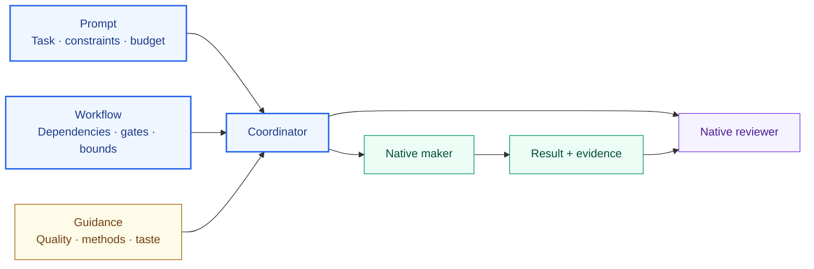
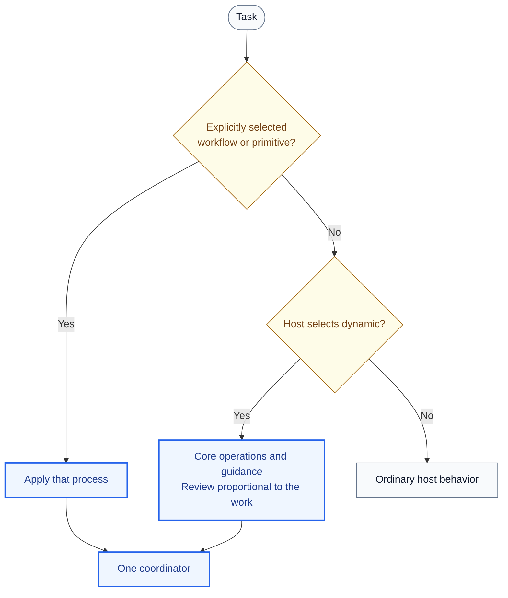
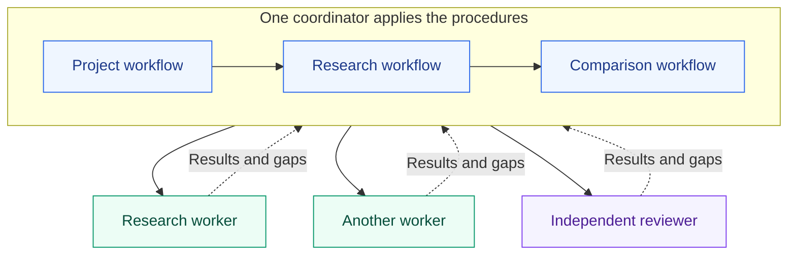
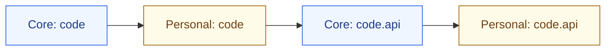
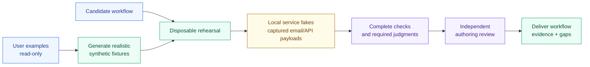
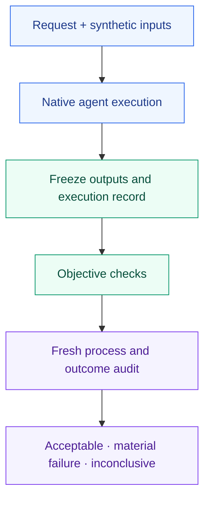

# Orchflows: design and operating model

Orchflows is a library of Markdown procedures for agents with native subagents. It separates **the work requested**, **the process to follow**, and **the standard of quality**. Users reuse small workflows inside larger ones and change model-specific guidance without rebuilding the process.

This is the human design report. [Agent contracts](docs/architecture.md) own execution rules; [host documentation](docs/hosts.md) owns platform details. Development history stays in the local, ignored `design/` directory.

## What are the building blocks?

| Component | Responsibility |
| --- | --- |
| Prompt | Current result, sources, constraints, permissions, limits and requested settings. |
| Workflow | Reusable inputs, dependencies, allowed effects, outputs, review gates and stopping conditions. |
| Guidance | Quality criteria, role-specific methods, taste and removable model corrections. |
| Coordinator | Resolve scope, apply workflows, staff assignments, join results and preserve bounds. |
| Native host | Skill discovery, agent execution, tools, permissions and available isolation. |
| CLI | Install/update packages, resolve paths and inspect transcripts. It does not execute workflows. |

## Which skills are built in?

There are **four built-ins: two primitives and two workflows**.

| Built-in | Contract | Model can invoke? |
| --- | --- | --- |
| [`orch-work`](skills/orch-work/SKILL.md) | Launch a fresh maker with an assignment and applicable guidance. | When a workflow names it or the user selects it |
| [`orch-review`](skills/orch-review/SKILL.md) | Launch a fresh reviewer who made none of the candidate; review without repairing. | When a workflow names it or the user selects it |
| [`orch-build-workflow`](skills/orch-build-workflow/SKILL.md) | Author, rehearse with fixtures, independently review, repair and deliver a reusable workflow or guidance. | No |
| [`orch-dynamic-workflow`](skills/orch-dynamic-workflow/SKILL.md) | Form and execute an ad hoc plan for a top-level task. | Eligible for automatic selection |

All four support explicit selection. Codex uses native `allow_implicit_invocation` metadata; Claude-compatible hosts use `disable-model-invocation`. ZCode and Antigravity document no manual-only setting, so their entrypoints rely on descriptions.

Hosts that enforce manual-only invocation treat a workflow loading a skill by name the same as the model choosing it, so a manual-only skill cannot be a named dependency. Skills that workflows name as dependencies (the primitives, Shared components, Research Acquire) therefore allow model invocation; their descriptions limit selection to workflows that name them and explicit user requests. Entrypoints stay manual, so costly workflows never start unasked. Steps within one package compose through relative links and can stay manual. A host rejection is not permission to bypass its controls.

## How is a task routed?

This describes host/model selection, not a routing engine. Named workflows keep their process; a missing named workflow remains a gap rather than silently becoming dynamic. Dynamic does not wrap selected primitives or restart inside children.

Automatic selection is best-effort. Recorded Claude trials selected dynamic for research-to-code but skipped it for a trivial file-writing request. Explicit invocation worked. Select it explicitly when the process matters.

## What does dynamic decide?

It establishes the result and checks, composing core workflows and primitives. Core `orchflows` guidance helps shape the process; applicable task-domain guidance guides makers and reviewers. Planning does not add an authoring review. Dynamic uses core guidance, including core specializations, without personal or library extensions. User and repository instructions still apply; task sources remain evidence. A request to create or save a reusable process invokes Build. Named workflows remain the route to optional library processes and extensions.

Straightforward, low-impact, reversible work that can be checked directly needs no independent review unless requested. Otherwise, plan coherent units around results and real dependencies, with a gate on each joined result before dependent work. Top-level domains suggest boundaries; supporting guidance does not add units, and consequential handoffs can separate units within one domain. New uncertainty can warrant review; missing reviewer capability does not make consequential work trivial. This policy applies to both automatic and explicit dynamic invocation.

A research-to-code task can use parallel research → joined research review/fix → parallel coding → joined code review/fix. A typo fix can use direct work and a check. Each gate gets one independent reviewer and one worker for at most one repair pass when needed, followed by required checks. Other staffing is flexible; an explicit `orch-work` call always requires a fresh maker.

## How can workflows nest without nested orchestrators?

Procedure depth and agent depth are separate. The same coordinator applies a workflow, its sub-workflows and their dependencies. Only actual work/review assignments launch agents.

Children cannot launch, assign or continue agents, including through alternate tools. They return outcomes and requests for further work. Loading another procedure neither adds a review nor resets an attempt limit. Local guidance, settings and output paths remain scoped to that call, not its siblings.

## What does a worker need if it remembers nothing?

`orch-work` and `orch-review` address the **coordinator**, not the child. The coordinator gives each child:

- Intended result and acceptance criteria.
- Relevant inputs, sources, candidate identity and prior evidence.
- Applicable guidance paths and role: common criteria plus Make or Review.
- Workspace, output location and ownership.
- Caller constraints, permitted effects, bounds and required checks.

The child can reconstruct the problem without the parent's conversation. A reviewer gets the stable candidate and criteria without the maker's argument. Missing required isolation is disclosed. Children may read domain references; loading delegation skills is not their job.

## How does guidance compose?

Named workflows and explicitly selected primitives can use an ordered list of guidance files. Named domains provide a convenience: visit dotted prefixes from general to specific, reading core then selected libraries in caller order at each prefix. Dynamic restricts this selection to core files.

For `code.api` with one personal library:

Keep each file once. More-specific preferences win within a domain; independent domains combine. Missing implicit parents are allowed, but explicitly selected domains/files must exist. Unresolved requirement conflicts block dependent work.

Common criteria apply to makers and reviewers; optional Make and Review sections supply role-specific instructions. Local extensions refine taste, not permissions, review obligations or caller limits. Reading another scope's guidance as evidence does not adopt its preferences.

Brevity, style and roughly 500-line code files are preferences. They guide judgment without automatic rejection or refactoring. A strict user requirement or destination format can make a limit mandatory; correctness, allowed effects and explicit resource bounds remain binding. There is no separate constraint schema or generic validator.

## What does review establish?

It supplies an independent judgment of an identified state and scope. The candidate stays stable until required judgments finish. Reviewers can run isolated checks but do not repair it.

The optional shared library's `shared:review-revise-once` permits one coordinated repair pass after review, followed by affected and caller-required checks—even when no repair is needed. Missing or incomplete review blocks repair. The original verdict stays attached to the inspected state; a revision does not inherit it. There is no automatic second review or release authorization.

Build and Dynamic use `orch-review` directly, with one reviewer and one worker for at most one repair pass when needed, without depending on shared. Build also uses this default for new production workflows while preserving explicit choices and selected component contracts. Dynamic counts an existing review only when candidate, criteria and scope match its planned gate. Build's completed authoring review satisfies the authoring unit when Dynamic composes it; no wrapper review is added.

## How does workflow building avoid touching real data?

Trials use the smallest representative local rehearsal. Supplied documents are not transformation targets. External reads use fixture responses where possible; writes use capture fakes. Email/calendar tests produce drafts and fake receipts, not real deliveries. A directory alone does not isolate a remote API.

Real content is copied only when essential and authorized for the trial; originals stay read-only. A sandbox or dry-run must be verified to avoid live resources. Live trials require an explicit request covering their effects. If no safe test exists, record an untested branch instead of performing it. Normal authorized execution remains separate from authoring tests.

Simulated services do not replace real independent reviewers. Finish selected trials and their judgments before authoring review. Report simulations and unverified integrations; static checks do not prove workflow behavior.

## How are limits and model settings preserved?

A bounded attempt counts before its first work, including failures and pauses. Resumable loops persist attempt identity, starting state and count; resumption continues that attempt. Composition and replanning do not replenish budgets. Each workflow defines its iteration and stopping rule; there is no universal checkpoint format.

Model and effort resolve separately. Current caller choices override saved preferences; within either source, assignment overrides stage, then operation default. Unspecified fields use native defaults. Authoring-session settings are not silently saved into new workflows.

Apply settings through actual host controls, including repairs. Direct work or reuse is valid only when it honors those settings; otherwise use a fresh worker. Unsupported controls are reported, not approximated with a model name in the prompt.

## What else ships?

Eleven optional [example libraries](https://github.com/DanMcInerney/orchflows/tree/main/example-workflows) provide 27 additional entrypoints, manual-only except the named dependencies in Shared and Research Acquire: social search, research acquisition, short video, browser games, candidate comparison and revision, software delivery, design loops, benchmark building, evolution, self-improvement and standalone export. They consume core; they are not extra primitives. Each declares dependencies and validation status. Setup does not install transitive library dependencies.

| Location | Owner and purpose |
| --- | --- |
| Source checkout | Library developers; edit core here. |
| `~/.orchflows/libraries/<name>/` | User-owned workflows/guidance; new workflows default to `personal`. |
| `~/.orchflows/.local/packages/orchflows/` | Setup-managed core; replaced on update. |
| Task workspace | Results, checkpoints and evidence, outside packages. |

The dependency-free Python CLI provides `setup`, read-only `doctor`, `resolve`, and native `history` access for Codex/Claude. Registration is not proof of authenticated execution. [Home and CLI contracts](docs/home.md).

## How do we test a nondeterministic process?

A test specifies an ordinary request, synthetic inputs and an acceptable range of outcomes. The executing agent receives the task; a separate evaluator receives the acceptance criteria and recorded evidence. Checks catch objective errors. The evaluator judges consequential behavior, including guidance scope, independent review, authorized effects and honest handling of missing capabilities. Neither grades private thoughts or demands one exact plan.

The maintainer-only runner discovers `case.json` beside an example's trial or in the core test directory. A new ordinary case needs no runner edit. A journey can build a library, freeze it, then test its larger workflow and a component on unseen inputs in parallel. A curated smoke suite stays small as examples accumulate.

One pool limits runner-launched target and audit sessions; native subagents and Build's inner trials add activity. Suite deadlines include checks and audits. A timeout is inconclusive unless evidence already establishes a material invariant violation. Calibration challenges the evaluator with a valid trace, harmless verbosity, skipped review and missing evidence. Frozen originals survive re-auditing.

The runner supports Claude Code and Codex. Historical Claude trials passed four smoke cases with independent audits in one 175.5-second run; the complete Build journey and two example cases remained inconclusive. Those trials do not validate the revised gate policy or Codex adapter. Synthetic inputs and fake services protect these trials from live effects, but the harness does not provide a security sandbox. [Running tests, adding cases and current evidence](https://github.com/DanMcInerney/orchflows/tree/main/tests/e2e).

## What is deliberately not guaranteed?

Production workflows have no Orchflows execution engine, scheduler, workflow DSL or host-enforced process checker. Their contracts depend on agents following instructions and hosts exposing required capabilities. Missing capability is reported rather than silently replaced; self-review cannot replace independent review.

Successful trials establish observed behavior under recorded conditions. Automatic workflow selection can still be missed, reviews can time out and passing checks do not establish general reliability. Soft report-length preferences are not acceptance gates.

The design aims to preserve useful processes as models improve: retain dependencies and judgments, remove obsolete corrections from guidance, and validate changes on representative work. More agents are useful when their independence or parallel work earns the coordination cost.
