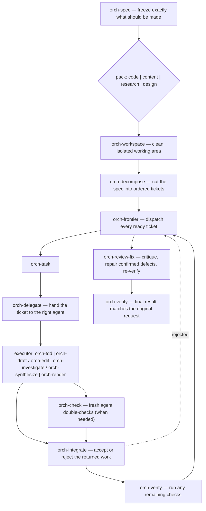

# orchflows

Build a self-improving agent loop in one sentence:

    Build me a workflow that loops over each project in my GitHub and
    saves a summary of its open issues. After the loop is done, the
    workflow runs self-improve on itself.

Or don't do that — just ask Claude or Codex for any one-off task of any
size, like you normally would. Every request autoroutes to the smallest
subagent-driven workflow that can prove it's done: a one-line answer
stays a one-line answer; a product-sized build gets a frozen spec,
tickets, parallel subagents, and a verification gate. 38 composable
skills. Claude Code and Codex, Windows and POSIX. By default the
planner/reviewer subagent is Fable 5 on high effort on Claude Code and
GPT-5.6 Sol on ultra on Codex; workers are Sonnet 5 on xhigh and
GPT-5.6 Sol on high. Think of it as an upgraded, cross-harness
Dynamic Workflows.

Use canonical `orch-benchmaker` to build a qualified immutable benchmark for
any target with an observable outcome. Its
[public dataflow and migration note](docs/benchmaker.md) cover the immutable
evaluation design, benchmark, score card, and evolution result roles;
Verify-before-Judge consumption; and manual between-campaign
self-benchmarking.

## The problem

Skill libraries break the same four ways:

- **Overly specific, handcrafted prompts.** As models get smarter,
  overprescription degrades output quality.
- **Manual chaining by the user.** First run `/brainstorm`, then run
  `/to-prd`, then run... blah blah blah.
- **Domain-specific.** The workflow for writing a blog is basically the
  workflow for shipping a feature: outline the goal, build each section
  in parallel, review the output for cohesion and consistency. You
  don't need a `/write-blog` skill and a `/build-feature` skill.
- **Static.** Run 100 hits the same snags as run 1.

orchflows answers each in structure:

- **Tiny, composable skills.** Every word of every skill has to fight
  for its life. Heavily avoids context rot.
- **Workflows, not prompts.** Every request autoroutes to the smallest
  workflow. No more memorizing skill names or chains.
- **Domain-blind.** Smart model outlines the task → cheaper parallel
  subagents deliver → smart model reviews. The same shape works for
  blogs, code, or research.
- **Self-improving.** `orch-self-improve` can run at any time to mine
  the logs for friction points in agent behavior and reasoning, and
  improve the workflows over time. `orch-evolve` is its sibling: a
  tournament-style improvement loop over any artifact, runnable or
  static.

## Legos

- **One brick, one job.** `orch-deliver` ships, `orch-critique`
  attacks, `orch-judge` scores blind, `orch-loop` iterates,
  `orch-fix` proves the cause before repairing it.
- **One stud pattern.** Six frozen contracts — spec, work-item,
  delegation, verdict, worklog, pack-signature — are the only
  interfaces. Anything that emits one plugs into anything that
  takes one.
- **Swappable baseplates.** Workflows are domain-blind; a pack
  (code | content | research | design) is pure data that retargets
  the whole tower. The pipeline that ships a feature also ships a
  research report — swap one pack, change zero control flow.

You snap bricks by naming them; the agent snaps them by routing. Same
bricks either way.

## Install

    git clone https://github.com/DanMcInerney/orchflows
    cd orchflows
    ./install.sh          # install.cmd on Windows

The wrapper resolves an interpreter (uv → python3 → python; any
Python 3 works) and
auto-detects your harnesses — Claude Code (`~/.claude`), Codex
(`~/.codex`) — configuring whichever exists. Update: `git pull`,
rerun. Committable per-project routing block: `python install.py
--project PATH`. Uninstall: `python install.py --user --uninstall`
removes only what it generated; `--dry-run` previews either.

## Usage

Just talk. Routing reads the request and picks the smallest shape:

    > fix the flaky login test
    # orch-fix: reproduce it, prove the cause, guard the repair

    > why did memory double last release?
    # orch-investigate: one read-only lane, answer cited from primary evidence

    > ship dark mode
    # orch-spec → orch-deliver: frozen spec, tickets, parallel subagents
    # on a rolling frontier, one review gate, final verification

    > build me a custom workflow that reads all the documentation, then
      researches similar projects, then builds a spec doc to copy their
      best features and implements them
    # orch-build: the chain is admitted as a project-local skill,
    # callable by name from then on

Or name the bricks yourself:

    > orch-loop orch-deliver until `pytest -q` exits 0
    > orch-panel these three cache designs — blind judges, pick one
    > orch-critique src/auth under the security lens

Or build your own custom workflow:

    > build me a workflow that does spec > deliver, then always updates
      the documentation afterwards (favoring edits and deletions over
      additions), and automatically PRs and merges it

Custom workflows are project-local. In the example above, if you were
working in `my-personal-site/` you'd get a workflow named something
like `/site-work-and-merge`, callable only when you're working in
`my-personal-site/`.

Routing too eager? `orch-off` stands it down for the session. The
routing law is `rules/topology.md` §2, installed as
`~/.orchflows/host-block.md`.

### A workflow that upgrades itself

Chain any bricks and put `orch-self-improve` last:

    > my release workflow: orch-investigate what merged since the last
      tag → orch-deliver the release notes under the content pack →
      orch-self-improve

Every run auto-logs its friction — retries, missing inputs,
workarounds — under an always-on law, and `trace.py` logs every
session's agent reasoning and secret-redacted tool calls.
`orch-self-improve` mines the logs into single-owner proposals you
accept or reject. Proposals I've seen in my own usage:

- Offload a repeated piece of agent reasoning to a deterministic script
- A tiny AGENTS.md addition telling agents to use the packaged Python
  interpreter instead of whatever `python` is on `$PATH`
- Remove overlapping `orch-verify` steps from a workflow to speed it up
- Add a documentation-update step to a workflow because the user kept
  asking for it manually

The coolest part of `orch-self-improve` is that you can run it on
itself. I run `orch-self-improve` across all sessions in a project,
then point a second `orch-self-improve` run at the first one.

### Visualize anything

`orch-visualize` renders anything you hand it as a verified Mermaid
diagram — a workflow, your session trace, a codebase, a website, a
process from a doc. Every diagram is syntax-verified against a real
Mermaid renderer before it comes back, and on request it emits a
self-contained HTML page. This is its drawing of the delivery pipeline
that ships every orchflows run:

## Architecture

### Skills and workflows

    orchflows
    │
    ├── Layer 0 · contracts/ — Shared forms that keep every part of the system speaking the same language
    │   ├── delegation     — Says what another agent should do, use, avoid, and return
    │   ├── pack-signature — Lists what every project-type setup must provide
    │   ├── spec           — Records exactly what the user wants made
    │   ├── verdict        — Records whether a check passed and what proves it
    │   ├── work-item      — Describes and tracks one piece of work
    │   └── worklog        — Records the progress and current state of a larger job
    │
    ├── Layer 1 · skills/ — Things the agents know how to do
    │   │
    │   ├── kernel/ — Basic building blocks used by the rest of the system
    │   │   ├── orch-check          — Has a fresh agent double-check the work and correct problems
    │   │   ├── orch-critique       — Reviews something and lists the most important problems
    │   │   ├── orch-decompose      — Breaks a large job into smaller pieces in the right order
    │   │   ├── orch-delegate       — Hands one clearly defined task to another agent
    │   │   ├── orch-elicit         — Asks the user when a decision cannot safely be made for them
    │   │   ├── orch-integrate      — Decides whether returned work is acceptable and can be used
    │   │   ├── orch-investigate    — Researches one focused question using reliable evidence
    │   │   ├── orch-judge          — Rates one option using standards agreed on beforehand
    │   │   ├── orch-mechanize      — Turns a repeatedly performed step into a reusable script
    │   │   ├── orch-synthesize     — Combines findings from several sources into one answer
    │   │   ├── orch-verify         — Runs the agreed checks to see whether the work passes
    │   │   ├── orch-worklog        — Updates the job's progress record
    │   │   └── orch-workspace      — Prepares a clean and safe place in which to work
    │   │
    │   ├── engines/ — Reusable ways of organizing work
    │   │   ├── orch-task      — Takes one ready piece of work from start to acceptance
    │   │   ├── orch-frontier  — Starts each piece of work as soon as the work it needs is finished
    │   │   ├── orch-loop      — Repeats work until an agreed check says it is done
    │   │   └── orch-panel     — Uses several independent reviewers to compare choices fairly
    │   │
    │   ├── workflows/ — Complete processes made from the smaller building blocks
    │   │   ├── orch-benchmaker    — Builds and qualifies an immutable runnable benchmark
    │   │   ├── orch-build         — Creates or changes a reusable part of the orchflows library
    │   │   ├── orch-deliver       — Runs a project from the agreed plan to a checked final result
    │   │   ├── orch-diagnose      — Reproduces a problem and finds what is actually causing it
    │   │   ├── orch-eval-design   — Freezes candidate-blind evaluation semantics before construction
    │   │   ├── orch-evolve        — Creates and compares improved versions over several rounds
    │   │   ├── orch-fix           — Finds the cause of a problem, repairs it, and proves it stays fixed
    │   │   ├── orch-repair        — Applies the smallest change that fixes a known problem
    │   │   ├── orch-review-fix    — Reviews the result once, fixes valid problems, and checks it again
    │   │   ├── orch-fixture       — Saves a finished task as an example that can be run again later
    │   │   ├── orch-goal          — Runs the delivery process again to improve the result further
    │   │   ├── orch-self-improve  — Studies past difficulties and proposes improvements to the system
    │   │   ├── orch-spec          — Turns a request into a clear, agreed plan
    │   │   └── orch-triage        — Sorts a list of work into what is ready, blocked, or needs a person
    │   │
    │   ├── instances/ — Skills that perform a particular kind of hands-on work
    │   │   ├── orch-tdd               — Writes software in small steps and checks each step with tests
    │   │   ├── orch-resolve-conflicts — Decides how to combine two sets of changes that clash
    │   │   ├── orch-draft             — Writes one section using only the supplied information
    │   │   ├── orch-edit              — Combines separate sections into one consistent document
    │   │   └── orch-render            — Builds a screen and checks how it actually looks and behaves
    │   │
    │   └── utilities/ — Small optional helpers
    │       ├── orch-visualize — Turns supplied information into a diagram
    │       └── orch-off       — Stops orchflows from automatically choosing skills
    │
    ├── Layer 2 · packs/ — Setups for different kinds of projects
    │   ├── orch-code-pack     — Tells the system how to organize, save, and check software work
    │   ├── orch-content-pack  — Tells the system how to organize and review written documents
    │   ├── orch-research-pack — Tells the system how to answer questions using trustworthy sources
    │   └── orch-design-pack   — Tells the system how to build and visually check interfaces
    │
    └── Layer 3 · compositions/ — Example playbooks showing how the parts can be combined
        ├── delivery-loop        — Repeats delivery until a chosen measurement says to stop
        ├── drift-canary         — Reruns known examples to detect changes in agent behavior
        ├── evidence-to-document — Researches a subject first, then turns the findings into a document
        ├── evolve               — Produces several versions and selects the strongest one
        ├── feature-plus-docs    — Builds a software feature and then documents what was built
        ├── improvement-delivery — Turns an approved process improvement into a tested change
        ├── renovate             — Reviews an existing project and completes selected improvements
        └── skill-tournament     — Tests competing versions of a skill to see which works best

Four layers, dependencies pointing one way. `contracts/` is the narrow
waist: six hash-pinned data shapes that are the only interfaces between
skills. `skills/` is everything callable — kernel primitives that call
no other skill, engines that add control flow, workflows assembled from
both, instances that do the domain's hands-on work, and a couple of
utilities. `packs/` is per-domain data, never control flow.
`compositions/` is non-normative worked examples, free to churn.

### Work routing

    UNITS OF WORK — the orchflows ladder
    │
    ├── (floor) Tested script
    │     no model, no ticket — a unit of certainty, not of work
    │     orch-mechanize keeps pushing repetition down here
    │
    ├── U0 — Direct answer
    │     question answered from context already in hand
    │     no deliverable change → no record, no ticket
    │
    ├── U1 — Verified ad-hoc ticket
    │     one ticket + one execution + one external verdict
    │     U1×N: a small ticket graph with edges, run on the frontier
    │
    ├── U2 — The run (spec → delivery)
    │     a frozen spec governs a ticket graph → rolling frontier →
    │     one review gate → final verification
    │
    └── U3 — Composition
          control flow OVER units: chained runs, goal loops

Every request lands on the cheapest rung that can still prove it's
done. A question you can answer from context costs nothing; a small fix
gets one ticket and one external verdict; only work that genuinely
needs a frozen spec pays for one; and repetition keeps getting pushed
below the floor into tested scripts that need no model at all.

### Packs

    packs/
    ├── orch-code-pack     — delivers code        · deterministic oracles · executor orch-tdd
    │                        workspace: git, one worktree per work item
    ├── orch-content-pack  — delivers documents   · judged oracles        · executor orch-draft, assembly orch-edit
    │                        workspace: document tree with outline slots
    ├── orch-design-pack   — delivers rendered UI · capture oracles       · executor orch-render
    │                        workspace: git plus render (view × breakpoint × state)
    └── orch-research-pack — delivers answers     · evidence oracles      · executor orch-investigate, assembly orch-synthesize
                             workspace: evidence store of lane packets

A pack is pure data — no control flow. It supplies the domain's
vocabulary, oracle classes, executors, workspace rules, and design
principles, all satisfying one frozen pack-signature, so everything the
library builds inside a domain stays cohesive. Stamp a different pack
on the spec and the identical pipeline ships code, documents, research,
or UI.

## Advantages over Anthropic's Dynamic Workflows

- **Cross-harness.** One library drives both Claude Code and Codex, on
  Windows and POSIX.
- **Workflows persist.** A custom workflow is admitted as a
  project-local skill — versioned, callable by name, improvable — not
  regenerated from scratch each session.
- **Verification is structural.** Named oracles, fresh-context
  checkers, and one review gate stand between an executor's claim and
  "done" — the agent never grades its own homework.
- **Self-improving.** Friction and full session traces are always
  logged; `orch-self-improve` mines them into concrete fixes to the
  workflows themselves — including to itself.
- **Survives session death.** Specs, tickets, and worklogs are files in
  `.orch/`, so any fresh context can resume a run mid-flight.
- **Smallest-first routing.** One intake for everything: a one-line
  question never pays workflow ceremony, and a launch never gets
  typo-fix rigor.
