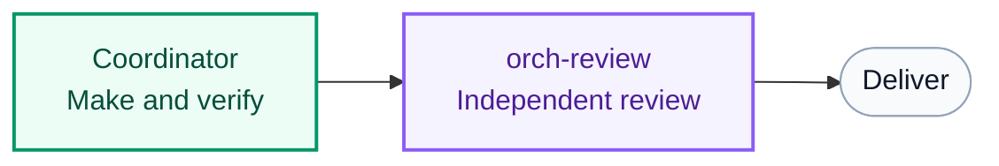
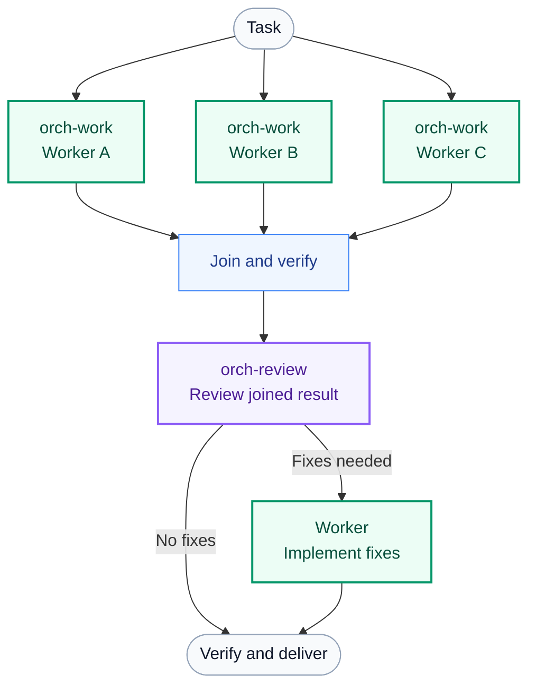
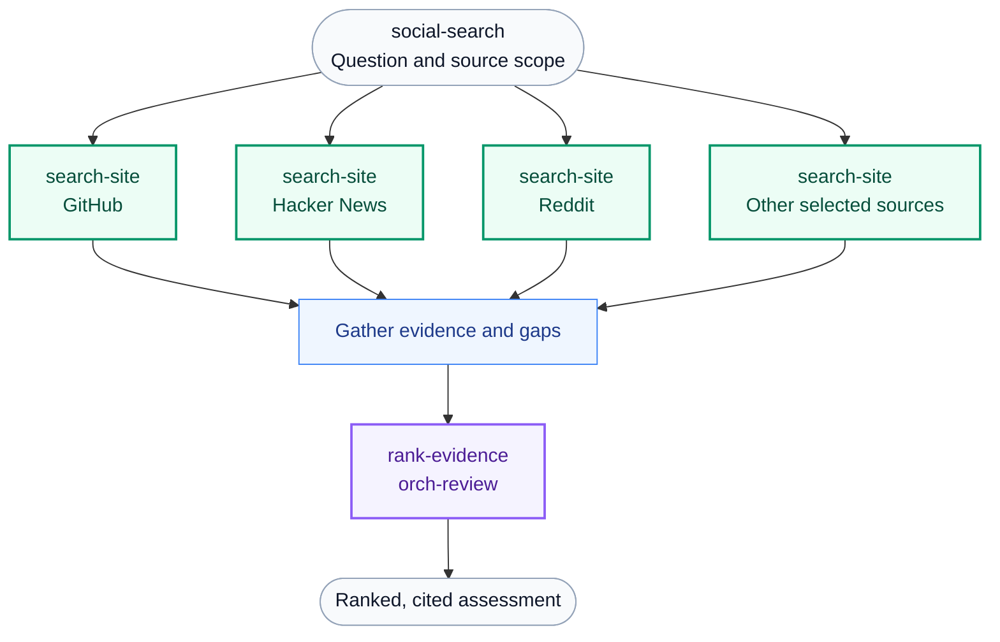
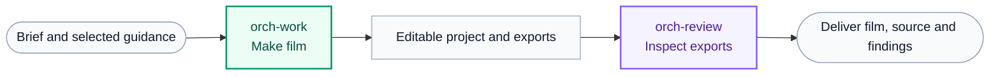
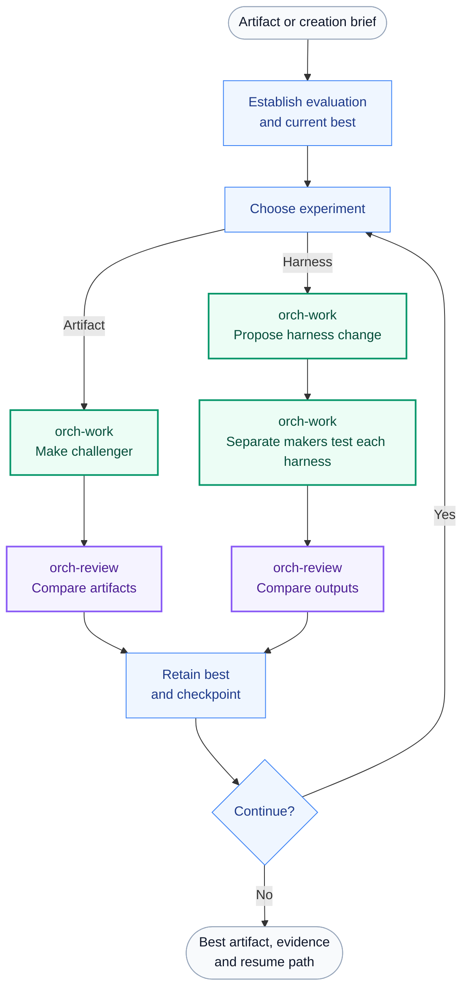
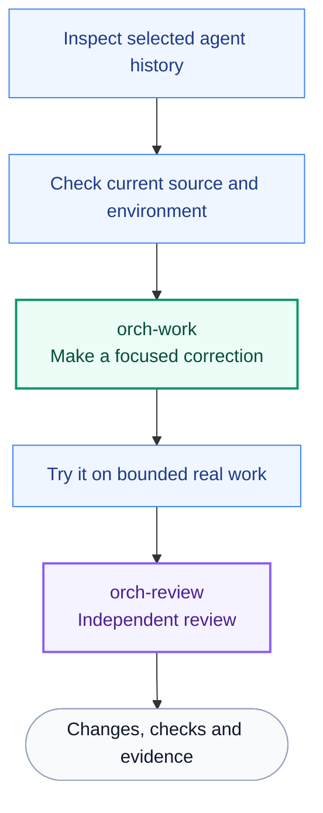

# orchflows

**Two primitives. Reusable workflows. Your own guidance.**

Build small reusable workflows, then compose them into larger processes, including improvement loops.

[**Work**](skills/orch-work/SKILL.md) makes a result. [**Review**](skills/orch-review/SKILL.md) independently judges it. Everything else is composition.

## Why

Skill libraries keep growing around a model's current limitations. [gstack](https://github.com/garrytan/gstack#the-sprint) packages a prescribed engineering sprint and specialist roles. [Matt Pocock's skills](https://github.com/mattpocock/skills#why-these-skills-exist) encode practices such as grilling sessions, test-first development and debugging gates. [Superpowers](https://github.com/obra/superpowers#the-basic-workflow) specifies a mandatory development process, down to task size and review stages.

Our objection is overprescription. Too much of the agent's judgment has already been made for it: how to investigate, how small to divide the work, when to stop and ask, which sequence to follow. That makes a workflow inflexible and its execution less adaptive to the task. These libraries offer customization, and some already separate model overrides; the problem is how much procedure remains embedded in the skills themselves.

Overprescription also ages badly. A workaround for one model can become unnecessary ceremony for the next. A model that can now reason through a whole change still gets marched through steps written for one that could not. When those corrections are scattered across skills, every model release invites another round of workflow rewrites.

**Orchflows abstracts prescription into guidance and guidance extension documents.** The two skills handle making and reviewing. Workflows describe the relationships between those operations. Separate, modular documents hold domain preferences, task specializations and corrections for model weaknesses.

When a new model no longer needs a correction, test its removal from the guidance or extension document. Keep the preferences you still care about. Model upgrades should usually change guidance and staffing while preserving your chosen process and quality standard.

## Install

Requires Python 3.11+ and a host with native subagents: Codex, Claude Code, Google Antigravity (`agy`), Kimi Code, Grok Build or Z.ai's ZCode. See [host support and limits](docs/hosts.md).

```sh
git clone https://github.com/DanMcInerney/orchflows.git
cd orchflows
python scripts/orchflows.py setup
```

Setup detects supported hosts through their executables, installs core through the Codex, Claude Code, Antigravity and Grok Build CLIs, and prints the remaining in-app steps for Kimi Code and ZCode. Rerun the same command to update. Existing settings and disabled plugins are preserved; conflicts or unsupported host versions appear in the result. One host's failure does not stop the others.

```sh
python scripts/orchflows.py setup --host codex --host grok  # Choose hosts
python scripts/orchflows.py setup --host agy               # Antigravity CLI
python scripts/orchflows.py setup --host none              # Prepare the home only
python scripts/orchflows.py doctor                         # Check without changes
```

Setup installs optional examples only when requested with `--example <name>` and refreshes libraries already installed through the supported CLIs. Concurrency stays unchanged unless you pass `--concurrency N`. [Setup options and result statuses](docs/home.md#setup) · [Manual registration and provider setup](docs/hosts.md#register-and-refresh).

Core skills, bundled examples and personal workflows request manual-only invocation. Invoke a workflow from the skill picker or by name. Unmatched requests use the host's ordinary agent behavior. Codex, Claude Code, Kimi Code and Grok Build support invocation settings; ZCode currently cannot enforce manual-only invocation, and Antigravity enforcement is unverified. [Invocation settings](docs/hosts.md#invocation-policy).

Start a new session to load Orchflows.

## Usage

Select a saved workflow, use either primitive directly, or build a workflow for recurring work with [/orch-build-workflow](skills/orch-build-workflow/SKILL.md). To review and revise an existing result once, select [/orch-review-revise-once](skills/orch-review-revise-once/SKILL.md).

**Simple task.** The coordinator makes and verifies an already-clear change directly. One independent child reviews it. This is a small explicit composition, shown with no repairs needed:


```mermaid
flowchart LR
    W["Coordinator<br/>Make and verify"] --> R["orch-review<br/>Independent review"]
    R --> D([Deliver])
    classDef work fill:#ecfdf5,stroke:#059669,color:#064e3b,stroke-width:2px;
    classDef review fill:#f5f3ff,stroke:#8b5cf6,color:#4c1d95,stroke-width:2px;
    classDef result fill:#f8fafc,stroke:#94a3b8,color:#0f172a;
    class W work;
    class R review;
    class D result;
```

**Larger task.** Independent workers run in parallel, their results join, and independent review covers the combined work. When fixes are needed, an existing or new worker can implement them:


```mermaid
flowchart TD
    T([Task]) --> A["orch-work<br/>Worker A"]
    T --> B["orch-work<br/>Worker B"]
    T --> C["orch-work<br/>Worker C"]
    A --> J[Join and verify]
    B --> J
    C --> J
    J --> R["orch-review<br/>Review joined result"]
    R -->|Fixes needed| F["Worker<br/>Implement fixes"]
    R -->|No fixes| D([Verify and deliver])
    F --> D
    classDef work fill:#ecfdf5,stroke:#059669,color:#064e3b,stroke-width:2px;
    classDef review fill:#f5f3ff,stroke:#8b5cf6,color:#4c1d95,stroke-width:2px;
    classDef coordinate fill:#eff6ff,stroke:#3b82f6,color:#1e3a8a;
    classDef result fill:#f8fafc,stroke:#94a3b8,color:#0f172a;
    class A,B,C,F work;
    class R review;
    class J coordinate;
    class T,D result;
```

There is one repair pass with verification, without another review. The coordinator can also make clear fixes directly. Calling `orch-work` alone creates just one worker. The examples select review explicitly; it is not added to every task.

**Custom workflows.** Use [/orch-build-workflow](skills/orch-build-workflow/SKILL.md) to turn a recurring task into a reusable workflow. It drafts the composition, tries it on real work, and refines it before independent review:


```mermaid
flowchart LR
    A([Recurring task]) --> W[Draft workflow]
    W --> T[Run a real trial]
    T -->|Refine| W
    T -->|Ready| R[Independent review]
    R --> D([Fix, verify and save])
    classDef work fill:#ecfdf5,stroke:#059669,color:#064e3b,stroke-width:2px;
    classDef review fill:#f5f3ff,stroke:#8b5cf6,color:#4c1d95,stroke-width:2px;
    classDef coordinate fill:#eff6ff,stroke:#3b82f6,color:#1e3a8a;
    classDef result fill:#f8fafc,stroke:#94a3b8,color:#0f172a;
    class W work;
    class R review;
    class T coordinate;
    class A,D result;
```

[Register the saved library with your host](docs/hosts.md#register-and-refresh) to invoke its workflows by name.

**Standalone skills.** The optional [/export-workflow](https://github.com/DanMcInerney/orchflows/tree/main/example-workflows/export-workflow) example exports an existing workflow as a native skill folder that runs without Orchflows installed:

> Use export-workflow:export-workflow to export social-search:social-search for Codex into exports/social-search, retaining all supported source scopes.

The exporter bundles selected guidance, helper workflows, scripts and assets, replaces the two primitives with native delegation, and runs a bounded trial of the primary capability. It delivers the folder and a separate portability report; installation is a separate step. Parallel work, independent review and loops can remain when the target host supports them. Guidance becomes a snapshot that needs re-exporting for shared updates. A single-file or single-agent version can lose capabilities; the [export contract](https://github.com/DanMcInerney/orchflows/blob/main/example-workflows/export-workflow/skills/export-workflow/references/export-contract.md) explains the tradeoffs.

**Models and effort.** Give Work and Review optional defaults, then override any named assignment—even the final fixer:

> Work: gpt-5.6-sol at medium. Review: gpt-6-astra at high. Worker B: high. Final fixer: gpt-6-astra at xhigh.

Use models and effort levels supported by your host. These choices apply to primitive assignments and saved workflows. To save these preferences, ask `/orch-build-workflow` to keep them beside the assignments in `SKILL.md`. Your current request overrides saved preferences field by field; settings absent from both use native defaults. A worker with different settings runs separately when the host cannot change an existing agent. [Resolution and host controls](docs/architecture.md#model-and-effort).

## Design

### Start with work and independent judgment

Give an agent a result to produce, then give another agent the result to assess. Keep the assignment specific and let the model choose how to do the work. Add instructions where you have a deliberate preference or an observed failure to correct.

| Skill | Contract |
| --- | --- |
| [orch-work](skills/orch-work/SKILL.md) | A fresh native child makes the result using common quality criteria and **Make** instructions. |
| [orch-review](skills/orch-review/SKILL.md) | A fresh child who did not make the result assesses it using the same criteria and **Review** instructions, without fixing it. |

A reviewer can inspect code, judge a film, rank evidence or compare competing designs. The subject changes; the two operations do not.

### Compose the task

A workflow is a `SKILL.md` that connects these operations: what can run in parallel, what depends on what, what gets reviewed, and whether the result feeds another round. It supplies assignments, context and outputs. The same primitives support a single review, a research team, a production pipeline or an improvement loop.

The package includes [workflow building](skills/orch-build-workflow/SKILL.md) and [review with one revision pass](skills/orch-review-revise-once/SKILL.md). These are workflows built from the two primitives. Saved workflows may compose other workflows at any depth in the same coordinator, preserving dependencies, independence and bounds. Ordinary production stages can run directly or use suitable makers; an explicit `orch-work` call always creates a fresh maker.

The optional [shared processes](https://github.com/DanMcInerney/orchflows/tree/main/example-workflows/shared) library provides independent candidate comparison and review with one revision pass. Design loop uses comparison; personal briefs and reports can use review-and-revision. Only the top-level orchestrator launches, assigns or continues agents; children return results and further-work requests. Other components remain in their domain libraries. Ordinary fan-out and gathering are [core execution rules](docs/architecture.md#execution), not a required helper import. Install `shared` explicitly before examples that declare it; setup does not install transitive dependencies.

Your host runs the agents. Orchflows adds no agent runtime, scheduler or workflow language. Loading a workflow applies its instructions in the current context; calling a primitive launches a child.

### Supply guidance separately

Guidance describes what good work means in a domain. Common criteria apply to makers and reviewers; optional **Make** and **Review** sections supply role-specific methods. For example, independently runnable tests are a shared quality criterion, while a technique for constructing them may be maker guidance. Temporary corrections can live in a removable section or extension.

Select only the domains the task needs. A film might use `writing`, `visual-design` and `short-video`. A coding task might use `code` and `code.api`. The workflow's structure stays the same when its selected guidance changes.

### Extend only the differences

Guidance extension documents specialize a domain. `code.api.md` extends `code.md`; `short-video.marketing.md` adds marketing preferences to `short-video.md`. A brand can add `short-video.marketing.<brand>.md`. Each extension states what it adds or changes, without copying its parents.

Your libraries can also extend an existing domain with a `guidance/code.md` of their own. Keep corrections for a particular model separately removable in such a library. When the correction stops helping, remove the instruction or deselect that library. Model names do not become new domain names.

A workflow can receive an ordered list of guidance files directly. Named domains are a convenience: resolve general to specific, reading core then selected libraries at each level. Reuse resolved paths and extend selection when a nested call introduces new work. Local guidance stays scoped to that call; a campaign's tone does not change its sibling research brief. See [guidance selection](docs/architecture.md#guidance-selection).

## Example workflows

These examples show parallel collection, creative production and improvement using the same two skills. They are optional libraries: add one with `python scripts/orchflows.py setup --example <name>` and follow any remaining host steps in the result. Each library documents its tool dependencies.

### Social search

> Research how developers are using coding agents. Search GitHub, Hacker News and Reddit, then rank the strongest evidence.

[Social search](https://github.com/DanMcInerney/orchflows/tree/main/example-workflows/social-search) tackles the same kind of research as [last30days](https://github.com/mvanhorn/last30days-skill), which bundles source integrations, parallel search and engagement scoring into a dedicated research engine. Social search builds collection and independent assessment from smaller, reusable workflows. Your prompt sets the sources, dates and bounds.

**Each source search is itself a workflow.** The reusable `search-site` workflow composes `orch-work`, source guidance and an evidence handoff. It can run alone or become one branch of `social-search`. The current library supplies guidance for **Reddit, Hacker News, GitHub, X, YouTube, Lemmy, web search, and RSS/Atom feeds**; other accessible sources use general guidance. These are instances of the same workflow with different guidance.

`social-search` composes the selected searches in parallel, gathers their evidence and gaps, then calls the separate `rank-evidence` workflow, which composes `orch-review`:


```mermaid
flowchart TD
    Q(["social-search<br/>Question and source scope"]) --> G["search-site<br/>GitHub"]
    Q --> H["search-site<br/>Hacker News"]
    Q --> R["search-site<br/>Reddit"]
    Q --> S["search-site<br/>Other selected sources"]
    G --> E[Gather evidence and gaps]
    H --> E
    R --> E
    S --> E
    E --> J["rank-evidence<br/>orch-review"]
    J --> O([Ranked, cited assessment])
    classDef work fill:#ecfdf5,stroke:#059669,color:#064e3b,stroke-width:2px;
    classDef review fill:#f5f3ff,stroke:#8b5cf6,color:#4c1d95,stroke-width:2px;
    classDef coordinate fill:#eff6ff,stroke:#3b82f6,color:#1e3a8a;
    classDef result fill:#f8fafc,stroke:#94a3b8,color:#0f172a;
    class G,H,R,S work;
    class J review;
    class E coordinate;
    class Q,O result;
```

The orchestrator chooses collection assignments; one independent assessor returns the completed evidence assessment. Shared original sources have one owner; missing or failed collection stays visible as a gap. Source-specific guidance shapes collection; shared research and writing guidance shapes the final assessment.

### Short video

> Make a 30-second launch film for this product. Deliver the editable project and the finished video.

[Short video](https://github.com/DanMcInerney/orchflows/tree/main/example-workflows/short-video) produces the requested films, then independently reviews their actual rendered exports. Genre, placement and brand requirements come from the brief and selected guidance.


```mermaid
flowchart LR
    B([Brief and selected guidance]) --> M["orch-work<br/>Make film"]
    M --> E[Editable project and exports]
    E --> R["orch-review<br/>Inspect exports"]
    R --> D([Deliver film, source and findings])
    classDef work fill:#ecfdf5,stroke:#059669,color:#064e3b,stroke-width:2px;
    classDef review fill:#f5f3ff,stroke:#8b5cf6,color:#4c1d95,stroke-width:2px;
    classDef result fill:#f8fafc,stroke:#94a3b8,color:#0f172a;
    class M work;
    class R review;
    class B,E,D result;
```

Every film receives independent review of all its placement versions. Staffing adapts to the work, and films can proceed concurrently. The composition ends after review; a repair round is a separate requested step.

### Evolve

> Improve this game's performance for an hour while preserving gameplay. Also improve how you search for optimizations.

[Evolve](https://github.com/DanMcInerney/orchflows/tree/main/example-workflows/evolve) starts with an artifact or creation brief. It designs an evaluation when none is supplied, makes a challenger, independently compares it with the current best, and retains only confirmed improvements. Every experiment saves evidence and a checkpoint.


```mermaid
flowchart TD
    S([Artifact or creation brief]) --> E["Establish evaluation<br/>and current best"]
    E --> C[Choose experiment]
    C -->|Artifact| M["orch-work<br/>Make challenger"]
    M --> R["orch-review<br/>Compare artifacts"]
    R --> K["Retain best<br/>and checkpoint"]
    C -->|Harness| H["orch-work<br/>Propose harness change"]
    H --> T["orch-work<br/>Separate makers test each harness"]
    T --> J["orch-review<br/>Compare outputs"]
    J --> K
    K --> B{Continue?}
    B -->|Yes| C
    B -->|No| O(["Best artifact, evidence<br/>and resume path"])
    classDef work fill:#ecfdf5,stroke:#059669,color:#064e3b,stroke-width:2px;
    classDef review fill:#f5f3ff,stroke:#8b5cf6,color:#4c1d95,stroke-width:2px;
    classDef coordinate fill:#eff6ff,stroke:#3b82f6,color:#1e3a8a;
    classDef result fill:#f8fafc,stroke:#94a3b8,color:#0f172a;
    class M,H,T work;
    class R,J review;
    class E,C,K,B coordinate;
    class S,O result;
```

The working **harness** is the maker instructions, tools and search strategy used by the run. Evolve can test a change to that harness against its predecessor, then use the verified revision in later rounds. Its coordinating evaluation and promotion rules stay fixed during that comparison. Harness experiments produce old/new outputs independently from matched inputs, with independent review. A subjective winner requires confirmation from a second fresh reviewer.

The default is three rounds with one challenger per round. A continuous request removes the round cap; the host must keep executing or resume the checkpoint. A plateau changes the search strategy. It does not prove the artifact cannot improve.

### Design loop (experimental)

> Build a local shopping-list CLI. Run two design cycles, beginning with the smallest working proof of concept.

[Design loop](https://github.com/DanMcInerney/orchflows/tree/main/example-workflows/design-loop) composes eight reusable workflows around a project endgoal: brainstorm and research, design one increment, implement it, independently compare it with the accepted baseline, then analyze the evidence for the next cycle. Its README includes a detailed flowchart and the component contracts.

**Experimental.** Design-loop preserves N attempted cycles with independent comparison and explicit adoption. Staffing follows core execution rules. Its comparison leaf has behavioral trial evidence; full cycles remain unvalidated.

### Benchmaker (experimental)

> Build a benchmark for this agent, with a quick run under five minutes.

[Benchmaker](https://github.com/DanMcInerney/orchflows/tree/main/example-workflows/benchmaker) turns an agent, workflow or capability description into a small runnable benchmark with representative tasks, outcome grading and explicit measurement limits. It preserves an independent pilot and explicitly applies core's review/revision workflow; the orchestrator owns target dispatch under the declared measurement plan. Install with `python scripts/orchflows.py setup --example benchmaker`.

The first implementation includes contracts and six acceptance scenarios; cross-domain validation remains incomplete. It generates runners suited to each benchmark and does not require a shared evaluation framework. [Validation status](https://github.com/DanMcInerney/orchflows/tree/main/example-workflows/benchmaker/trials).

### Software factory

> Add CSV export to this application, run its checks and specialist reviews, and leave a release handoff. Use two candidate passes.

[Software factory](https://github.com/DanMcInerney/orchflows/tree/main/example-workflows/software-factory) adapts the agentic software factory design into bounded implementation, CI and independent review loops, followed by risk routing and an optional authorized rollout. Separate observation and incident workflows turn production evidence into proposed fixes or mitigations. It uses the project's existing tools and adds no scheduler or CI runtime.

Delivery defaults to three candidate passes. The orchestrator chooses staffing for implementation, applicable independent review and any authorized release. Low-risk automated review requires project opt-in; release authority remains separate. Install the optional library with `python scripts/orchflows.py setup --example software-factory`.

We built two applications with this workflow and with a fresh single agent using the same product prompt, tools and observed model/effort:

| Task | Software factory | Single agent |
| --- | --- | --- |
| Authenticated webhook inbox | 28/28 independent checks; 25.6 min | 28/28 independent checks; 17.2 min |
| Fast log archive | 31/31 independent checks; 42.4 min | 31/31 independent checks; 16.4 min |

Workflow review also caught and repaired a valid nested-JSON crash that remained in the single-agent log result. That exploratory finding is separate from the fixed scores. The workflow used 2.4× and 4.4× the output tokens, respectively. There was one run per approach per task, so these results do not establish a general winner. [Side-by-side results, all four implementations and their artifacts](https://github.com/DanMcInerney/orchflows/tree/main/benchmarks/software-factory/2026-09-16).

### Self-improve

> /self-improve Review this session and improve the workflows and guidance behind the problems you find.

[Self-improve](https://github.com/DanMcInerney/orchflows/tree/main/example-workflows/self-improve) learns from native agent history. Install the optional library with `python scripts/orchflows.py setup --example self-improve`. Scope it to a session, period or project; by default it uses the current session. It checks whether an observed problem still exists in the current source or environment, then makes the smallest useful correction to local setup, custom workflows, guidance or Orchflows itself.


```mermaid
flowchart TD
    H[Inspect selected agent history] --> C[Check current source and environment]
    C --> W["orch-work<br/>Make a focused correction"]
    W --> T[Try it on bounded real work]
    T --> R["orch-review<br/>Independent review"]
    R --> D([Changes, checks and evidence])
    classDef work fill:#ecfdf5,stroke:#059669,color:#064e3b,stroke-width:2px;
    classDef review fill:#f5f3ff,stroke:#8b5cf6,color:#4c1d95,stroke-width:2px;
    classDef coordinate fill:#eff6ff,stroke:#3b82f6,color:#1e3a8a;
    classDef result fill:#f8fafc,stroke:#94a3b8,color:#0f172a;
    class W work;
    class R review;
    class H,C,T coordinate;
    class D result;
```

Ask for a report only to stop after inspecting history. An improvement pass includes a bounded trial and independent review, with findings tied to agent and event references. Missing history stays visible as a gap. Corrections go into the owning checkout or user library.

## Structure

**One concept, one owner.** Put each instruction, fact or mechanism in one place and reference it everywhere else.

| Concept | Owner |
| --- | --- |
| Desired result, constraints, sources, dates, budgets, model and effort | Your prompt; explicit saved model/effort preferences sit beside workflow assignments |
| Saved process, dependencies, independence, loops and stopping conditions | Workflow `SKILL.md` |
| Runtime allocation, concurrency, gathering and integration | Orchestrator applying core execution rules |
| Quality preferences and domain extensions | `guidance/` |
| Package dependencies and required guidance | `references/library-context.md` |
| Shared knowledge and handoff contracts | Library `references/`; skill-local references for one consumer |
| Deterministic mechanics | The owning skill's `scripts/`, with sibling `tests/` |
| Package identity | Root `plugin.json` |
| Skill discovery | Native host manifests and catalogs |
| Agent execution and isolation | Native host; see [supported hosts and limits](docs/hosts.md) |
| Results, checkpoints and run evidence | Your project workspace |

The repository follows those boundaries:

```text
skills/             two primitives and two built-in compositions
guidance/           domain preferences and extension documents
docs/               shared architecture and operating contracts
scripts/ + tests/   core setup, resolution and history tools
example-workflows/  optional workflow libraries
plugin.json         package identity
```

The core checkout is for library development. Your editable libraries live in `~/.orchflows/libraries/`, with `personal` as the default for new workflows. Setup maintains the installed core under `~/.orchflows/.local/`. Edit the checkout or your libraries; keep task outputs in the project workspace.

The examples directory also includes `research-acquire` for public-source acquisition and `3d-browser-game` for Three.js game development. Run outputs normally belong in caller workspaces. Explicitly published comparison snapshots live under `benchmarks/`, outside the installable core and example libraries.

[Architecture](docs/architecture.md) · [Home and updates](docs/home.md) · [Host integration](docs/hosts.md) · [Agent history](docs/history.md) · [Authoring guidance](guidance/orchflows.md)
