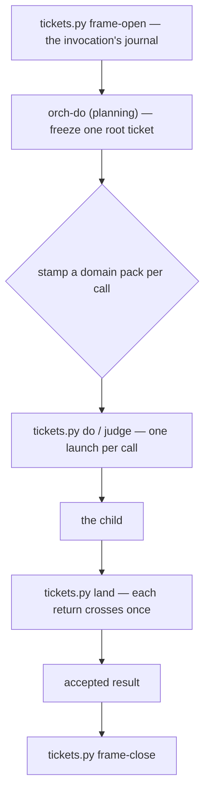

# orchflows

A skill library that turns Claude Code, Codex or Grok Build into an
orchestrator: subagents that work in parallel, real verification of
everything they produce, and workflows that improve themselves. You
just talk; it picks the right workflow.

## Install

    git clone https://github.com/DanMcInerney/orchflows
    cd orchflows
    ./install.sh          # install.cmd on Windows

Works with Claude Code, Codex and Grok Build, on Windows, macOS, and
Linux. It configures whichever CLI it finds. To update: `git pull`,
rerun. `python install.py doctor --quick` answers, in one line, whether
what is installed still matches the checkout you are standing in.

Each host keeps its own user-scope surface under its own home, and each
home has an override the installer follows: `CLAUDE_CONFIG_DIR`,
`CODEX_HOME`, `GROK_HOME`. Grok Build's is skills at
`~/.grok/skills/<name>/SKILL.md`, role agents in `~/.grok/agents/`, a
`[subagents]` block merged into `~/.grok/config.toml`, and the always-on
instruction layer as one whole installer-owned file,
`~/.grok/rules/orchflows.md`.

This is a user install, the only installation scope. It creates or reuses
`~/.orchflows/runtime`, a private Python
environment used by installed commands even when installation starts from
an active project environment. Runtime dependencies are declared in
`requirements-runtime.txt`, with exact hashes for the local UI server and its
transitive closure. A custom skill, pack or workflow declares its own in a
`requirements.txt` beside it, and `orchflows sync` builds each one its own
environment.
Dry runs create nothing, and user uninstall retains the private runtime for
explicit manual cleanup.

## Observe

The local UI shows the current workflow graph without changing it. From a
checkout, start it with `uv run --no-project python reader/scripts/ui.py`; an
installed copy runs through the private Python environment. It binds only to
`127.0.0.1`, serves its prebuilt assets offline, and exposes metadata rather
than prompts, tool output, or transcript contents. See the
[UI platform](reader/docs/platform.md) for installed commands, routes, security
boundaries, and the split between this platform and the dark-mode visual
experience that follows it.

## Use

Ask for things like you normally would. There are no skill names to
memorize.

    > why did memory double last release?
    # a cited answer from a read-only research lane

    > ship dark mode
    # one root ticket that cuts itself into tickets, parallel
    # subagents, one review pass, and a final verification against
    # what you asked for

    > fix the flaky login test
    # reproduce it, prove the cause, repair it, guard the repair

    > research the top three auth libraries, then integrate the winner
    # two root tickets, the second waiting on the first, automatically

    > browser-game this incomplete cooperative puzzle-game brief
    # a versioned program record, evidence-bound checkpoint, and
    # pack-stamped successor plan without invented product defaults

Small requests stay small; medium and large work earn structure only when
their graph does. Those sizes are explanatory, never fields on the work.
Nothing marks "done" except an external check passing.

## More ways to use it

Routing projects four lanes, smallest need first: `direct` when evidence
already decides and a change this session can make, check narrowly, and
record in its own medium's history; `worker` — one `tickets.py do` or
`judge`, for work wanting isolation or a checked landing; `team` for
work needing parallel children, resume, or an audit trail; and
`plan` when the goal itself is unresolved — a planning `orch-do`
freezes and seals the root before `team` drives it. Tripwires promote
on evidence, never prediction: a second concern mid-`direct` enters
`worker`, a child's scope splitting enters `team`, and an unknown or
unverified cause investigates before anything edits. Everything else
runs only when you name it, so the routing table never
grows as the library does. The table is installed at
`~/.orchflows/host-block.md`, the one surface every turn already pays
for; [vocabulary.md](docs/vocabulary.md)'s routing-shape entry owns what
may enter it. If routing gets in the way, the router's off flag stands
it down for the session.

Name the callables yourself when you want a specific shape:

    > loop the build until `pytest -q` exits 0
    > orch-judge this cache design — rank what it gets wrong
    > evolve this blog post — no benchmark, derive a blind judge panel
    > evolve the summarizer prompt against the frozen benchmark

Or build your own workflow in plain English:

    > build me a workflow that researches, then builds, then always
      updates the documentation afterwards (favoring edits and
      deletions over additions), and automatically PRs and merges it

That gets admitted as a named workflow — a skill whose prose calls the
callables in order, with one end-to-end done check at the end. It's
project-local and callable by name from then on, like a
`/site-work-and-merge` you own.

Runs survive session death: every ticket is a file in one per-user
state sink outside every repository, so a fresh context — in any
checkout — resumes mid-flight. What a ticket is — anatomy, lifecycle,
review, failure handling — is [TICKETS.md](TICKETS.md).

Team setup: each teammate runs the user install. Repository-local custom
skills and workflows are ordinary repository work under
`<repo>/.orchflows`, governed by
[custom workflow authoring](docs/custom-workflow-authoring.md); they are not an installation scope. Uninstall:
`python install.py --user --uninstall` removes only what it generated;
`--dry-run` previews whether runtime apply will create, reuse, or repair.
`--claude-adapters {all,four}` chooses how much of the library
Claude gets first-class adapters for — `all` (the default) mints one per
package and workflow, `four` mints only `orch-do` and
`orch-judge` and leaves every other name to resolve at
`by-name/`. Default model and effort per role, all three hosts:
[profiles.md](hosts/profiles.md). Edit
a rendered role agent to run your own; installs ask before replacing it
and keep it by default.

## The interesting parts

### It improves itself

Every run auto-logs its friction — retries, missing inputs,
workarounds — under an always-on law, and `trace.py` extracts each
session's requests, narration and tool calls into one event record.
the improvement workflow mines those logs into proposals you accept or
reject, each scoped to where the change lands: your **environment** (a
missing interpreter, a broken tool), your **project** (code or docs
that keep causing friction), or the **workflows** themselves. Real
proposals from my own usage:

- Offload a repeated piece of agent reasoning to a deterministic script
- A tiny AGENTS.md addition pointing agents at the packaged Python
  instead of whatever `python` is on `$PATH`
- Remove overlapping verification steps from a workflow to speed it up
- Add a documentation-update step a user kept requesting manually

Chain any callables and put the improvement workflow last and you have a
workflow that upgrades itself:

    > my release workflow: investigate what merged since the last
      tag → a root ticket for the release notes under the content pack
      → improvement proposal

The coolest part: it runs on itself. I run the improvement workflow across
all sessions in a project, then point a second run at the first one.

### Tournaments: evolve and benchmaker

The `benchmaker` workflow builds a qualified benchmark for any
target with an observable outcome — a prompt, a skill, a script. The
`evolve` workflow then runs a tournament against it:
bounded generations planned deterministically from settled public outcomes,
blind judges, and promotion only when a frozen rule and margin are beaten.
Together they turn "make this
better" into a measured campaign instead of vibes. The dataflow is in
[example-workflows/benchmaker/SKILL.md](example-workflows/benchmaker/SKILL.md);
`skill-tournament` applies
the same loop to the library's own skills.

### Visualize anything

`orch-do` renders a supplied subject as a verified visual page when
the design pack is stamped, choosing diagrams, panels, or charts from its
relationships. This delivery view points to
[`orch-do`](skills/kernel/orch-do/SKILL.md), which both plans the root and
builds each unit; [verification](rules/verification.md) owns acceptance.
This view shows the one path every return crosses; that rule owns its
details:

```mermaid
flowchart TD
    frame["tickets.py frame-open — the invocation's journal"] --> plan["orch-do (planning) — freeze one root ticket"]
    plan --> pack{"stamp a domain pack per call"}
    pack --> callable["tickets.py do / judge — one launch per call"]
    callable --> exec["the child"]
    exec --> join["tickets.py land — each return crosses once"]
    join --> accepted["accepted result"]
    accepted --> close["tickets.py frame-close"]
```

## Design

### The problem

Skill libraries break the same four ways:

- **Overly specific, handcrafted prompts.** As models get smarter,
  overprescription degrades output quality.
- **Manual chaining by the user.** First run `/brainstorm`, then run
  `/to-prd`, then run... blah blah blah.
- **Domain-specific.** The workflow for writing a blog is basically the
  workflow for shipping a feature: outline the goal, build each section
  in parallel, review the output for cohesion and consistency. You
  don't need a `/write-blog` skill and a `/build-feature` skill.
- **Static.** Run 100 hits the same snags as run 1.

orchflows answers each in structure: tiny composable skills where
every word fights for its life; autorouting instead of memorized
chains; domain-blind workflows retargeted by data packs; and
self-improvement wired into every run.

### Legos

- **Two callables, every job.** `orch-do` produces each unit and, in its
  planning mode, freezes the root; `orch-judge` challenges Goal and
  evidence. Each has one minting command that mints, seals, establishes
  and launches it. A ticket's `done` predicate decides Goal at `land`.
  Control flow is not a callable: loops, branches and retries are the
  calling workflow's own prose, and a `frame` ticket is the durable stack
  frame under them.
- **One stud pattern.** Six contracts — dispatch, work-item, verdict,
  worklog, pack-signature, result — are the only interfaces. Anything
  that emits one plugs into anything that takes one.
- **One return shape.** Every ticket attempt closes through the dispatch
  outcome envelope: `assignment_seal`, `dispatch_id`, `outcome_record_id`,
  writer, and evidence. The durable result identity then feeds any
  successor's evidence, carried forward as one verbatim `artifact:` line,
  so a chain needs no per-pair glue.

You snap callables by naming them; the agent snaps them by routing. Same
callables either way.

### One command out, one command back

Sending work to a subagent and getting it back used to be a hand-typed
sequence — read the host file, pick the model, write the child's prompt,
then import, join, and clean up afterwards. Each of those is now one command.

`tickets.py do` (and `judge`, its read-only twin) is the whole outbound
half in one transaction: it mints the ticket under its parent, seals it,
pins the pack, creates the isolated worktree the child will work in,
opens the attempt, and hands back one `launch` object naming the exact
agent, model and effort, and carrying the whole prompt the child is given
— the ticket's path, its workspace, the interpreter, the pack's craft, the
filing commands. The orchestrator's job is to invoke it verbatim. `tickets.py land` is the whole inbound
half: import the result, adjudicate it at the join, retire the worktree,
and report what became ready to dispatch next. A ticket you wrote by hand
takes the same `do --goal-file` (and `--details-file`) command — there is
no second command for hand-authored work.

That split is the honest line between mechanical and judgment. Both
commands are pure bookkeeping — replayable, refusing before they touch
anything. What stays a judgment call is what the work *is* and whether
it is good: the root, the calls, the review. The granular commands are
still there for recovery; nothing needs them on a healthy path.

### Skills and workflows

    orchflows
    │
    ├── Layer 0 · contracts/ — the narrow waist: pure data shapes, the only
    │                         interface between everything above them
    ├── Layer 1 · skills/    — everything callable: kernel/ primitives that call no
    │                         skill, workflows/ assembled from them
    ├── Layer 2 · packs/     — per-domain data (code, content, research, design, data),
    │                         never control flow
    └── Layer 3 · example-workflows/ — named workflows, callable like any skill

Four layers, dependencies pointing one way. `ARCHITECTURE.md` is the
codemap — what lives where, who owns it — and `ls` is the current list;
this README does not keep a second copy of it.

### Packs

    packs/
    ├── orch-code-pack     — delivers code        · tests and checks       · executor orch-do
    │                        workspace: git, one worktree per work item
    ├── orch-content-pack  — delivers documents   · artifact evidence     · executor orch-do, assembly stage
    │                        workspace: document tree with outline slots
    ├── orch-data-pack     — delivers analyses    · reproduction evidence · executor orch-do, assembly stage
    │                        workspace: git, datasets pinned by digest manifest
    ├── orch-design-pack   — delivers rendered UI · capture evidence      · executor orch-do
    │                        workspace: git plus render (view × breakpoint × state)
    └── orch-research-pack — delivers answers     · source evidence       · executor orch-do, assembly stage
                             workspace: evidence store of lane packets

A pack is pure data — no control flow. It supplies the domain's
vocabulary, artifact evidence, workspace rules, and design principles,
all satisfying one frozen pack-signature, so everything the library
builds inside a domain stays cohesive. Stamp a different pack on the
root ticket and the identical pipeline ships code, documents, research,
analyses, or UI.

Each pack is read three ways through two callables — its **making** taste when
`orch-do` produces work, its **planning** taste when `orch-do` freezes a
root instead, telling the planner what a well-formed one looks like in
that domain and which questions are worth asking before sealing it, and
its **review** taste when `orch-judge` challenges the result. Same data,
three projections; the signature says which sections each reads.

### Advantages over Anthropic's Dynamic Workflows

Against the shipped runtime as documented on 2026-08-15
([the workflows docs](https://code.claude.com/docs/en/workflows)) —
saved workflows are no longer the difference, so this is what is:

- **Cross-harness.** One library drives Claude Code, Codex and Grok
  Build.
- **Verification is contractual, not merely available.** Adversarial
  review is house advice there; here Goal, executor evidence, and the
  applicable independent path stand between an executor's claim and "done".
- **Self-improving.** Nothing there mines runs into fixes; here friction
  and traces feed the improvement workflow, including on itself.
- **Survives session death.** Exit mid-run and a workflow starts fresh
  there; here every ticket is a file in a per-user state sink, so any
  fresh context in any checkout resumes mid-flight.
