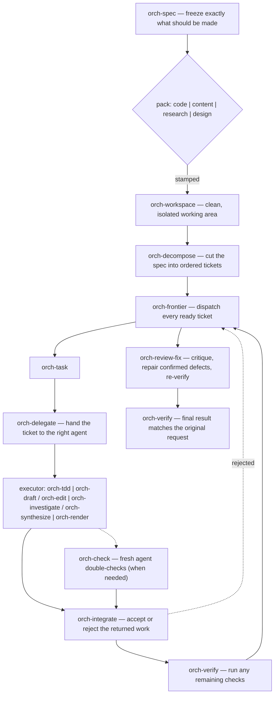

# orchflows

A skill library that turns Claude Code or Codex into an orchestrator:
subagents that work in parallel, real verification of everything they
produce, and workflows that improve themselves. You just talk; it
picks the right workflow.

## Install

    git clone https://github.com/DanMcInerney/orchflows
    cd orchflows
    ./install.sh          # install.cmd on Windows

Works with Claude Code and Codex, on Windows, macOS, and Linux. It
configures whichever CLI it finds. To update: `git pull`, rerun.

## Use

Ask for things like you normally would. There are no skill names to
memorize.

    > why did memory double last release?
    # a cited answer from a read-only research lane

    > ship dark mode
    # a frozen spec, tickets, parallel subagents, one review gate,
    # and a final verification against what you asked for

    > fix the flaky login test
    # reproduce it, prove the cause, repair it, guard the repair

    > research the top three auth libraries, then integrate the winner
    # a research run chained into a code run, automatically

Small requests stay small — a one-line question costs a one-line
answer. Big requests get real project structure. Nothing marks "done"
except an external check passing.

## More ways to use it

Routing has four branches — answer, ad-hoc, deliver, fix — and picks
the smallest one that can prove it's done. Everything else runs only
when you name it, so the routing table never grows as the library
does. The routing law is `rules/topology.md` §2, installed at
`~/.orchflows/host-block.md`. If routing gets in the way, `orch-off`
stands it down for the session.

Name the bricks yourself when you want a specific shape:

    > orch-loop orch-deliver until `pytest -q` exits 0
    > orch-panel these three cache designs — blind judges, pick one
    > evolve the summarizer prompt against the frozen benchmark

Or build your own workflow in plain English:

    > build me a workflow that does spec > deliver, then always updates
      the documentation afterwards (favoring edits and deletions over
      additions), and automatically PRs and merges it

That gets admitted as a composition — a workflow file made of three
combinators (`seq`, `par`, `loop`) over skills and other compositions,
with its own rules and one end-to-end done check. It's project-local
and callable by name from then on, like a `/site-work-and-merge` you
own. `orch-compose` is the engine that runs any composition, including
the chains routing builds for multi-part requests.

Runs survive session death: specs, tickets, and worklogs are files in
`.orch/`, so a fresh context resumes mid-flight.

Team setup: `python install.py --project PATH` writes a committable
routing block for a repo. Uninstall: `python install.py --user
--uninstall` removes only what it generated; `--dry-run` previews
either. Default model bindings: the planner/reviewer is Fable 5 on
high effort (Claude Code) or GPT-5.6 Sol on ultra (Codex); workers are
Sonnet 5 on xhigh and GPT-5.6 Sol on high.

## The interesting parts

### It improves itself

Every run auto-logs its friction — retries, missing inputs,
workarounds — under an always-on law, and `trace.py` records each
session's reasoning and secret-redacted tool calls.
`orch-self-improve` mines those logs into proposals you accept or
reject, each scoped to where the change lands: your **environment** (a
missing interpreter, a broken tool), your **project** (code or docs
that keep causing friction), or the **workflows** themselves. Real
proposals from my own usage:

- Offload a repeated piece of agent reasoning to a deterministic script
- A tiny AGENTS.md addition pointing agents at the packaged Python
  instead of whatever `python` is on `$PATH`
- Remove overlapping `orch-verify` steps from a workflow to speed it up
- Add a documentation-update step a user kept requesting manually

Chain any bricks and put `orch-self-improve` last and you have a
workflow that upgrades itself:

    > my release workflow: orch-investigate what merged since the last
      tag → orch-deliver the release notes under the content pack →
      orch-self-improve

The coolest part: it runs on itself. I run `orch-self-improve` across
all sessions in a project, then point a second run at the first one.

### Tournaments: evolve and benchmaker

The `benchmaker` composition builds a qualified, immutable benchmark
for any target with an observable outcome — a prompt, a skill, a
script. The `evolve` composition then runs a tournament against it:
bounded generations of candidates, blind judges, promotion only when a
frozen rule and margin are beaten. Together they turn "make this
better" into a measured campaign instead of vibes. The dataflow is in
[docs/benchmaker.md](docs/benchmaker.md); `skill-tournament` applies
the same loop to the library's own skills.

### Visualize anything

`orch-visualize` renders anything you hand it as a verified visual
page — a workflow, your session trace, a codebase, a process from a
doc — choosing the form per subject: Mermaid graphs (ELK layout),
styled HTML panels for timelines and comparisons, Vega-Lite charts
for data. Every visual is syntax-checked and legibility-linted before
it comes back. This is its drawing of the pipeline that ships every
orchflows delivery:

```mermaid
flowchart TD
    spec["orch-spec — freeze exactly what should be made"] --> pack{"pack: code | content | research | design"}
    pack -->|stamped| ws["orch-workspace — clean, isolated working area"]
    ws --> dec["orch-decompose — cut the spec into ordered tickets"]
    dec --> frontier["orch-frontier — dispatch every ready ticket"]
    frontier --> task["orch-task"]
    task --> del["orch-delegate — hand the ticket to the right agent"]
    del --> exec["executor: orch-tdd | orch-draft / orch-edit | orch-investigate / orch-synthesize | orch-render"]
    exec -.-> chk["orch-check — fresh agent double-checks (when needed)"]
    exec --> integ["orch-integrate — accept or reject the returned work"]
    chk --> integ
    integ -.->|rejected| frontier
    integ --> ver1["orch-verify — run any remaining checks"]
    ver1 --> frontier
    frontier --> gate["orch-review-fix — critique, repair confirmed defects, re-verify"]
    gate --> final["orch-verify — final result matches the original request"]
```

## Design

### The problem

Skill libraries break the same four ways:

- **Overly specific, handcrafted prompts.** As models get smarter,
  overprescription degrades output quality.
- **Manual chaining by the user.** First run `/brainstorm`, then run
  `/to-prd`, then run... blah blah blah.
- **Domain-specific.** The workflow for writing a blog is basically the
  workflow for shipping a feature: outline the goal, build each section
  in parallel, review the output for cohesion and consistency. You
  don't need a `/write-blog` skill and a `/build-feature` skill.
- **Static.** Run 100 hits the same snags as run 1.

orchflows answers each in structure: tiny composable skills where
every word fights for its life; autorouting instead of memorized
chains; domain-blind workflows retargeted by data packs; and
self-improvement wired into every run.

### Legos

- **One brick, one job.** `orch-deliver` ships, `orch-critique`
  attacks, `orch-judge` scores blind, `orch-loop` iterates, the `fix`
  composition proves the cause before repairing it.
- **One stud pattern.** Eight frozen contracts — spec, work-item,
  delegation, verdict, worklog, pack-signature, composition, result —
  are the only interfaces. Anything that emits one plugs into anything
  that takes one.
- **One return shape.** Every dispatchable unit returns one result
  envelope — status, result identity, verification — so any unit's
  output feeds any successor's evidence. Three combinators — `seq`,
  `par`, `loop` — are the whole grammar; a composition is just those
  combinators over named bricks, written down in a file.
- **Swappable baseplates.** Workflows are domain-blind; a pack
  (code | content | research | design) is pure data that retargets
  the whole tower. The pipeline that ships a feature also ships a
  research report — swap one pack, change zero control flow.

You snap bricks by naming them; the agent snaps them by routing. Same
bricks either way.

### Skills and workflows

    orchflows
    │
    ├── Layer 0 · contracts/ — Shared forms that keep every part of the system speaking the same language
    │   ├── composition    — Defines a named workflow: steps, edges, invariants, done check
    │   ├── delegation     — Says what another agent should do, use, avoid, and return
    │   ├── pack-signature — Lists what every project-type setup must provide
    │   ├── result         — The envelope every unit returns: status, result identity, verification
    │   ├── spec           — Records exactly what the user wants made
    │   ├── verdict        — Records whether a check passed and what proves it
    │   ├── work-item      — Describes and tracks one piece of work
    │   └── worklog        — Records the progress and current state of a larger job
    │
    ├── Layer 1 · skills/ — Things the agents know how to do
    │   │
    │   ├── kernel/ — Basic building blocks used by the rest of the system
    │   │   ├── orch-check          — Has a fresh agent double-check the work and correct problems
    │   │   ├── orch-critique       — Reviews something and lists the most important problems
    │   │   ├── orch-decompose      — Breaks a large job into smaller pieces in the right order
    │   │   ├── orch-delegate       — Hands one clearly defined task to another agent
    │   │   ├── orch-elicit         — Asks the user when a decision cannot safely be made for them
    │   │   ├── orch-integrate      — Decides whether returned work is acceptable and can be used
    │   │   ├── orch-investigate    — Researches one focused question using reliable evidence
    │   │   ├── orch-judge          — Rates one option using standards agreed on beforehand
    │   │   ├── orch-mechanize      — Turns a repeatedly performed step into a reusable script
    │   │   ├── orch-synthesize     — Combines findings from several sources into one answer
    │   │   ├── orch-verify         — Runs the agreed checks to see whether the work passes
    │   │   ├── orch-worklog        — Updates the job's progress record
    │   │   └── orch-workspace      — Prepares a clean and safe place in which to work
    │   │
    │   ├── engines/ — Reusable ways of organizing work
    │   │   ├── orch-task      — Takes one ready piece of work from start to acceptance
    │   │   ├── orch-frontier  — Starts each piece of work as soon as the work it needs is finished
    │   │   ├── orch-loop      — Repeats work until an agreed check says it is done
    │   │   ├── orch-panel     — Uses several independent reviewers to compare choices fairly
    │   │   └── orch-compose   — Runs a saved workflow step by step and checks the whole at the end
    │   │
    │   ├── workflows/ — Complete processes made from the smaller building blocks
    │   │   ├── orch-build         — Creates or changes a reusable part of the orchflows library
    │   │   ├── orch-deliver       — Runs a project from the agreed plan to a checked final result
    │   │   ├── orch-diagnose      — Reproduces a problem and finds what is actually causing it
    │   │   ├── orch-eval-design   — Freezes candidate-blind evaluation semantics before construction
    │   │   ├── orch-repair        — Applies the smallest change that fixes a known problem
    │   │   ├── orch-review-fix    — Reviews the result once, fixes valid problems, and checks it again
    │   │   ├── orch-fixture       — Saves a finished task as an example that can be run again later
    │   │   ├── orch-self-improve  — Studies past difficulties and proposes improvements to the system
    │   │   ├── orch-spec          — Turns a request into a clear, agreed plan
    │   │   └── orch-triage        — Sorts a list of work into what is ready, blocked, or needs a person
    │   │
    │   ├── instances/ — Skills that perform a particular kind of hands-on work
    │   │   ├── orch-tdd               — Writes software in small steps and checks each step with tests
    │   │   ├── orch-resolve-conflicts — Decides how to combine two sets of changes that clash
    │   │   ├── orch-draft             — Writes one section using only the supplied information
    │   │   ├── orch-edit              — Combines separate sections into one consistent document
    │   │   └── orch-render            — Builds a screen and checks how it actually looks and behaves
    │   │
    │   └── utilities/ — Small optional helpers
    │       ├── orch-visualize — Turns supplied information into a visual page
    │       └── orch-off       — Stops orchflows from automatically choosing skills
    │
    ├── Layer 2 · packs/ — Setups for different kinds of projects
    │   ├── orch-code-pack     — Tells the system how to organize, save, and check software work
    │   ├── orch-content-pack  — Tells the system how to organize and review written documents
    │   ├── orch-research-pack — Tells the system how to answer questions using trustworthy sources
    │   └── orch-design-pack   — Tells the system how to build and visually check interfaces
    │
    └── Layer 3 · compositions/ — Named workflows built from the skills, callable like any skill
        ├── benchmaker           — Builds and qualifies an immutable runnable benchmark
        ├── drift-canary         — Reruns known examples to detect changes in agent behavior
        ├── evolve               — Produces several versions and selects the strongest one
        ├── fix                  — Finds the cause of a problem, repairs it, and proves it stays fixed
        ├── improvement-delivery — Turns an approved process improvement into a tested change
        ├── renovate             — Reviews an existing project and completes selected improvements
        └── skill-tournament     — Tests competing versions of a skill to see which works best

Four layers, dependencies pointing one way. `contracts/` is the narrow
waist: eight hash-pinned data shapes that are the only interfaces
between skills. `skills/` is everything callable — kernel primitives
that call no other skill, engines that add control flow, workflows
assembled from both, instances that do the domain's hands-on work, and
a couple of utilities. `packs/` is per-domain data, never control flow.
`compositions/` is the stdlib: normative, admitted workflow files over
skills and other compositions, each declaring how it enters (`routed`
in the intake table, `named` only on request, or `scheduled`), its
invariants, and one done check over the whole chain.

### Work routing

    UNITS OF WORK — the orchflows ladder
    │
    ├── (floor) Tested script
    │     no model, no ticket — a unit of certainty, not of work
    │     orch-mechanize keeps pushing repetition down here
    │
    ├── U0 — Direct answer
    │     question answered from context already in hand
    │     no deliverable change → no record, no ticket
    │
    ├── U1 — Verified ad-hoc ticket
    │     one ticket + one execution + one external verdict
    │     U1×N: a small ticket graph with edges, run on the frontier
    │
    ├── U2 — The run (spec → delivery)
    │     a frozen spec governs a ticket graph → rolling frontier →
    │     one review gate → final verification
    │
    └── U3 — Composition
          control flow OVER units: chained runs, goal loops

Every request lands on the cheapest rung that can still prove it's
done. A question you can answer from context costs nothing; a small fix
gets one ticket and one external verdict; only work that genuinely
needs a frozen spec pays for one; and repetition keeps getting pushed
below the floor into tested scripts that need no model at all.

### Packs

    packs/
    ├── orch-code-pack     — delivers code        · deterministic oracles · executor orch-tdd
    │                        workspace: git, one worktree per work item
    ├── orch-content-pack  — delivers documents   · judged oracles        · executor orch-draft, assembly orch-edit
    │                        workspace: document tree with outline slots
    ├── orch-design-pack   — delivers rendered UI · capture oracles       · executor orch-render
    │                        workspace: git plus render (view × breakpoint × state)
    └── orch-research-pack — delivers answers     · evidence oracles      · executor orch-investigate, assembly orch-synthesize
                             workspace: evidence store of lane packets

A pack is pure data — no control flow. It supplies the domain's
vocabulary, oracle classes, executors, workspace rules, and design
principles, all satisfying one frozen pack-signature, so everything the
library builds inside a domain stays cohesive. Stamp a different pack
on the spec and the identical pipeline ships code, documents, research,
or UI.

### Advantages over Anthropic's Dynamic Workflows

- **Cross-harness.** One library drives both Claude Code and Codex, on
  Windows and POSIX.
- **Workflows persist.** A custom workflow is admitted as a
  project-local skill — versioned, callable by name, improvable — not
  regenerated from scratch each session.
- **Verification is structural.** Named oracles, fresh-context
  checkers, and one review gate stand between an executor's claim and
  "done" — the agent never grades its own homework.
- **Self-improving.** Friction and full session traces are always
  logged; `orch-self-improve` mines them into concrete fixes to the
  workflows themselves — including to itself.
- **Survives session death.** Specs, tickets, and worklogs are files in
  `.orch/`, so any fresh context can resume a run mid-flight.
- **Smallest-first routing.** One intake for everything: a one-line
  question never pays workflow ceremony, and a launch never gets
  typo-fix rigor.
