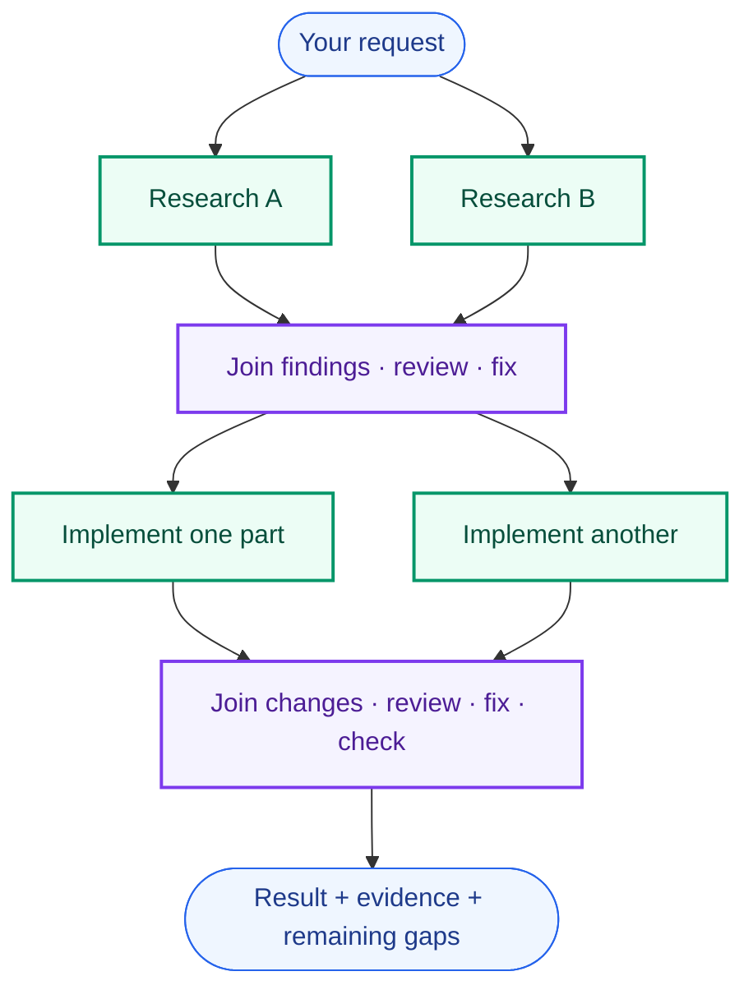
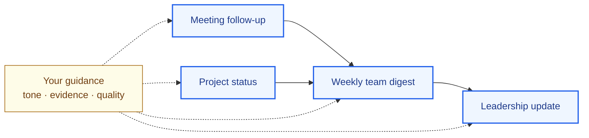

# orchflows

**Build an agent workflow once. Reuse it inside bigger jobs.**

Stop re-explaining your process in every agent session. Orchflows saves it as small Markdown workflows for Codex, Claude Code and other agents with native subagents.

Two primitives—**work** and **independent review**—compose into research, coding, creative work and improvement loops. Your process lives in workflows; your standards and model-specific corrections live in editable guidance.

**A better model should need fewer instructions, not a new workflow architecture.**

## Try it

Requires Python 3.11+ and a supported agent host.

```sh
git clone https://github.com/DanMcInerney/orchflows.git
cd orchflows
python scripts/orchflows.py setup
```

Start a new agent session, then ask:

> Use orch-dynamic-workflow to research two approaches to this feature, review the recommendation, implement it, and review the combined result.

The coordinator can assemble this task-specific process:


```mermaid
flowchart TB
    T([Your request]) --> A[Research A] & B[Research B]
    A & B --> R["Join findings · review · fix"]
    R --> C[Implement one part] & D[Implement another]
    C & D --> F["Join changes · review · fix · check"]
    F --> O([Result + evidence + remaining gaps])
    classDef work fill:#ecfdf5,stroke:#059669,color:#064e3b,stroke-width:2px;
    classDef review fill:#f5f3ff,stroke:#7c3aed,color:#4c1d95,stroke-width:2px;
    classDef outcome fill:#eff6ff,stroke:#2563eb,color:#1e3a8a;
    class A,B,C,D work;
    class R,F review;
    class T,O outcome;
```

The task determines stages and staffing. A clear change may need direct work and one reviewer. Dynamic defaults to one final review, adding intermediate gates where later work depends on important decisions. Each gate it adds permits at most one repair pass.

Dynamic is available for automatic selection on ordinary tasks; explicitly named workflows take precedence. Automatic selection is a model decision, so name it when you require its process.

## Turn a good process into a library

> Use orch-build-workflow to create a reusable meeting follow-up workflow from these example notes. Extract actions, draft emails, and prepare calendar invitations.

The builder saves the workflow, rehearses it with realistic synthetic data and simulated external effects, then independently reviews it. **Your examples are read-only references. A rehearsal does not send real emails or invitations.** Untestable integrations remain explicit gaps.

Later, compose that workflow with others:


```mermaid
flowchart LR
    A[Meeting follow-up] --> B[Weekly team digest]
    C[Project status] --> B
    B --> D[Leadership update]
    G["Your guidance<br/>tone · evidence · quality"] -.-> A & B & C & D
    classDef workflow fill:#eff6ff,stroke:#2563eb,color:#1e3a8a,stroke-width:2px;
    classDef guidance fill:#fefce8,stroke:#a16207,color:#713f12;
    class A,B,C,D workflow;
    class G guidance;
```

Like functions in a Python library, workflows can call other workflows. One coordinator applies their procedures and launches actual workers. Loading another workflow does not create another orchestrator.

## Five built-ins, two primitives

| Skill | What it does | Invocation |
| --- | --- | --- |
| [`orch-work`](skills/orch-work/SKILL.md) | Delegate a result to a fresh worker. | Explicit |
| [`orch-review`](skills/orch-review/SKILL.md) | Get a fresh non-maker's judgment, without repairs. | Explicit |
| [`orch-review-revise-once`](skills/orch-review-revise-once/SKILL.md) | Review an existing result, repair at most once, run checks. | Explicit |
| [`orch-build-workflow`](skills/orch-build-workflow/SKILL.md) | Create or improve a reusable workflow or guidance. | Explicit |
| [`orch-dynamic-workflow`](skills/orch-dynamic-workflow/SKILL.md) | Compose and execute the current task. | Automatic or explicit |

The last three compose the first two. Only the coordinator delegates; children receive concrete assignments and relevant guidance. Your host runs the agents. Orchflows supplies no agent runtime, scheduler or workflow language.

## Keep taste out of the plumbing

Workflows express dependencies, independence, review gates and stopping conditions. Guidance expresses what good work looks like: research standards, coding preferences, writing style or a brand's voice.

For example, `code.api.md` specializes `code.md`. A personal library can add its own `guidance/code.md`. Select only the domains and extensions the task needs; a marketing preference does not spill into a sibling research assignment.

When a model stops needing a corrective instruction, test removing that instruction from guidance. Keep the process and the preferences you still care about. [How composition and guidance work](DESIGN.md).

## Start from an example

Optional libraries install separately:

```sh
python scripts/orchflows.py setup --example social-search
```

| Library | Use it for |
| --- | --- |
| [Social search](https://github.com/DanMcInerney/orchflows/tree/main/example-workflows/social-search) | Parallel source research and independent evidence ranking. |
| [Short video](https://github.com/DanMcInerney/orchflows/tree/main/example-workflows/short-video) | Script, render and review a finished video. |
| [Software factory](https://github.com/DanMcInerney/orchflows/tree/main/example-workflows/software-factory) | Bounded implementation, checks, review and authorized release. |
| [Evolve](https://github.com/DanMcInerney/orchflows/tree/main/example-workflows/evolve) | Compare challengers against an incumbent and retain improvements. |
| [Design loop](https://github.com/DanMcInerney/orchflows/tree/main/example-workflows/design-loop) | Develop and evaluate successive increments; experimental. |
| [Benchmaker](https://github.com/DanMcInerney/orchflows/tree/main/example-workflows/benchmaker) | Build a runnable benchmark for a capability; experimental. |

[All libraries](https://github.com/DanMcInerney/orchflows/tree/main/example-workflows), including game development, source acquisition, candidate comparison, self-improvement and standalone export. Libraries declare their dependencies; setup does not install them transitively.

## What the evidence says

These are instructions agents can misapply, not host-enforced guarantees. Trials have exposed skipped automatic selection, missed constraints and incomplete review. [Native trial record](https://github.com/DanMcInerney/orchflows/tree/main/tests/e2e).

In a published two-task software comparison, both approaches passed the fixed checks. Workflow review also caught a nested-JSON crash missed by the single agent, while using more time and tokens. One run per approach per task does not establish a general winner. [Prompts, implementations, measurements and artifacts](https://github.com/DanMcInerney/orchflows/tree/main/benchmarks/software-factory/2026-09-16).

## Setup, customization and updates

- Setup detects installed hosts and preserves existing settings. Codex, Claude Code, Antigravity and Grok Build use CLI registration; Kimi Code and ZCode receive remaining in-app steps. [Host support and limitations](docs/hosts.md).
- Edit your workflows in `~/.orchflows/libraries/`. The default authoring library is `personal`; the installed core under `.local/` is setup-managed.
- Specify model and effort per operation, stage or assignment. Current instructions override saved preferences; unspecified settings use native defaults. [Precedence](docs/architecture.md#model-and-effort).
- Update the checkout and rerun `python scripts/orchflows.py setup`. Use `doctor` for read-only checks. Concurrency changes only with `--concurrency N`. [Setup and updates](docs/home.md).
- Invocation settings differ by host: ZCode cannot enforce manual-only skills; Antigravity enforcement is unverified. [Invocation policy](docs/hosts.md#invocation-policy).

[Design report](DESIGN.md) · [Agent contracts](docs/architecture.md) · [Library authoring](docs/libraries.md) · [Native history](docs/history.md) · [MIT license](LICENSE)
