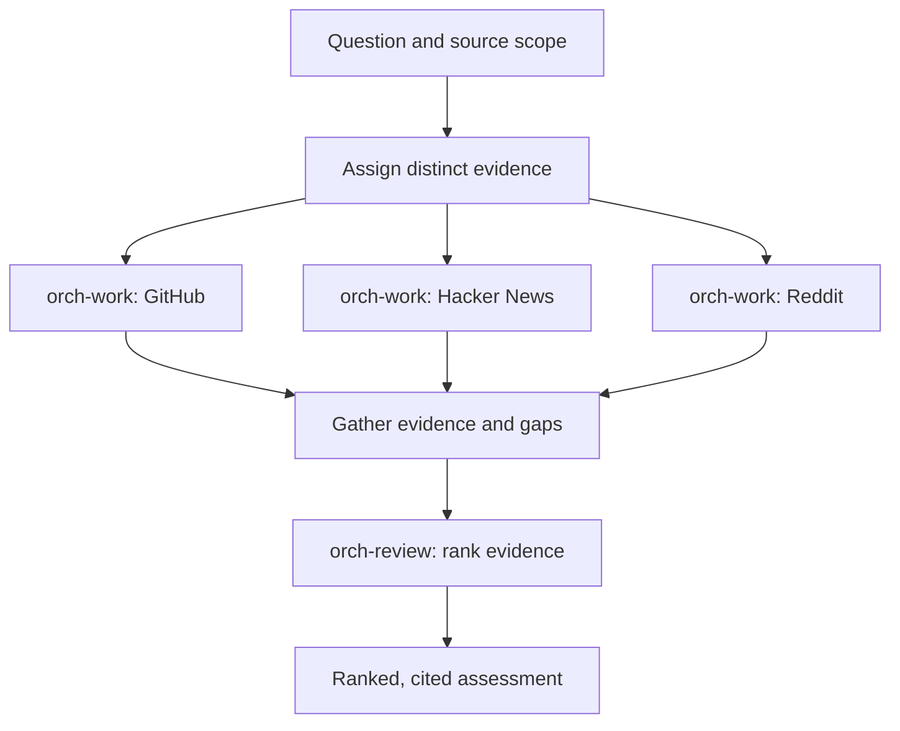
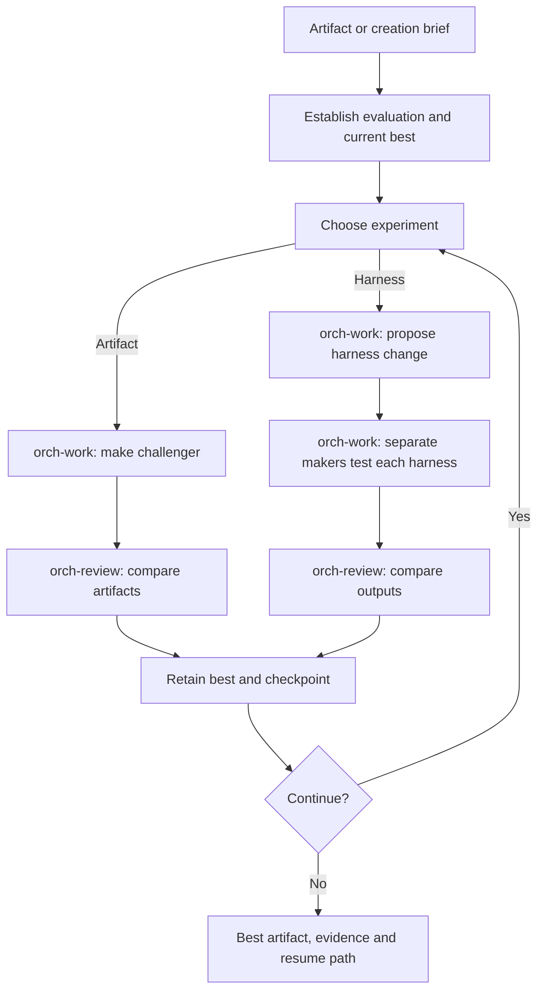

# orchflows

**Delete your skill libraries. You only need two skills.**

Compose these skills into infinitely complex, task-specific workflows, including self-improving loops.

[**Work**](skills/orch-work/SKILL.md) makes a result. [**Review**](skills/orch-review/SKILL.md) independently judges it. Everything else is composition.

## Why

Skill libraries keep growing around a model's current limitations. [gstack](https://github.com/garrytan/gstack#the-sprint) packages a prescribed engineering sprint and specialist roles. [Matt Pocock's skills](https://github.com/mattpocock/skills#why-these-skills-exist) encode practices such as grilling sessions, test-first development and debugging gates. [Superpowers](https://github.com/obra/superpowers#the-basic-workflow) specifies a mandatory development process, down to task size and review stages.

Our objection is overprescription. Too much of the agent's judgment has already been made for it: how to investigate, how small to divide the work, when to stop and ask, which sequence to follow. That makes a workflow inflexible and its execution less adaptive to the task. These libraries offer customization, and some already separate model overrides; the problem is how much procedure remains embedded in the skills themselves.

Overprescription also ages badly. A workaround for one model can become unnecessary ceremony for the next. A model that can now reason through a whole change still gets marched through steps written for one that could not. When those corrections are scattered across skills, every model release invites another round of workflow rewrites.

**Orchflows abstracts prescription into guidance and guidance extension documents.** The two skills handle making and reviewing. Workflows describe the relationships between those operations. Separate, modular documents hold domain preferences, task specializations and corrections for model weaknesses.

When a new model no longer needs a correction, delete it from the guidance or extension document. Keep the preferences you still care about. The two skills and your workflow structures stay unchanged across model upgrades; model-related churn belongs in these modular guidance documents.

## Install

Requires Python 3.11+ and Codex or Claude Code with native subagents.

```sh
git clone https://github.com/DanMcInerney/orchflows.git
cd orchflows
python scripts/orchflows.py setup
```

Run the two commands for your host:

```sh
# Codex
codex plugin marketplace add ~/.orchflows
codex plugin add orchflows-light@orchflows-home

# Claude Code
claude plugin marketplace add ~/.orchflows
claude plugin install orchflows-light@orchflows-home --scope user
```

Start a new session and ask for `orch-dynamic-workflow`. The plugin identifier remains `orchflows-light` for compatibility. [Setup options](docs/home.md#setup) · [Host registration and invocation](docs/hosts.md#register-and-refresh).

## Design

### Start with work and independent judgment

Give an agent a result to produce, then give another agent the result to assess. Keep the assignment specific and let the model choose how to do the work. Add instructions where you have a deliberate preference or an observed failure to correct.

| Skill | Contract |
| --- | --- |
| [orch-work](skills/orch-work/SKILL.md) | A fresh native child makes the requested result under selected **Make** guidance. |
| [orch-review](skills/orch-review/SKILL.md) | A fresh child who did not make the result assesses it under selected **Review** guidance, without fixing it. |

A reviewer can inspect code, judge a film, rank evidence or compare competing designs. The subject changes; the two operations do not.

### Compose the task

A workflow is a `SKILL.md` that connects these operations: what can run in parallel, what depends on what, what gets reviewed, and whether the result feeds another round. It supplies assignments, context and outputs. The same primitives support a single review, a research team, a production pipeline or an improvement loop.

The package includes three ready-made compositions: [dynamic work](skills/orch-dynamic-workflow/SKILL.md), [workflow building](skills/orch-build-workflow/SKILL.md) and [self-improvement from agent history](skills/orch-self-improve/SKILL.md). They compose the two primitives and show how to write your own. A workflow declares its agent count and any repetition; loops are part of the requested workflow.

Codex or Claude Code runs the agents. Orchflows adds no agent runtime, scheduler or workflow language. Loading a workflow applies its instructions in the current context; calling a primitive launches a child.

### Supply guidance separately

Guidance describes what good work means in a domain. Each document has a **Make** section for production and a **Review** section for assessment. For example, code guidance can require independently runnable tests; visual guidance can require inspection of the rendered result.

Select only the domains the task needs. A film might use `writing`, `visual-design` and `short-video`. A coding task might use `code` and `code.api`. The workflow's structure stays the same when its selected guidance changes.

### Extend only the differences

Guidance extension documents specialize a domain. `code.api.md` extends `code.md`; `short-video.marketing.md` adds marketing preferences to `short-video.md`. A brand can add `short-video.marketing.<brand>.md`. Each extension states what it adds or changes, without copying its parents.

Your libraries can also extend an existing domain with a `guidance/code.md` of their own. Keep corrections for a particular model separately removable in such a library. When the correction stops helping, remove the instruction or deselect that library. Model names do not become new domain names.

The outer workflow resolves guidance once, from general to specific. At each level it reads core guidance, then selected libraries in the supplied order. More specific guidance takes precedence within its domain; independent domains combine. Resolved paths and request context pass through to the workers and reviewers. See [guidance selection](docs/architecture.md#guidance-selection) for the complete contract.

## Example workflows

These three libraries show parallel collection, creative production and iterative improvement using the same two skills. Add one with `python scripts/orchflows.py setup --example <name>`, then [install it through your host](docs/hosts.md#register-and-refresh). Each library documents its tool dependencies.

### Social search

> Research how developers are using coding agents. Search GitHub, Hacker News and Reddit, then rank the strongest evidence.

[Social search](https://github.com/DanMcInerney/orchflows/tree/main/example-workflows/social-search) divides the question into distinct collection assignments and runs them in parallel. One independent reviewer ranks the combined evidence. Shared original sources have one owner; missing or failed collection remains visible as a gap.


```mermaid
flowchart TD
    Q[Question and source scope] --> A[Assign distinct evidence]
    A --> G["orch-work: GitHub"]
    A --> H["orch-work: Hacker News"]
    A --> R["orch-work: Reddit"]
    G --> E[Gather evidence and gaps]
    H --> E
    R --> E
    E --> J["orch-review: rank evidence"]
    J --> O[Ranked, cited assessment]
```

N collection assignments use N workers and one reviewer. Source-specific guidance shapes collection; shared research and writing guidance shapes the final assessment.

### Short video

> Make a 30-second launch film for this product. Deliver the editable project and the finished video.

[Short video](https://github.com/DanMcInerney/orchflows/tree/main/example-workflows/short-video) gives one maker the brief, then sends the actual rendered exports to a fresh reviewer. Genre, placement and brand requirements come from the brief and selected guidance.


```mermaid
flowchart LR
    B[Brief and selected guidance] --> M["orch-work: make film"]
    M --> E[Editable project and exports]
    E --> R["orch-review: inspect exports"]
    R --> D[Deliver film, source and findings]
```

One film uses one maker and one reviewer, including its placement versions. Additional films can run in parallel. The composition ends after review; a repair round is a separate requested step.

### Evolve

> Improve this game's performance for an hour while preserving gameplay. Also improve how you search for optimizations.

[Evolve](https://github.com/DanMcInerney/orchflows/tree/main/example-workflows/evolve) starts with an artifact or creation brief. It designs an evaluation when none is supplied, makes a challenger, independently compares it with the current best, and retains only confirmed improvements. Every experiment saves evidence and a checkpoint.


```mermaid
flowchart TD
    S[Artifact or creation brief] --> E[Establish evaluation and current best]
    E --> C[Choose experiment]
    C -->|Artifact| M["orch-work: make challenger"]
    M --> R["orch-review: compare artifacts"]
    R --> K[Retain best and checkpoint]
    C -->|Harness| H["orch-work: propose harness change"]
    H --> T["orch-work: separate makers test each harness"]
    T --> J["orch-review: compare outputs"]
    J --> K
    K --> B{Continue?}
    B -->|Yes| C
    B -->|No| O[Best artifact, evidence and resume path]
```

The working **harness** is the maker instructions, tools and search strategy used by the run. Evolve can test a change to that harness against its predecessor, then use the verified revision in later rounds. Its coordinating evaluation and promotion rules stay fixed during that comparison. Harness experiments use one proposer and two fresh makers per test case, with independent review of their outputs. A subjective winner requires confirmation from a second fresh reviewer.

The default is three rounds with one challenger per round. A continuous request removes the round cap; the host must keep executing or resume the checkpoint. A plateau changes the search strategy. It does not prove the artifact cannot improve.

## Structure

**One concept, one owner.** Put each instruction, fact or mechanism in one place and reference it everywhere else.

| Concept | Owner |
| --- | --- |
| Desired result, constraints, sources, dates and budgets | Your prompt |
| Coordination, dependencies, agent count and loops | Workflow `SKILL.md` |
| Quality preferences and domain extensions | `guidance/` |
| Package dependencies and required guidance | `references/library-context.md` |
| Shared knowledge and handoff contracts | Library `references/`; skill-local references for one consumer |
| Deterministic mechanics | The owning skill's `scripts/`, with sibling `tests/` |
| Package identity | Root `plugin.json` |
| Skill discovery | Native host manifests and catalogs |
| Agent execution and isolation | Codex or Claude Code |
| Results, checkpoints and run evidence | Your project workspace |

The repository follows those boundaries:

```text
skills/             two primitives and three built-in compositions
guidance/           domain preferences and extension documents
docs/               shared architecture and operating contracts
scripts/ + tests/   core setup, resolution and history tools
example-workflows/  optional libraries and runnable examples
plugin.json         package identity
```

The core checkout is for library development. Your editable libraries live in `~/.orchflows/libraries/`, with `personal` as the default for new workflows. Setup maintains the installed core under `~/.orchflows/.local/`. Edit the checkout or your libraries; keep task outputs in the project workspace.

The examples directory also includes `research-acquire` for public-source acquisition, `3d-browser-game` for Three.js game development, and the complete Nightbind game with editable Blender sources.

[Architecture](docs/architecture.md) · [Home and updates](docs/home.md) · [Host integration](docs/hosts.md) · [Agent history](docs/history.md) · [Authoring guidance](guidance/orchflows.md)
