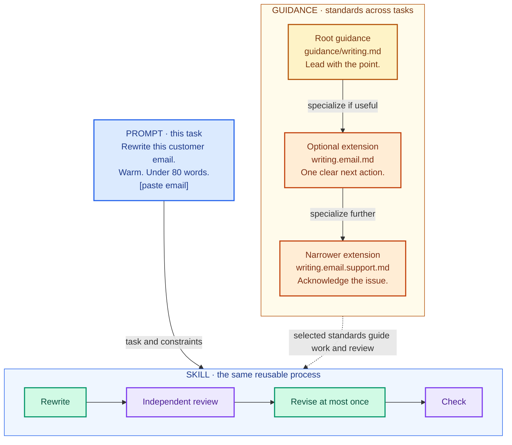
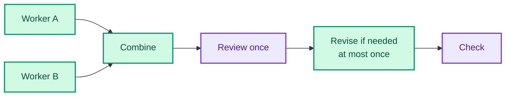
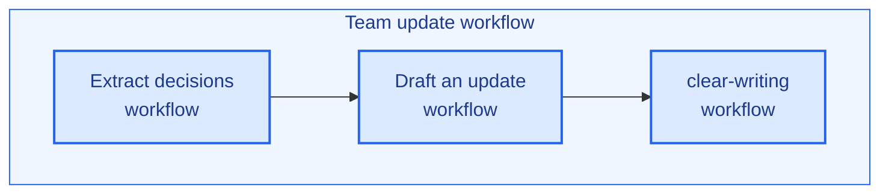

# orchflows

**Build an agent workflow once. Reuse it inside bigger jobs.**

## Install

Requires Python 3.11+ and an agent with native subagents, such as Codex or Claude Code. [Supported hosts](docs/hosts.md).

```sh
git clone https://github.com/DanMcInerney/orchflows.git
cd orchflows
python scripts/orchflows.py setup
```

Follow any host steps printed by setup, then start a new agent session.

## Build your first workflow

Make a **clear-writing** workflow. All you need is text to paste:

> Use orch-build-workflow to create clear-writing: have a worker rewrite my text concisely, then have an independent reviewer check that the meaning and tone survived. Revise at most once to address the review, check the changes, and return the final text with any unresolved concerns separately.

The [builder](skills/orch-build-workflow/SKILL.md) saves a Markdown skill in your personal library, rehearses it with sample text, and independently reviews it. It also checks host registration; follow any reported steps and start a new session to use it by name:

> Use clear-writing. Keep this friendly and under 25 words: "Just wanted to check if you could possibly send me the draft by Friday so I can take a look before our meeting on Monday."

Example result:

> Could you send me the draft by Friday so I can review it before Monday's meeting?

Next time, change the text, audience, or tone in your prompt. Reuse the same workflow.

## Try a dynamic workflow

For a task you only need once:

> Use orch-dynamic-workflow to develop three approaches to this message in parallel, combine the strongest ideas, then independently review and revise once if needed: "Our team should record meeting decisions."

[Dynamic](skills/orch-dynamic-workflow/SKILL.md) assembles and runs a process for the current task. It adapts the work and review to the task; simple tasks can use a direct check unless you request independent review. If you also ask to save the process, it uses Build to author and test the reusable workflow.

## Why save the process?

You find a process that works: split up the work, combine the results, get a second opinion, fix the issues. Then the next session starts, and you explain it all again.

Orchflows saves those choices in editable Markdown: **what happens, what gets checked, and when to stop.** Your host runs the agents; orchflows supplies the reusable process.

## Put specificity where it belongs

**Most task-specific detail belongs in the prompt.** Skills keep reusable steps. Root guidance docs hold shared standards; optional extension docs add increasingly specific preferences you want to reuse.


```mermaid
flowchart TB
    P["PROMPT · this task<br/>Rewrite this customer email.<br/>Warm. Under 80 words.<br/>[paste email]"]
    subgraph G["GUIDANCE · standards across tasks"]
        direction TB
        B["Root guidance<br/>guidance/writing.md<br/>Lead with the point."]
        E["Optional extension<br/>writing.email.md<br/>One clear next action."]
        S["Narrower extension<br/>writing.email.support.md<br/>Acknowledge the issue."]
        B -->|specialize if useful| E -->|specialize further| S
    end
    subgraph W["SKILL · the same reusable process"]
        direction LR
        A[Rewrite] --> R[Independent review] --> F[Revise at most once] --> C[Check]
    end
    P -->|task and constraints| W
    G -.->|selected standards guide work and review| W
    classDef prompt fill:#dbeafe,stroke:#2563eb,color:#1e3a8a,stroke-width:2px;
    classDef guidance fill:#fef3c7,stroke:#b45309,color:#78350f,stroke-width:2px;
    classDef extension fill:#ffedd5,stroke:#c2410c,color:#7c2d12,stroke-width:2px;
    classDef work fill:#d1fae5,stroke:#059669,color:#064e3b,stroke-width:2px;
    classDef review fill:#ede9fe,stroke:#7c3aed,color:#4c1d95,stroke-width:2px;
    class P prompt;
    class B guidance;
    class E,S extension;
    class A,F work;
    class R,C review;
    style G fill:#fffbeb,stroke:#b45309,color:#78350f;
    style W fill:#eff6ff,stroke:#2563eb,color:#1e3a8a;
```

The extension names above are examples you could add in your own library. A saved workflow selects only what applies: general writing → email → support email. Extensions refine shared standards; the current request still controls the task. [How guidance composes](DESIGN.md#how-does-guidance-compose).

## Start small. Compose upward.

**1. Make something, then get an independent review.**


```mermaid
flowchart LR
    W["orch-work<br/>Make a result"] --> R["orch-review<br/>Review the result"]
    classDef work fill:#d1fae5,stroke:#059669,color:#064e3b,stroke-width:2px;
    classDef review fill:#ede9fe,stroke:#7c3aed,color:#4c1d95,stroke-width:2px;
    class W work;
    class R review;
```

These are the two primitives: [work](skills/orch-work/SKILL.md) launches a fresh maker; [review](skills/orch-review/SKILL.md) launches a fresh reviewer who did not make the result. The reviewer reports findings without changing it.

**2. Work in parallel, then review the combined result.**


```mermaid
flowchart LR
    A[Worker A] & B[Worker B] --> J[Combine]
    J --> R[Review once] --> F["Revise if needed<br/>at most once"] --> C[Check]
    classDef work fill:#d1fae5,stroke:#059669,color:#064e3b,stroke-width:2px;
    classDef review fill:#ede9fe,stroke:#7c3aed,color:#4c1d95,stroke-width:2px;
    class A,B,J,F work;
    class R,C review;
```

The optional [shared library](https://github.com/DanMcInerney/orchflows/tree/main/example-workflows/shared) packages the last three steps as `shared:review-revise-once`. It stops after the checks, reporting anything unresolved.

**3. Use whole workflows as steps in a bigger workflow.**


```mermaid
flowchart LR
    subgraph U[Team update workflow]
        direction LR
        N["Extract decisions<br/>workflow"] --> D["Draft an update<br/>workflow"] --> C["clear-writing<br/>workflow"]
    end
    classDef workflow fill:#dbeafe,stroke:#2563eb,color:#1e3a8a,stroke-width:2px;
    class N,D,C workflow;
    style U fill:#eff6ff,stroke:#2563eb,color:#1e3a8a;
```

Each box can contain the patterns above—or other workflows. Your **clear-writing** workflow keeps its review and revision steps when reused here. One coordinator connects the procedures and delegates the actual work.

## Go further

- [Example libraries](https://github.com/DanMcInerney/orchflows/tree/main/example-workflows): research, software development, video, and improvement loops.
- [Setup and updates](docs/home.md) · [Host support](docs/hosts.md) · [Model and effort settings](docs/architecture.md#model-and-effort).
- [Design and built-ins](DESIGN.md) · [Library authoring](docs/libraries.md) · [Agent contracts](docs/architecture.md) · [Native history](docs/history.md).
- [Behavior tests and evidence](https://github.com/DanMcInerney/orchflows/tree/main/tests/e2e) · [MIT license](LICENSE).
