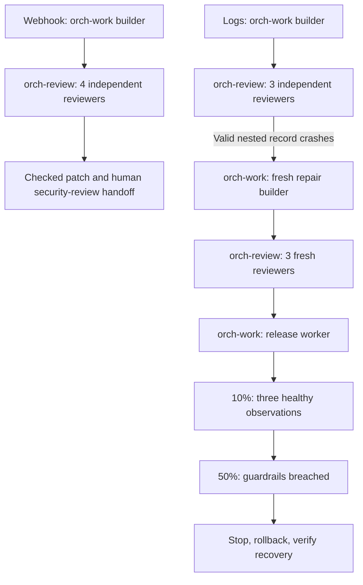

# Software factory comparison

The workflow caught and repaired a real log-processing edge case, at substantially higher time and token usage. Both approaches passed the fixed external suites. The single-agent log build still crashes on the review-discovered valid nested record. One run per case supports that specific finding, not a general reliability claim.

Merged [PR #203](https://github.com/DanMcInerney/orchflows/pull/203), commit `1a04d85254455012b9f73e2bced43218f9f755f5`. Both workflow builds used that exact version. The workflow was unchanged throughout, and final candidates were not repaired after external grading.

## Measured results

| Case | Approach | Fixed external checks | Warm search speedup | Build + handoff time | Agent contexts |
| --- | --- | ---: | ---: | ---: | ---: |
| Webhook inbox | Workflow | 28/28 | — | 25.6 min | 6 |
| Webhook inbox | Single agent | 28/28 | — | 17.2 min | 1 |
| Log archive | Workflow | 31/31 | 374.7× | 42.4 min | 10 |
| Log archive | Single agent | 31/31 | 620.8× | 16.4 min | 1 |

Times run from dispatch to the final native response, including coordination and handoff. Agent contexts include the workflow coordinator and all children; each control has exactly one. All used `gpt-6-astra` with `xhigh` effort, as recorded by the host. The application runtime was Windows/Python 3.14.6.

Both webhook builds correctly stopped for human security review, with no release attempts. Both log builds passed all eight independent release checks: three healthy observations at 10%, breach at 50%, no further advancement, baseline restoration, verified recovery, zero final exposure and unchanged released source. These are synthetic local observations with a disclosed injected failure; they test policy execution rather than diagnosis of an unknown outage.

Log performance was measured sequentially after all builders finished: 30,000 records, 16 queries per round, baseline/candidate then candidate/baseline, all timed answers independently checked. Workflow totals were 9.2733 seconds baseline / 0.02475 candidate; single-agent totals were 7.5936 / 0.01223 seconds. Both comfortably exceed 5×. These short warmed query loops do not establish a precise production performance ranking or cold CLI speed.

## Findings beyond the fixed suites

The workflow's first log candidate passed its authored tests, but a fresh correctness reviewer found that recursive `deepcopy` crashes on valid deeply nested extra fields. A fresh builder replaced it with iterative copying, and all three review lenses reassessed the revised candidate.

A separate depth-550 probe was declared while the controls were still building, after that review finding but before inspecting their final code/results. It was then run identically against the frozen reference and both final log candidates:

| Exploratory log probe | Reference | Workflow | Single agent |
| --- | --- | --- | --- |
| Valid deep JSON, complete independent API result | Pass | Pass | `RecursionError` |
| CLI emits the correct JSON successfully | Pass | Pass | Exit 1, traceback |

This is a confirmed public-contract defect in the single-agent log build. It remains separate from the predeclared 31/31 score; no repair followed grading. [Probe and raw results](results/supplemental-deep-json/result.json).

A second source-inspection concern about webhook parser depth was not demonstrated: both servers accepted, read back and retried the same valid 2,410-byte request nested 1,200 levels. It is not counted as a defect. [Webhook exploratory result](results/supplemental-webhook-nesting/result.json).

Both webhook patches independently apply and reconstruct their full candidates. The workflow log patch has a line-ending export defect: direct application to the pristine starter fails; a separate LF-normalized diagnostic copy reconstructs the candidate. The original remains unchanged, and its persistent Git commit is usable. The single-agent log patch explicitly contains tracked files only; its new benchmark/test remain in the full candidate and manifest, so that patch alone is not a complete reconstruction. The log task did not explicitly require a standalone complete patch. [Artifact inspection](records/artifact-inspection.md) records these distinctions.

## Actual workflow execution

These are actual native calls through the two primitives. Workflow prose controls assignments and sequencing; `code` and `software-delivery` guidance supply quality criteria. Webhooks used one candidate pass and five children. Logs used two passes and nine children: two builders, six reviewers and one release worker. The single-agent controls implemented, tested, self-reviewed and handled the same policy without delegation.

Both approaches independently found and repaired Windows file-sharing and stat/fstat issues during the log build. The additional confirmed contribution of independent review here was the deep-copy counterexample. The experiment does not show that every specialist review or the full amount of coordination was necessary.

## Recorded resource use

| Case | Approach | Uncached input tokens | Cached input tokens | Output tokens |
| --- | --- | ---: | ---: | ---: |
| Webhook inbox | Workflow | 362,300 | 5,376,640 | 76,085 |
| Webhook inbox | Single agent | 102,156 | 772,992 | 31,283 |
| Log archive | Workflow | 762,299 | 13,387,264 | 118,011 |
| Log archive | Single agent | 117,821 | 1,337,856 | 27,110 |

These are native per-context totals, summed across each run's agents. Output includes reasoning; it is not added twice. Cached context can be reused across many calls, so input totals are not unique text volume. These are not dollar costs. Experiment preparation, this report and shared external grading are excluded. All 18 build contexts have observable usage, the same model/effort, and no missing usage counter. [Usage evidence](records/usage-summary.json).

## Cases and controls

1. **Webhook inbox:** a real loopback HTTP service with HMAC authentication, tenant-scoped SQLite data, idempotency, concurrency, pagination and restart durability. The endpoint is checked code and a human-review release handoff.
2. **Support log archive:** preserve a precise search API/CLI while reaching at least five times the full-scan reference throughput, with file freshness and concurrency intact. Then handle a deliberately failing local staged-release simulation and verify rollback.

For each case, both arms start with identical source bytes and the same exact product prompt. The workflow arm loads the merged workflow and guidance and may delegate through its primitives. The control is a fresh single agent instructed to avoid Orchflows and delegation. Both have the same tools, standard-library constraint, public contract, local release policy and 45-minute elapsed cap. The two workflow builds run first; the single-agent wave receives no solutions, reviewer findings or scores from them.

Exact task hashes:

| Case | SHA-256 |
| --- | --- |
| Webhook inbox | `90a4a79df170f8c88be9fc7f1e82cfda2fe70ca31a1cff4066c7b44617af7c47` |
| Log archive | `52ac1d60a21e66aa398c72cfa4fcd9b563b0b759721b290c0ea013564123de8c` |

`records/*-inputs.json` records starter hashes/commits and both prepared arms. Per-arm dispatch, candidate, raw check output and handoff live in `runs/<case>/<approach>/artifacts/`.

The control launch supplied no workflow or guidance paths and explicitly prohibited Orchflows use and delegation. Common host instructions and tools still apply to all agents. Source separation is based on directories and instructions, not an adversarial security sandbox.

## Delivered artifacts

Exact prompts: [Webhook task](cases/webhook-inbox/prompt.md) · [Log task](cases/log-archive/prompt.md).

| Case | Approach | Entry point | Evidence and usage | Raw fixed score |
| --- | --- | --- | --- | --- |
| Webhook inbox | Workflow | [Source](runs/webhook-inbox/workflow/project/inbox.py) | [Handoff](runs/webhook-inbox/workflow/artifacts/HANDOFF.md) | [External results](results/webhook-inbox/workflow/external.json) |
| Webhook inbox | Single agent | [Source](runs/webhook-inbox/single/project/inbox.py) | [Handoff](runs/webhook-inbox/single/artifacts/HANDOFF.md) | [External results](results/webhook-inbox/single/external.json) |
| Log archive | Workflow | [Source](runs/log-archive/workflow/project/log_archive.py) | [Handoff](runs/log-archive/workflow/artifacts/HANDOFF.md) | [External results](results/log-archive/workflow/external.json) |
| Log archive | Single agent | [Source](runs/log-archive/single/project/log_archive.py) | [Handoff](runs/log-archive/single/artifacts/HANDOFF.md) | [External results](results/log-archive/single/external.json) |

[Machine-readable comparison](results/comparison.json) · [Experiment plan](PLAN.md) · [Final integrity audit](records/final-integrity-audit.json).

All four candidates retain the original tasks, contexts, public tests and untracked caller notes. Log baselines and public API/CLI/acceptance sections are preserved. Sources remained unchanged through fixed and exploratory grading. Failed attempts, repairs and original outputs remain available.

## Evaluation calibration and correction

Independent evaluators were frozen before their corresponding case builds. Builders are instructed not to inspect those files. The task contracts disclose tested behavior; concrete test inputs are held out. Each evaluator uses actual public APIs/CLI, and webhook requests go over real loopback HTTP to isolated server processes. Builder-written tests do not determine the external score.

- Webhook starter: 3 of 28 checks passed; 25 expected failures; no infrastructure errors. Signing helper calibration passed 3 checks. Constant-time code, documentation, dependency compliance and release claims require separate artifact inspection.
- Log starter: all 31 assertions passed, but throughput was 0.9425 times the frozen reference, an expected speed failure. An independent fast calibration control passed all 31 and achieved 17.5546 times the reference. The control is outside all starter/build directories.
- Log calibration exposed Windows evaluator/control issues before log builds: deletion of the evaluator's current directory, different path/fd creation-time metadata and transient file-sharing errors during replacement. These were corrected without changing the public speed target. Notes retain the captured initial failures; initial full JSON was overwritten during calibration and is not claimed preserved.
- The release simulator was checked for stage gates, threshold breach, halt, baseline restoration and recovery observation. It only changes local JSON state and emits synthetic signals; it is not a production deployment.

The full plan is in `PLAN.md`; case/evaluator/tool hashes are in `records/pre-build-freeze.json`. There was no score-driven repair after final external evaluation. Any evaluator correction must follow the already-published contract and be applied to both arms.

The first external webhook workflow evaluation returned 27 passes and one evaluator teardown error. Its own SQLite integrity-check connection used a transaction context manager without closing the handle, preventing Windows temporary-directory cleanup. The correction only explicitly closes that evaluator-owned connection; assertions, inputs and expectations are unchanged. The same corrected evaluator is used for both arms. Original code, hashes, diff and rationale are in `records/evaluator-correction-1/`; the original result is in `results/webhook-inbox/workflow/attempt-1-harness-error/`. The corrected full rerun passed 28/28 without changing candidate source. The initial evaluator overwrote the affected check status on cleanup error, so its pre-teardown assertion status is not claimed recoverable from that report.

## Limits

One run per approach per case; no equal-token or equal-compute claim. The two independent cases ran concurrently within each build wave, so elapsed time includes host scheduling and possible resource contention. Performance grading ran sequentially afterward, with raw paired timings preserved. Python 3.11 and other operating systems were not executed. No live cloud deployment, real production observation, recurring monitoring or production incident mitigation was tested. The exploratory probes are explicitly separate from the frozen primary scores. The findings describe these artifacts and conditions.
