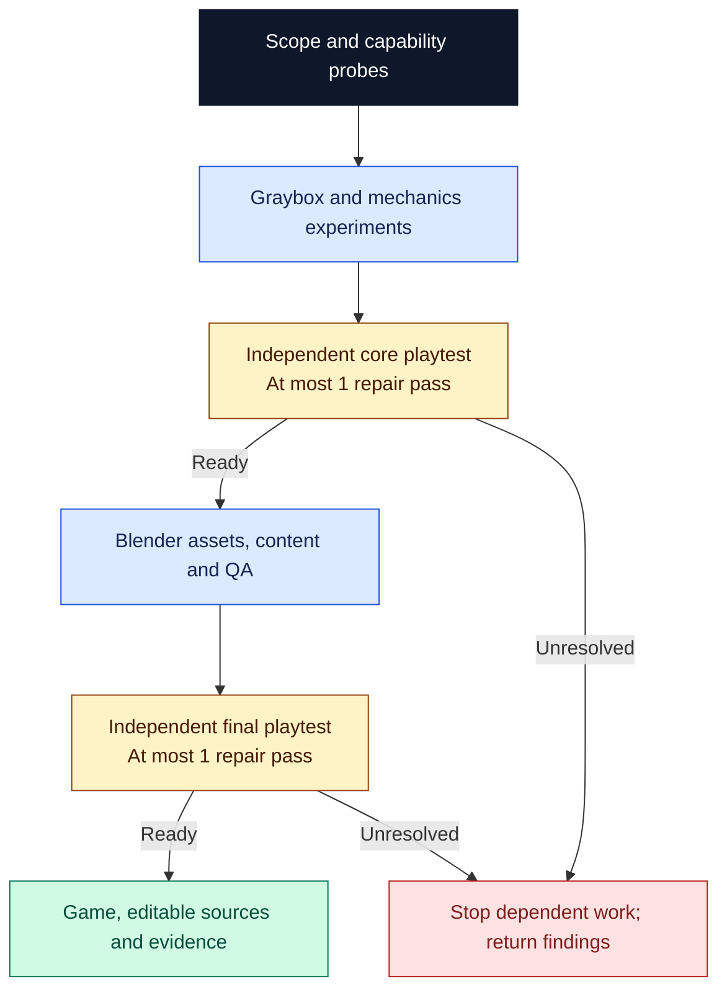

# 3D browser game

Find a playable game in a player fantasy, then build the art and content around it. This library develops a complete Three.js session with original Blender assets, tests the mechanics before final asset production, and gives the core and finished game separate independent playtests. Use it for a small game players can learn, finish and replay.

## Try it

```text
$3d-browser-game:3d-browser-game
Build a salvage game where valuable cargo changes movement and route choice.
Target desktop keyboard/mouse. Make one escalating mission with original
Blender assets, a clear outcome and quick retry in ./salvage-game. Include
the playable build, editable sources and playtest evidence.
```

Claude Code uses `/3d-browser-game:3d-browser-game`. Entry points are manual-only. Supply target devices, controls, session length, assets and constraints. Unspecified choices are recorded. Existing games and bounded production phases are supported; partial work is labeled.

## Prove the core, then produce the game



The core compares **at least three mechanics** and runs **two focused before/after experiments**. It must support ordinary-input start–play–outcome–retry. Uncoached, adaptive browser play tests understanding, alternate tactics and setback/recovery. Only a ready core advances to final assets and content, with shared direction and one integration owner.

Each checkpoint permits at most one necessary repair pass, followed by affected checks and a complete session/retry. These checks are maker verification; there is no second independent review. An unchanged ready candidate needs no rebuild or replay. The final reviewer is fresh and different from the core reviewer. Remaining `needs change` or `unverified` stops dependent work and returns the best runnable state, findings and next action. Extra rounds require a request.

Delivery includes the build/preview, controls, reproducible commands, editable code and `.blend` sources, GLBs, dependencies, design/asset notes and measured conditions. Reports identify frozen source/build candidates by a full commit when it covers all tested source; otherwise by the commit plus a saved diff of relevant dirty files and changed asset paths and sizes, or by an exact copy. Repaired builds retain their own identities and maker verification. The [evidence contract](references/evidence.md) and [test interface](references/test-interface.md) distinguish ordinary play, assistance and scenarios.

Standalone components are [make-blender-game-assets](skills/make-blender-game-assets/SKILL.md), without independent review, and [playtest-3d-browser-game](skills/playtest-3d-browser-game/SKILL.md), one independent review without repairs. See the [complete workflow](skills/3d-browser-game/SKILL.md).

## Setup and limits

Run from a complete Orchflows core checkout with Python 3.11+:

```sh
python scripts/orchflows.py setup --example 3d-browser-game
```

Setup preserves existing copies and installs no runtimes. Complete any reported [host installation steps](https://github.com/DanMcInerney/orchflows/blob/main/docs/hosts.md#register-and-refresh), then start a new session.

Requires core, native children, JavaScript/package tools, browser rendering/input and Blender with Python/glTF export. Declare Three.js, build and optional physics/test dependencies in the project lockfile. Image generation is optional; [library context](references/library-context.md) defines capability probes.

Actual play and target-device performance remain unverified when the necessary tools or hardware are missing. Public deployment needs a hosting request. The [trial request](https://github.com/DanMcInerney/orchflows/blob/main/example-workflows/3d-browser-game/trials/request.md) and its evaluator-only acceptance criteria specify expected behavior; they do not establish complete native validation or game quality.
