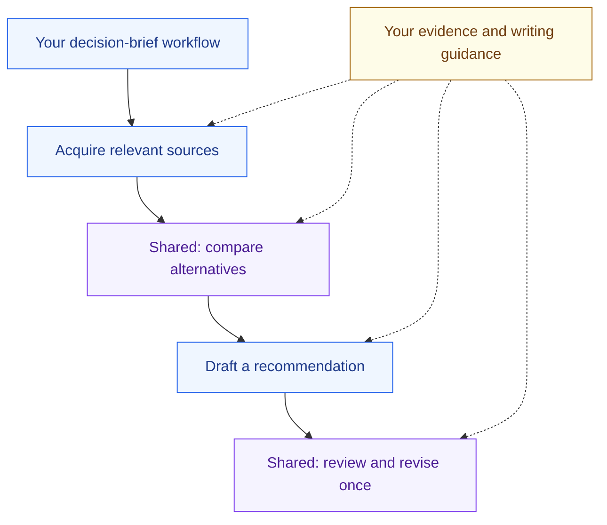

# Stop starting every agent workflow from scratch

**Save the process that worked. Use it inside the next one.** These eleven libraries show how small Markdown workflows compose into research, software, films and improvement loops. Run one whole, borrow a component or reuse its guidance.

From an Orchflows checkout:

```sh
python scripts/orchflows.py setup --example social-search
```

Start a new agent session, then ask:

> Use social-search:social-search to investigate how developers handle flaky browser tests. Compare the evidence and give me a source-linked brief.

Each library below explains its inputs, dependencies, bounds and current limits. All example entrypoints require explicit selection; installing one does not make it the default for ordinary requests.

## Pick a process

| Library | Useful components and process |
| --- | --- |
| [Shared](shared/README.md) | Independently compare stable candidates; review with at most one repair pass |
| [Social search](social-search/README.md) | Collect assigned source scopes; rank supplied evidence; coordinate adaptive collection |
| [Research acquire](research-acquire/README.md) | Bounded public-source acquisition and inspectable evidence |
| [Short video](short-video/README.md) | Make a film; review exact exports; coordinate independent films |
| [Browser game](3d-browser-game/README.md) | Make Blender assets; independently playtest; coordinate game production |
| [Design loop](design-loop/README.md) | Brainstorm, research, design, implement, compare and analyze bounded cycles; uses shared comparison |
| [Evolve](evolve/README.md) | Improve and retain artifacts with its own evaluation and confirmation policy |
| [Software factory](software-factory/README.md) | Deliver software; observe production; investigate incidents |
| [Benchmaker](benchmaker/README.md) | Construct and independently pilot benchmarks; review and repair using Shared |
| [Export workflow](export-workflow/README.md) | Export a standalone native skill and trial its behavior |
| [Self-improve](self-improve/README.md) | Improve instructions from observed history and current evidence |

## Build your own workflow library

A personal decision brief might acquire sources, compare alternatives, draft a recommendation, then independently review it. The coordinator applies each procedure and delegates the actual assignments. Adding a component does not create another orchestrator.



Domain libraries own their small workflows. `shared/` holds processes useful across domains, including `shared:compare-candidates` and `shared:review-revise-once`. Core supplies ordinary parallel work and gathering; extract a component when its contract helps actual callers.

Save your own workflows in `~/.orchflows/libraries/`, usually `personal`. Ask `orch-build-workflow` to compose them from an ordinary recurring-work request. It rehearses the result using synthetic inputs and simulated external effects before independent authoring review. Your examples remain read-only references.

Install complete packages and every declared dependency with `setup --example NAME`; dependencies are not installed transitively. Keep guidance and references alongside skills. [Setup](../docs/home.md) and [host support](../docs/hosts.md) describe registration and limits.

## Examples are starting points, not proof

Some libraries have only partial native validation. Each README states its limits. Executable trials live beside workflows under `trials/<case>/`; the [E2E framework](../tests/e2e/README.md) runs selected cases concurrently and audits their evidence. A documented scenario or passing static check does not establish that the workflow succeeded.
