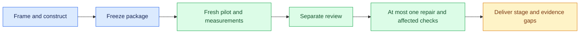

# Benchmaker design

Benchmaker builds a task-specific benchmark around the system's actual model, instructions, tools, orchestration and memory. It supplies an authoring process and execution contract rather than a universal runner.

## Three kinds of evidence

| Evidence | Establishes |
| --- | --- |
| Harness checks | Execution, grading, budgets and recovery work on the exercised paths |
| Benchmark validation | Tasks are feasible and graders accept valid alternatives while rejecting relevant failures |
| Agent measurement | The declared system's observed performance under recorded conditions |

A simulator can exercise machinery; capability claims require actual agent execution. Synthetic authoring fixtures and simulated external effects follow core's trial policy.

## From request to defensible result

The coordinator frames the claim, studies representative work, constructs a package and freezes it. A fresh pilot first solves public inputs without authoring history or evaluator answers, then receives evaluator material to inspect discrepancies and controls. The coordinator owns target-agent execution. A separate reviewer assesses the frozen package and complete pilot evidence before the single permitted repair pass.

A benchmark can stop at prototype, calibrated pilot or evaluation suite according to its evidence and budget. Smoke, quick and full are execution profiles, not maturity levels. Requested scope and unmet gates remain visible when only a smaller stage is affordable.

Outcome credit represents useful partial work. Full success and critical failures remain separate. Missing judgments stay unknown; infrastructure failures do not silently become task failures or disappear from coverage. Changed definitions receive a new benchmark identity, while saved outcomes can be re-scored under an explicit scorer revision.

## Contract owners

| Owner | Responsibility |
| --- | --- |
| [Workflow](skills/benchmaker/SKILL.md) | Inputs, phases, independence, repair bound and delivery |
| [Benchmarking guidance](guidance/benchmarking.md) | Task validity, grading quality and interpretation |
| [Quality profile](references/quality-profile.md) | Stage gates, substantial work and challenge calibration |
| [Benchmark contract](references/benchmark-contract.md) | Records, identity, execution, recovery and aggregation |
| [Research lessons](references/research.md) | Primary precedents for design choices |

Generated packages and evidence live outside this library. Use installed tooling and the lightest environment that preserves fidelity and required access controls. A local directory is not a secrecy boundary. Shared runner templates or optional harness integrations need demonstrated cross-domain reuse and outcome parity before adoption.

The library remains experimental. [Trial scenarios and validation gaps](https://github.com/DanMcInerney/orchflows/blob/main/example-workflows/benchmaker/trials/README.md) define what to exercise; a passing pilot does not establish broad readiness.
