# Benchmaker design

Benchmaker builds a task-specific benchmark around a system's actual model, instructions, tools, orchestration and memory. It supplies an authoring process, admission criteria and an execution contract rather than a universal runner.

## A benchmark is not a test suite

A test suite checks that known behavior still works. A benchmark samples hard, valuable work and exists to separate systems that differ in an ability. That changes what matters. Tasks should take a capable practitioner substantial effort. Verifiers must accept every valid outcome and reject every shortcut. The suite as a whole must show headroom and discrimination, measured rather than asserted.

Public benchmarks show how easily this goes wrong. Terminal-Bench 2.0 kept 89 of 229 submitted tasks and still repaired 28 later. An empty-response agent scored 38% on τ-bench's airline domain. Frontier models cheated on about half of ImpossibleBench's deliberately impossible tasks. Benchmaker's design follows from those failures: most candidate tasks are expected to be rejected, and every admitted task carries evidence.

## Three kinds of evidence

| Evidence | Establishes |
| --- | --- |
| Harness checks | Execution, grading, budgets and recovery work on the exercised paths |
| Benchmark validation | Each task is realistic, solvable, fully specified, fairly graded, shortcut-resistant and hard for the claimed ability |
| Agent measurement | The declared systems' observed performance under recorded conditions |

A simulator can exercise machinery; capability claims require actual agent execution.

## From request to defensible result

```mermaid
flowchart LR
    A[Claim and comparison set] --> Q[Fan-out research into real work]
    Q --> B[Source more candidates than needed]
    B --> C[Build each task]
    C --> D[Admission: reference, trivial attempts, blind auditor, adversary, calibration]
    D -->|revise within limit| C
    D -->|reject and log| R[Rejection log]
    D -->|admit| E[Freeze suite and measure comparison set]
    E --> F[Quality card]
    F --> G[Separate review, at most one repair]
    G --> H[Deliver suite, card and gaps]
    classDef make fill:#dbeafe,stroke:#2563eb,color:#172554
    classDef check fill:#dcfce7,stroke:#16a34a,color:#14532d
    classDef result fill:#fef3c7,stroke:#d97706,color:#78350f
    class A,Q,B,C make
    class D,E,G check
    class F,H,R result
```

The loop sits at the task, not the package. Each task passes the admission criteria or is revised within a declared limit or rejected. Only the admitted suite is measured and reviewed as a whole.

Realism comes first. Benchmaker fans out web research guided by the solver's goal, gathers real scenarios, artifacts and hard cases into a catalog, and sources tasks from it. Too-easy tasks are replaced with harder real work before anyone edits them, and every reconstructed or synthetic task gets an independent realism review. Three early trials drew all their tasks from invented repositories with planted faults, and difficulty kept drifting toward artificial defects; research-first sourcing is the fix. Difficulty is never pinned to today's models: as measured systems approach a suite's ceiling, fresh research extends it with more complex real work, not with harder tricks.

Skills, workflows and harnesses default to an uplift claim: the same tasks with and without the component, at matched budget, beside a simple baseline. That is usually the question someone deciding whether to adopt them needs answered.

Difficulty is set for the systems the user wants the benchmark to measure, usually state-of-the-art models, taken from the request, read from the target or asked for. It is not set by whichever strong model happens to be available. The first known-ordering trial, which was inconclusive, suggested why. Calibrating against Sonnet 5 drove three rounds of hardening that never slowed Sonnet but left the Haiku target at the floor, where the suite could no longer show improvements to it. Hardening also drifted into stacking fourteen statically visible defects behind a one-symptom ticket. A Haiku variant with no shell outscored the real agent nearly threefold; the trial's evaluator attributed this both to tasks that had become README audits rather than diagnosis and to the missing shell changing when the agent stopped. The known-order check, the target with its claimed ability removed, exists to catch that kind of drift before delivery.

The second trial, calibrated for a Sonnet 5 target, reached the middle band the first never did and was judged acceptable: the suite separated every confirmed pair of hidden variants, and the builder honestly stopped at draft. The same drift persisted in milder form. Tickets ending "follow the rules in the README" put hidden defects in scope, most defects produced no visible symptom, and the known-order check, run only after freezing, could not tell execution-based diagnosis from exhaustive reading. Two repeats inside one run behaved like one sample, since per-task full success flipped between runs. Hardening had also targeted what the subject happened to miss, and a preservation dimension that no system ever lost still appeared in the claim. Graded faults now have to be reachable from what the task reports, the check runs before admission, repeats must be independent, hardening follows the ability rather than one system's misses, and no claim rests on an inert dimension.

The quality card replaces paperwork maturity with measured properties: validity, headroom, discrimination, reliability, coverage, integrity, cost and yield. Stages are named by the evidence they hold. A draft is incomplete. A development suite has every task admitted and measured. An evaluation suite adds held-out tasks measured once. Smoke, quick and full are execution profiles, not maturity levels.

## Benchmarking Benchmaker

Because the benchmarks it delivers are executable, Benchmaker can be benchmarked. A task asks it to build a benchmark for a subject system. The verifier runs the delivered benchmark against a hidden pool of subject variants with a known order: a stronger variant, the subject, variants with planted defects, a do-nothing variant and a cheating variant. A good benchmark recovers the order, catches the defects and gives the cheater nothing. The verifier recomputes those results by running the delivered benchmark, so a package cannot pass by claiming them. The [trial catalog](https://github.com/DanMcInerney/orchflows/blob/main/example-workflows/benchmaker/trials/README.md) includes this design, including a scenario where Benchmaker builds a benchmark of benchmark builders and is itself one of the builders measured.

## Contract owners

| Owner | Responsibility |
| --- | --- |
| [Workflow](skills/benchmaker/SKILL.md) | Inputs, phases, independence, bounds and delivery |
| [Benchmarking guidance](guidance/benchmarking.md) | Task, specification, verification and integrity quality; interpretation |
| [Quality card](references/quality-card.md) | Claim, admission criteria, measured properties and stages |
| [Benchmark contract](references/benchmark-contract.md) | Package, records, identity, execution, recovery and aggregation |
| [Research lessons](references/research.md) | Precedents and observed failure rates behind the design |

Generated packages and evidence live outside this library. Use installed tooling and the lightest environment that preserves fidelity and required access controls. A local directory is not a secrecy boundary.

The library remains experimental. [Trial scenarios](https://github.com/DanMcInerney/orchflows/blob/main/example-workflows/benchmaker/trials/README.md) define what to exercise; a passing trial does not establish broad readiness.
