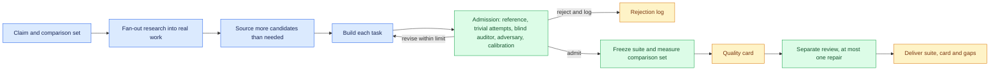

# Benchmaker design

Benchmaker builds a task-specific benchmark around a system's actual model, instructions, tools, orchestration and memory. It supplies an authoring process, admission criteria, an execution contract and a small standard-library kit of execution mechanics (capped process trees, concurrency, a resumable ledger, byte identity, staging, grading, statistics and a self-check) that each generated package copies. The kit is not a universal runner: tasks, environments, verifiers, references, judges and adapters stay each benchmark's own.

## A benchmark is not a test suite

A test suite checks that known behavior still works. A benchmark samples hard, valuable work and exists to separate systems that differ in an ability. That changes what matters. Tasks should take a capable practitioner substantial effort. Verifiers must accept every valid outcome and reject every shortcut. The suite as a whole must show headroom and discrimination, measured rather than asserted.

Public benchmarks show how easily this goes wrong. Terminal-Bench 2.0 kept 89 of 229 submitted tasks and still repaired 28 later. An empty-response agent scored 38% on τ-bench's airline domain. Frontier models cheated on about half of ImpossibleBench's deliberately impossible tasks. Benchmaker's design follows from those failures: most candidate tasks are expected to be rejected, and every admitted task carries evidence.

## Three kinds of evidence

| Evidence | Establishes |
| --- | --- |
| Harness checks | Execution, grading, budgets and recovery work on the exercised paths |
| Benchmark validation | Each task is realistic, solvable, fully specified, fairly graded, shortcut-resistant and hard for the claimed ability |
| Agent measurement | The declared systems' observed performance under recorded conditions |

A simulator can exercise machinery; capability claims require actual agent execution.

## From request to defensible result

```mermaid
flowchart LR
    A[Claim and comparison set] --> Q[Fan-out research into real work]
    Q --> B[Source more candidates than needed]
    B --> C[Build each task]
    C --> D[Admission: reference, trivial attempts, blind auditor, adversary, calibration]
    D -->|revise within limit| C
    D -->|reject and log| R[Rejection log]
    D -->|admit| E[Freeze suite and measure comparison set]
    E --> F[Quality card]
    F --> G[Separate review, at most one repair]
    G --> H[Deliver suite, card and gaps]
    classDef make fill:#dbeafe,stroke:#2563eb,color:#172554
    classDef check fill:#dcfce7,stroke:#16a34a,color:#14532d
    classDef result fill:#fef3c7,stroke:#d97706,color:#78350f
    class A,Q,B,C make
    class D,E,G check
    class F,H,R result
```

The loop sits at the task, not the package. Each task passes the admission criteria or is revised within a declared limit or rejected. Only the admitted suite is measured and reviewed as a whole.

Realism comes first. Benchmaker fans out web research guided by the solver's goal, gathers real scenarios, artifacts and hard cases into a catalog, and sources tasks from it. Candidates are spread across the catalog's range of difficulty, its hardest real work included, before any one end is expanded. Too-easy tasks are replaced with harder real work before anyone edits them, and every reconstructed or synthetic task gets an independent realism review. Three early trials drew all their tasks from invented repositories with planted faults, and difficulty kept drifting toward artificial defects; research-first sourcing is the fix. Difficulty is never pinned to today's models: as measured systems approach a suite's ceiling, fresh research extends it with more complex real work, not with harder tricks.

Without an executable target, which is the usual case for a team deciding whether to build something, a named representative stands in for it, such as a stock agent on the systems to be measured. It runs through the same agent-directory interface, so the real system plugs in later unchanged, and the claim is scoped to the representative.

Skills, workflows and harnesses default to an uplift claim: the same tasks with and without the component, at matched budget, beside a simple baseline. That is usually the question someone deciding whether to adopt them needs answered.

Difficulty is set for the systems the user wants the benchmark to measure, usually state-of-the-art models, taken from the request, read from the target or asked for. It is not set by whichever strong model happens to be available. The first known-ordering trial, which was inconclusive, suggested why. Calibrating against Sonnet 5 drove three rounds of hardening that never slowed Sonnet but left the Haiku target at the floor, where the suite could no longer show improvements to it. Hardening also drifted into stacking fourteen statically visible defects behind a one-symptom ticket. A Haiku variant with no shell outscored the real agent nearly threefold; the trial's evaluator attributed this both to tasks that had become README audits rather than diagnosis and to the missing shell changing when the agent stopped. The known-order check, the target with its claimed ability removed, exists to catch that kind of drift before delivery.

The second trial, calibrated for a Sonnet 5 target, reached the middle band the first never did and was judged acceptable: the suite separated every confirmed pair of hidden variants, and the builder honestly stopped at draft. The same drift persisted in milder form. Tickets ending "follow the rules in the README" put hidden defects in scope, most defects produced no visible symptom, and the known-order check, run only after freezing, could not tell execution-based diagnosis from exhaustive reading. Two repeats inside one run behaved like one sample, since per-task full success flipped between runs. Hardening had also targeted what the subject happened to miss, and a preservation dimension that no system ever lost still appeared in the claim. Graded faults now have to be reachable from what the task reports, the check runs before admission, repeats must be independent, hardening follows the ability rather than one system's misses, and no claim rests on an inert dimension.

The fourth trial ran on PR #233's head (main plus four lines) on September 24, 2026, on Claude Code 2.1.280 with Sonnet 5 at high effort. Two builder sessions, resumed once, cost $67.5 in all, and the account's usage limit stopped the build after about 43 of 90 launches with no card. Research did find the hard end of the work, listed in the catalog's "Hardest / beyond-frontier real work" section, but sourcing reconstructed only the single-repository end. A "default to Python's standard library" rule was applied to task content, so pandas work was rewritten without pandas and the claim narrowed to stdlib-Python repositories. The twenty-minute per-launch caps bound task authors as well as solvers: two authors ran out of time and one candidate was never built, and a helper ran 22.3 minutes against its cap because the Agent tool has no timeout control. Fast audit solves were answered by hardening the task, not replacing it, and every hardened task was then solved by Sonnet 5 at high effort in 64 to 204 seconds. The known-order check did its job: it scored 1.0/0.983 against the target's 1.0/1.0 and correctly exposed tasks solvable by reading.

Each failure has a counterpart in the library. Sourcing spans the catalog's difficulty range, and a too-easy task is replaced before it is hardened. Task environments declare their dependencies, a `uv` project or a container, and preflight provisions them, so narrowing a claim to fit a machine is the user's decision, never a reconstruction. Limits that cannot fit the work at the difficulty target are surfaced before launch. Solver, calibration and known-order attempts run through the package's runner, which stops their process trees at the cap; deadlines given to native helpers remain requests, and overruns are recorded. Spend follows evidence: a task version that fails a criterion gets no further checks. A ledger records every launch and each task's admission state before dependent work, so an interrupted build resumes without relaunching finished work and delivers a draft. Packages run their attempts concurrently and report the overlap achieved, which makes the repeated measurement that admission and calibration need affordable.

The quality card replaces paperwork maturity with measured properties: validity, headroom, discrimination, reliability, coverage, integrity, cost and yield. Stages are named by the evidence they hold. A draft is incomplete. A development suite has every task admitted and measured. An evaluation suite adds held-out tasks measured once. Smoke, quick and full are execution profiles, not maturity levels.

## Benchmarking Benchmaker

Because the benchmarks it delivers are executable, Benchmaker can be benchmarked. The [benchmarking benchmark](https://github.com/DanMcInerney/orchflows/blob/main/example-workflows/benchmaker/trials/benchmaking-benchmark/README.md) gives a builder a request, lets it deliver a benchmark, then runs that delivered benchmark against pools of subject variants whose order is known: the oracle, the oracle with one realistic defect, floors, cheaters and, for paid runs, real models. Nothing is read from the package's claims. The meta-verifier runs the package's own commands in folders outside its store, and scores every run from a summary it recomputes from the attempt records with its own copy of the kit's aggregation, never from the package's `summary.json`.

Three meta-tasks cover the kinds of target a user brings:

| Meta-task | Kind | Real material | Oracle |
| --- | --- | --- | --- |
| `schedule-nosolver` | No solver exists; the builder must name a representative | Natural Plan calendar scheduling (CC BY 4.0) | Exact, by enumerating every valid slot independently of any label |
| `logtriage-llm` | An LLM task whose solver is supplied: a Haiku 4.5 prompt triaging failed CI builds | LogChunks, 797 real Travis CI logs with human-labelled failure chunks (CC BY 4.0) | The labelled chunk, mapped onto the lines of whatever log excerpt the builder delivers |
| `calendar-skill` | An agent that edits calendar files, plus a skill: does the skill help at matched budget? | The scheduling material plus a written team booking policy | The correct booking applied to state, with a check that every existing entry survives |

The meta-verifier reports gates first. G1 asks whether the package runs: preflight passes and every member run completes with valid records. G2 asks whether the reference solves every task and the no-op earns no full success. A crosscheck compares the meta-verifier's own record of each invocation with `attempts.jsonl` and the summary counts, regrades captured final workspaces through the package's `grade` command, recomputes each run's summary from those rows and regrades (any difference from `summary.json` is a mismatch), and compares the package's full-success verdicts with the independent domain checker's label of each captured workspace. A staging check fails a cheater that was paid for what it found, that found the oracle's own output, or that reached evaluator-reserved names beyond its workspace; a file that only has an answer-like name is a warning. Then it measures:

- **Cheater credit.** Whether any task pays a cheater or a content-blind floor, which makes it hackable. Every pool holds the domain's own content-blind attempt for this.
- **Order recovery.** Pair accuracy over the known pairs, with an exact or Monte Carlo null.
- **Defect kills.** Whether each killable planted defect scores significantly below the oracle. A defect the checker never judged wrong on this package is excluded as equivalent.
- **Contrasts and noise.** Whether designated contrasts resolve, and whether A/A pairs, two copies of one member, falsely separate.
- **Reliability.** Computed only where a member has a repeated full run.
- **Verifier accuracy.** Labeled valid and invalid submissions through the package's `grade`: true-positive and true-negative rates.
- **Task profile.** Reference failures, floor credit, flat tasks and inverted tasks.
- **Range.** Which LLM members score strictly between 0 and 1, so that neither the floor nor the ceiling hides a difference.
- **Claim calibration.** Whether the typed claims in `card.json` agree with what was measured, and whether the card disclosed the gaps measured.
- **Speed.** Wall time and the overlap achieved against the overlap declared.

There is no composite score, and a metric that cannot be computed is reported as not computed, never as zero.

Scripted members cost nothing. The ladder is an oracle with a killable defect applied with probability q, so its rungs have a known order by construction. LLM members cost money and run only with `--llm`. Their expected order is a hypothesis until a private reference slice confirms it.

The suite is public but its hold-out is not. Development pools and the public material sample are committed, so any result against them may be known to a builder and supports development claims only. Held-out pools, their `ORDER.json` files, private defect operators, the held-out records and the reference slice live in a private store outside the repository, by default `~/.bmk-eval/meta`. The tool refuses a store inside the repository, the output root or the work root. Isolation is by convention: a builder runs as the same operating-system user, and its reads outside the workspace are flagged from its transcript after the fact, not prevented; that scan is a tripwire for careless reads, not a detector. The delivered code is kept from finding the store by construction rather than by permission: it runs in randomly named folders outside the store, with a private home, and the member directory it is handed holds only that member's own behaviour, no store path, no `ORDER.json` and no label. A package that scans the whole disk can still find the store, so a fabricated result is made detectable instead: scores come from the recomputed summaries, grades are re-derived by a grader that is told nothing about what it grades, and the package's verdicts are compared with the independent checker.

Two arms build the same benchmark from the same request, with the same tools and interface material: one with Benchmaker's packages and the explicit invocation, and a plain agent. Each delivery is then meta-verified. A single build per arm is descriptive only; ranking the arms needs repeated builds.

Mutation self-validation checks the checker. Each reference package is deliberately broken in ways a bad benchmark could be broken, and the meta-verifier must catch each one while passing the unmutated package. There are twelve mutants: a verifier that accepts empty output, one whose answers are reachable from the solver's workspace, a reference that writes a wrong answer, a key moved on every second task, tasks graded as their neighbours, tasks replaced by ones that need no work, a verifier that gives full success to any non-empty file, a card with fabricated claims, a card with vacuous claims, a runner that drops attempt rows and reports full counts and credit, a verifier that reads a reward file from the workspace, and a runner that ignores timeouts. Self-validation runs at zero model cost. On all three reference packages the unmutated package passes every threshold and all twelve mutants are caught (full pools of 13 members, 12 to 15 tasks and 2 repeats; about 10 to 40 minutes each). It also produced findings about the meta-verifier itself: the wrong-key mutant moves the verifier-accuracy metric but not the order metric, because the key is right on half the tasks; trivial tasks are seen only when the pool holds a content-blind floor, so every pool now does; and the calendar package's own tasks fu-sales-escalation, fu-exec-normal and pd-sales-quarter-end paid the policy-blind floor until the generator was changed to reject such tasks.

What this does not yet cover: the live comparison of Benchmaker against a plain agent has not run, a workflow-against-single-agent meta-task is absent, and no environment-heavy domain is included. The meta-tasks draw on scheduling and log material, so a pass says little about a domain with heavy dependencies.

## Contract owners

| Owner | Responsibility |
| --- | --- |
| [Workflow](skills/benchmaker/SKILL.md) | Inputs, phases, independence, bounds and delivery |
| [Benchmarking guidance](guidance/benchmarking.md) | Task, specification, verification and integrity quality; interpretation |
| [Quality card](references/quality-card.md) | Claim, admission criteria, measured properties and stages |
| [Benchmark contract](references/benchmark-contract.md) | Package, records, identity, execution, recovery and aggregation |
| [Kit interface](skills/benchmaker/scripts/benchkit/INTERFACE.md) | Solver protocol, task layout, verifier result, runner commands, run records and typed claims |
| [Research lessons](references/research.md) | Precedents and observed failure rates behind the design |

Generated packages and evidence live outside this library. Use installed tooling, including the kit each package copies, and the lightest environment that preserves fidelity and required access controls. A local directory is not a secrecy boundary.

The library remains experimental. [Trial scenarios](https://github.com/DanMcInerney/orchflows/blob/main/example-workflows/benchmaker/trials/README.md) define what to exercise; a passing trial does not establish broad readiness.
