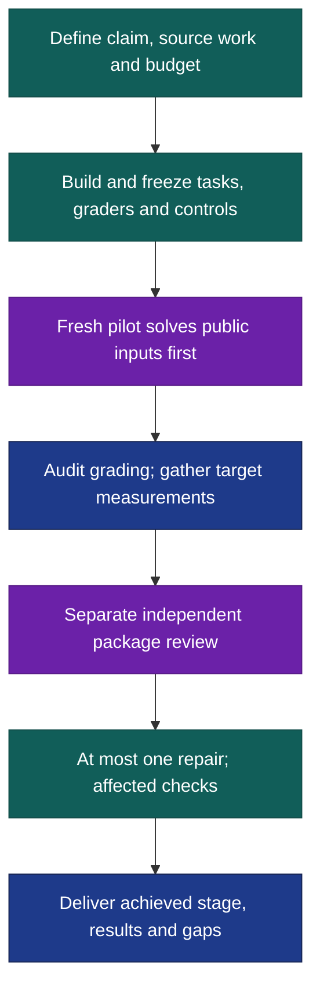

# Benchmaker

A benchmark can run perfectly and still measure the wrong thing. Benchmaker builds tasks around substantial user work, checks whether their graders recognize useful outcomes, and separates that validation from measurements of the agent. Each package reports the stage requested, the stage achieved and the evidence still missing.

**Experimental:** cross-domain acceptance remains incomplete. After [installation](#install), try this in Codex:

```text
$benchmaker:benchmaker Compare the two research workflows in this workspace.
Build a development prototype from representative source tasks. Allow at
most two target launches, ten minutes each, with no retries. Save the
package, reproducible commands, measurements and unmet quality gates in
./benchmark-run/.
```

In Claude Code, use `/benchmaker:benchmaker`; invocation is manual. Supply a target path, callable, command, endpoint, native workflow or capability description, plus budget and output location. A description supports a draft; measurement requires actual execution.

## Validate the ruler before trusting the score



The pilot saves answers before seeing evaluator material. A different reviewer then inspects the frozen package and joined evidence through core `orch-review-revise-once`. Repairs wait for that review; at most one pass follows, with affected independent checks within the remaining allowance. The original verdict applies only to the reviewed version.

The [quality profile](references/quality-profile.md) distinguishes **prototype**, **calibrated pilot** and **evaluation suite**. Smoke, quick and full select runs, not maturity. Broad claims plan around 40–60 independently sourced development cases and a later 150–300-case suite; these adjustable ranges are neither statistical minimums nor launch budgets. Smaller prototypes retain the larger request's unmet gates.

Challenge tracks default to 30–50% full-task success for a named strong baseline on development cases. This is a calibration target, not an unseen-performance promise. Baselines, source-group splits and conditions freeze before measurement; semantic grading stays provisional until independent held-out calibration.

## What the package preserves

Expect a benchmark card, cases and provenance, fixtures, adapters, graders, controls, reproducible commands, observed time/cost and raw evidence in your workspace. Results keep **full success, useful outcome credit and critical failures** separate, with denominators and per-family coverage. Harness checks, benchmark validation and fresh agent measurements remain distinct.

The [execution contract](references/benchmark-contract.md) bounds launches, retries, time and spend. Failed attempts consume limits; wrong answers are never transient retries. Resume requires matching benchmark and condition identities, reuses completed work, and reconciles uncertain execution before relaunch. Re-scoring retained outputs records a new scorer result, not a fresh agent attempt. Missing access or judgment leaves affected claims incomplete. Local folder separation does not enforce evaluator secrecy.

## Install

From the Orchflows **source checkout**, with Python 3.11+:

```sh
python scripts/orchflows.py setup --example benchmaker
```

Complete any reported [host installation steps](https://github.com/DanMcInerney/orchflows/blob/main/docs/hosts.md#register-and-refresh), then start a new session. Requires **Orchflows 0.11.0+** and native child delegation; [library context](references/library-context.md) lists core components and task-specific tools. No paid judge, Docker or additional benchmark runtime is required.

**Validation limit:** the [trial catalog](trials/README.md) specifies research, stateful, artifact, coding and failure scenarios. Full current authoring/pilot execution, held-out semantic calibration, interruption/cleanup and protected evaluator access remain unverified. No cross-domain readiness is claimed.
