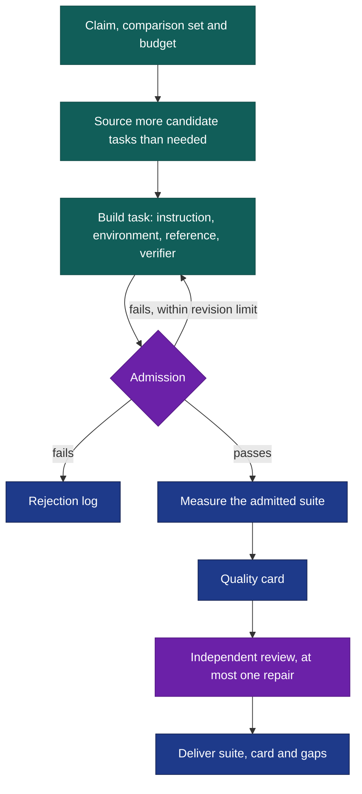

# Benchmaker

Most homemade agent benchmarks are unit tests in disguise: a handful of easy cases that every capable system passes, graded by checks an agent can game. Benchmaker builds the other kind. It sources hard, valuable tasks and admits only those that survive a blind audit, an agent told to cheat and repeated calibration runs. It then reports how well the finished suite actually separates the systems you care about.

It works for agents, skills, workflows, harnesses and tool-calling models. For skills and workflows it asks by default whether they help at matched budget.

**Experimental:** the current process has not yet been exercised end to end. After [installation](#install), try this in Codex:

```text
$benchmaker:benchmaker Does the research workflow in this workspace beat
the same model working alone? Build a development suite from real research
questions in ./sources. Allow at most 40 target launches, fifteen minutes
each, no retries. Save the suite, commands, quality card and rejection log
in ./benchmark-run/.
```

In Claude Code, use `/benchmaker:benchmaker`; invocation is manual. Supply a target (path, callable, command, endpoint, native workflow, skill or capability description), plus budget and output location. A description supports a draft; measurement requires actual execution.

## Most tasks should not make it



A task is admitted only when:

- its reference solution passes and doing nothing does not;
- a fresh auditor, who solves it before seeing the answers, finds every graded requirement in the instructions;
- the verifier accepts a different valid solution and rejects plausible wrong ones;
- an agent told to earn credit without doing the work fails;
- repeated calibration runs place it within the difficulty target, and failures show the claimed ability failing.

Real benchmarks work this way. Terminal-Bench 2.0 kept 89 of 229 submitted tasks, and SWE-bench Verified discarded two thirds of its sample.

The [quality card](references/quality-card.md) reports measured validity, headroom, discrimination, reliability, coverage, integrity, cost and yield. Stages follow the evidence. A **draft** is incomplete. A **development suite** has every task admitted and measured. An **evaluation suite** adds held-out tasks measured once. Smoke, quick and full select runs, not maturity. Difficulty is set for the systems you want to measure, usually state-of-the-art models. Benchmaker takes them from your request or reads them from the agent you supply, and asks when neither settles it. Unless you set a difficulty target, tasks keep the weakest of those systems off the floor and the strongest below saturation, so changes anywhere in between can show. A known-order check, usually your agent with the claimed ability removed, must rank where expected; otherwise the suite is measuring something else and the claim stays unsupported. The card also says whether measured headroom and separation actually support your claim.

## What the package preserves

Expect public tasks, environments, verifiers, reference solutions, admission evidence, the rejection log, adapters, reproducible commands, the quality card, observed time and cost, and raw transcripts in your workspace. Results keep **full success, useful partial credit and critical failures** separate, with denominators and per-family coverage. Harness checks, benchmark validation and agent measurements remain distinct.

The [execution contract](references/benchmark-contract.md) bounds launches, retries, time and spend. Failed attempts consume limits, and wrong answers are never retried. Resume refuses changed definitions and reuses completed work. Missing access or judgment leaves affected claims incomplete. A local folder does not keep answers secret from an agent that can read it; the card says which boundaries were enforced.

## Install

From the Orchflows **source checkout**, with Python 3.11+:

```sh
python scripts/orchflows.py setup --example shared
python scripts/orchflows.py setup --example benchmaker
```

Complete any reported [host installation steps](https://github.com/DanMcInerney/orchflows/blob/main/docs/hosts.md#register-and-refresh), then start a new session. Requires **Orchflows, shared** and native child delegation; [library context](references/library-context.md) lists components and task-specific tools. Setup preserves existing library copies and does not install transitive dependencies; update an older shared copy before refreshing host registration. No paid judge, Docker or additional benchmark runtime is required, though some tasks need them.

Admission multiplies agent runs, so real suites cost more than their task count suggests. Show the plan's estimate before launching and budget for it.

**Validation limit:** the [trial catalog](https://github.com/DanMcInerney/orchflows/blob/main/example-workflows/benchmaker/trials/README.md) specifies how to exercise Benchmaker, including benchmarking it against hidden subject variants with a known order. Known ordering ran once, before the current difficulty and known-order rules, and was inconclusive; [DESIGN](DESIGN.md) records what it taught. No trial has run against the current process, and no cross-domain readiness is claimed.
