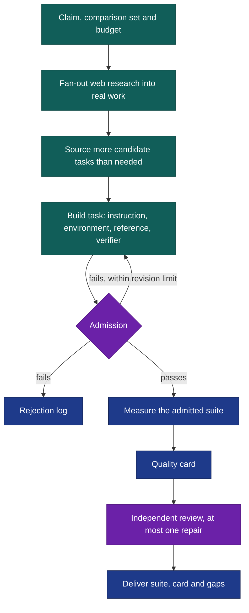

# Benchmaker

Most homemade agent benchmarks are unit tests in disguise: a handful of easy cases that every capable system passes, graded by checks an agent can game. Benchmaker builds the other kind. It starts with web research into how the work you care about is really done and where it really gets hard, sources tasks from that real work across its whole range, from routine cases to the hardest real work the research finds, and admits only those that survive a blind audit, an agent told to cheat and repeated calibration runs. It then reports how well the finished suite actually separates the systems you care about.

It works for agents, skills, workflows, harnesses and tool-calling models. For skills and workflows it asks by default whether they help at matched budget.

**Experimental:** the current process has not yet completed a live end-to-end run; [Status](#status) says what has been exercised. After [installation](#install), try this in Codex:

```text
$benchmaker:benchmaker Does the research workflow in this workspace beat
the same model working alone? Build a development suite from real research
questions in ./sources. Allow at most 40 target launches, fifteen minutes
each, no retries. Save the suite, commands, quality card and rejection log
in ./benchmark-run/.
```

In Claude Code, use `/benchmaker:benchmaker`; invocation is manual. Supply a target (path, callable, command, endpoint, native workflow, skill or capability description), plus budget and output location. A description supports a draft; measurement requires actual execution. With no system to measure yet, Benchmaker names a representative, such as a stock agent on the models you want to measure, and benchmarks that. The representative runs through the same [agent-directory interface](skills/benchmaker/scripts/benchkit/INTERFACE.md) a real system plugs into later, so the suite carries over unchanged and its claims stay scoped to the representative.

## Most tasks should not make it


```mermaid
flowchart TD
    A["Claim, comparison set and budget"] --> R["Fan-out web research into real work"]
    R --> B["Source more candidate tasks than needed"]
    B --> C["Build task: instruction, environment, reference, verifier"]
    C --> D{"Admission"}
    D -->|"fails, within revision limit"| C
    D -->|"fails"| X["Rejection log"]
    D -->|"passes"| E["Measure the admitted suite"]
    E --> F["Quality card"]
    F --> G["Independent review, at most one repair"]
    G --> H["Deliver suite, card and gaps"]
    classDef work fill:#115e59,stroke:#134e4a,color:#ffffff;
    classDef evidence fill:#1e3a8a,stroke:#172554,color:#ffffff;
    classDef review fill:#6b21a8,stroke:#581c87,color:#ffffff;
    class A,R,B,C work;
    class D,G review;
    class E,F,H,X evidence;
```

A task is admitted only when:

- it traces to real work found by the research, or an independent reviewer judges a reconstructed or synthetic task realistic;
- its reference solution passes and doing nothing does not;
- a fresh auditor, who solves it before seeing the answers, finds every graded requirement in the instructions;
- the verifier accepts a different valid solution and rejects plausible wrong ones;
- an agent told to earn credit without doing the work fails;
- repeated calibration runs place it within the difficulty target, and failures show the claimed ability failing.

Real benchmarks work this way. Terminal-Bench 2.0 kept 89 of 229 submitted tasks, and SWE-bench Verified discarded two thirds of its sample.

The [quality card](references/quality-card.md) reports measured validity, headroom, discrimination, reliability, coverage, integrity, cost and yield. Stages follow the evidence. A **draft** is incomplete. A **development suite** has every task admitted and measured. An **evaluation suite** adds held-out tasks measured once. Smoke, quick and full select runs, not maturity. Difficulty is set for the systems you want to measure, usually state-of-the-art models. Benchmaker takes them from your request or reads them from the agent you supply, and asks when neither settles it. Unless you set a difficulty target, tasks keep the weakest of those systems off the floor and the strongest below saturation, so changes anywhere in between can show. A known-order check, usually your agent with the claimed ability removed, must rank where expected; otherwise the suite is measuring something else and the claim stays unsupported. The card also says whether measured headroom and separation actually support your claim.

## How a run behaves

Each generated package carries a small copy of the [kit](skills/benchmaker/scripts/benchkit/INTERFACE.md), so it runs without this library: `python run.py preflight | smoke | quick | full | resume | rescore | grade | compare`. The kit supplies mechanics and record formats. Tasks, environments, verifiers, references, judges and adapters stay the benchmark's own.

- **Bounded and parallel.** Attempts run concurrently up to a declared limit and the achieved overlap is reported. Every solver attempt runs in a process tree that the runner stops at its cap: on Windows a job object holds the whole tree; elsewhere the runner stops the attempt's process group, which a process that starts its own session can leave. Leftover processes are stopped and recorded. The kit's [interface](skills/benchmaker/scripts/benchkit/INTERFACE.md) says which boundaries it enforces and which are conventions. Deadlines given to native helper agents remain requests, and overruns are recorded.
- **Planned before it runs.** `preflight` makes no model calls. It validates the package, provisions declared environments, runs a short self-check of the runner itself, and prints planned attempts, caps, estimated and worst-case wall time and estimated spend.
- **Resumable.** An append-only ledger records each launch before it happens. A usage limit, a deadline or Ctrl-C stops admission cleanly; `resume` continues from the ledger without relaunching finished work, and refuses if the package bytes or observed tool versions have changed.
- **Graded away from the solver.** A solver works in a temporary workspace outside the package. Verifiers grade a captured copy after the solver's processes are gone, and staging refuses evaluator files in the solver's workspace. `grade` scores supplied final workspaces without running any solver.
- **Evidence-proportional.** A task version that fails an admission criterion gets no further checks, and calibration stops on a task once its interval falls decisively inside or outside the difficulty target (`--stop-band`).
- **Declared environments.** A task's environment can include a `uv` project or container recipe. `suite.json` lists `provision` commands that `preflight` runs once and `observe` commands whose output is recorded with each run.

If a build is interrupted, it resumes from its records and can still deliver what it has as a draft.

## What the package preserves

Expect public tasks, environments, verifiers, reference solutions, admission evidence, the rejection log, adapters, reproducible commands, the quality card, observed time and cost, and raw transcripts in your workspace. Results keep **full success, useful partial credit and critical failures** separate, with denominators and per-family coverage. Harness checks, benchmark validation and agent measurements remain distinct.

The [execution contract](references/benchmark-contract.md) bounds launches, retries, time and spend. Failed attempts consume limits, and wrong answers are never retried. Resume refuses changed definitions and reuses completed work. Missing access or judgment leaves affected claims incomplete. A local folder does not keep answers secret from an agent that can read it; the card says which boundaries were enforced.

## Install

From the Orchflows **source checkout**, with Python 3.11+:

```sh
python scripts/orchflows.py setup --example shared
python scripts/orchflows.py setup --example benchmaker
```

Complete any reported [host installation steps](https://github.com/DanMcInerney/orchflows/blob/main/docs/hosts.md#register-and-refresh), then start a new session. Requires **Orchflows, shared** and native child delegation; [library context](references/library-context.md) lists components and task-specific tools. Setup preserves existing library copies and does not install transitive dependencies; update an older shared copy before refreshing host registration. Packages copy the kit from `skills/benchmaker/scripts/benchkit/`, which installs with the skill and needs only Python's standard library (3.11+, Windows and POSIX). Task environments may declare their own dependencies, such as a `uv` project, which `preflight` provisions before offline attempts. No paid judge, Docker or additional benchmark runtime is required, though some tasks need them.

Admission multiplies agent runs, so real suites cost more than their task count suggests. Show the plan's estimate before launching and budget for it.

## Status

The kit and the meta-benchmark that measures Benchmaker have been exercised offline and in a first live comparison on one meta-task, too small to rank Benchmaker against a plain agent.

- **Fourth known-ordering trial.** It ran on September 24, 2026 on Claude Code 2.1.280 with Sonnet 5 at high effort, and cost $67.5 over two builder sessions. It stopped at the account usage limit after about 43 of 90 launches with no card. Research had found the hard end of the work, but sourcing reconstructed only single-repo tasks; the stdlib-only default was applied to task content and narrowed the claim; per-launch caps also bound task authors, so two ran out of time and one candidate was never built; and fast audit solves were answered by hardening rather than replacement. The known-order check did expose tasks solvable by reading. [DESIGN](DESIGN.md) has the details and what changed in response.
- **Benchmarking benchmark.** The [meta-benchmark](https://github.com/DanMcInerney/orchflows/blob/main/example-workflows/benchmaker/trials/benchmaking-benchmark/README.md) has a Benchmaker builder and a plain agent build the same benchmark, then measures each delivery against pools of scripted and LLM subject variants of known order. Its three meta-tasks, scoring code and reference packages are built and unit-tested offline. Three live probe calls ran the supplied subject agents (the Haiku triage prompt, its Sonnet variant and the calendar agent with its skill loaded), and their output parsed and graded correctly. On October 2 and 3, 2026, builders on Sonnet 5.5 at low effort built the scheduling benchmark at the smallest budget: four Benchmaker builds across three library versions and two plain builds were delivered and meta-verified. The first Benchmaker build ran out of time and left Haiku failing by time-out, which led to the wall-clock and difficulty changes. The two builds on the current library finished inside the cap and placed Haiku off the floor. At that budget they measured fewer tasks than a plain agent's first build, and two builds per arm cannot rank the arms. The [meta-benchmark's results](https://github.com/DanMcInerney/orchflows/blob/main/example-workflows/benchmaker/trials/benchmaking-benchmark/README.md#live-comparison) have the table.
- **Not covered yet.** Workflow-against-single-agent uplift and an environment-heavy domain have no meta-task, and no cross-domain readiness is claimed.

The [trial catalog](https://github.com/DanMcInerney/orchflows/blob/main/example-workflows/benchmaker/trials/README.md) specifies the manual scenarios. No scenario has run live against the current process; [DESIGN](DESIGN.md) records what the first, second and fourth known-ordering trials taught.
