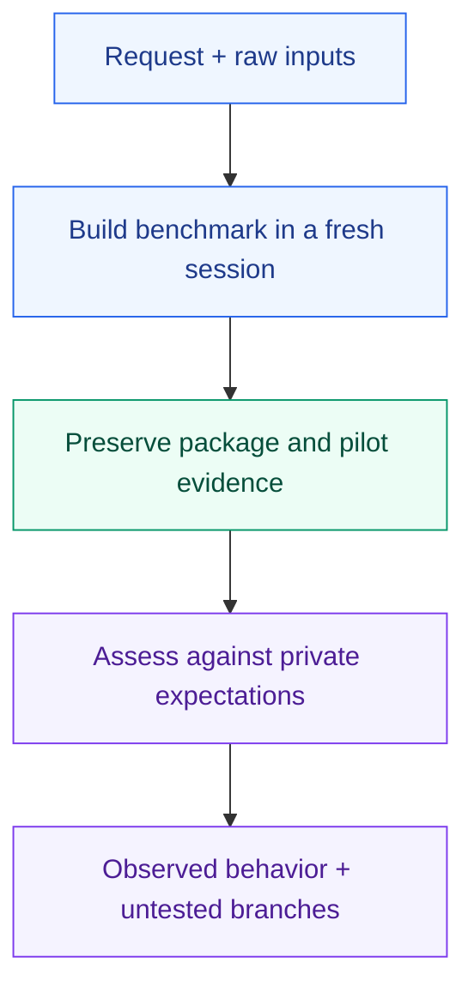

# Test the benchmark before trusting the score

A runnable benchmark can still reward the wrong thing. These manual scenarios probe whether Benchmaker produces useful tasks, valid graders and an honest account of what was measured.

| Scenario | What it probes |
| --- | --- |
| [Research](research/request.md) | Distinct source-grounded tasks, native execution and valid alternatives |
| [Stateful planning](stateful-planning/request.md) | Reset, valid actions, preservation and explanations |
| [Artifacts](artifacts/request.md) | Actual modality inspection and unavailable judgments |
| [Coding](coding/request.md) | Real workflow invocation and delivered behavior |
| [Unreliable adapter](unreliable-adapter/request.md) | Overlap, cleanup, durable partial results and retry/resume |
| [Description only](description-only/request.md) | A useful provisional package without invented execution |
| [Substantial research](substantial-research/request.md) | Staged acceptance, evidence decisions, outcome credit and calibration gaps |
| [Substantial stateful work](substantial-stateful/request.md) | Recovery, feasible alternatives, partial outcomes and synthetic provenance |
| [Review and revision](shared-revision/request.md) | Public-only pilot, separate review, one repair and preserved target evidence |

Run a request in a fresh workspace, starting it with the host's explicit invocation where it writes `[invoke benchmaker:benchmaker]`. Use the complete library, resolved core/shared packages and guidance, and only its raw inputs. Withhold the authoring conversation and sibling `expected-behavior.md` from the executing author. An independent evaluator uses those expectations afterward. Save packages, native identities, commands, outputs, timings and findings outside this library.

These folders have no `case.json` and are not discovered by the automated E2E runner. They specify coverage to exercise; they do not establish execution or cross-domain acceptance.

**Full current authoring behavior remains unverified.** Complete native authoring/pilot execution, held-out semantic calibration, interruption and owned-child cleanup, evaluator isolation and broader generalization require evidence. A machinery check or successful generated package does not establish Benchmaker's reliability across domains.
