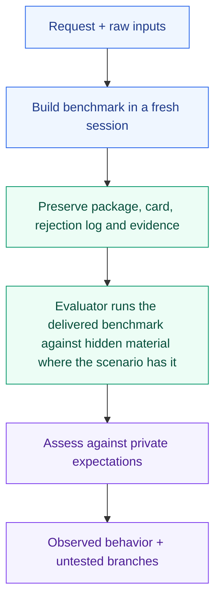

# Test the benchmark before trusting the score

A runnable benchmark can still reward the wrong thing, or reward nothing hard. These manual scenarios probe whether Benchmaker admits hard, valid tasks, rejects the rest, and reports honestly what the suite measures. One entry, the benchmarking benchmark, is different: it is executable code that measures the benchmarks Benchmaker delivers.

| Scenario | What it probes |
| --- | --- |
| [Known ordering](known-ordering/request.md) | Whether the delivered benchmark separates hidden subject variants of known quality and gives a cheater nothing |
| [Self-benchmark](self-benchmark/request.md) | Benchmaker building a benchmark of benchmark builders, with itself as the target |
| [Benchmarking benchmark](benchmaking-benchmark/README.md) | Executable meta-benchmark: builds from three meta-tasks with and without Benchmaker, then measures each delivery against pools of subject variants of known order. Not an E2E case |
| [Planted shortcut](planted-shortcut/request.md) | Whether admission finds an exploitable shortcut the author was not told about |
| [Skill uplift](skill-uplift/request.md) | Paired with/without measurement, activation and non-activation work, leakage and harm |
| [Workflow uplift](workflow-uplift/request.md) | A multi-agent workflow against the same model alone at matched budget |
| [Research](research/request.md) | Hard source-grounded synthesis, citation support and unavailable judging |
| [Coding](coding/request.md) | Real workflow invocation, hidden verifiers, history leakage and valid alternatives |
| [Stateful planning](stateful-planning/request.md) | Reset, preservation, infeasible requests and partial credit |
| [Artifacts](artifacts/request.md) | Actual modality inspection and unavailable judgments |
| [Description only](description-only/request.md) | A useful draft without invented execution |
| [Unreliable adapter](unreliable-adapter/request.md) | Overlap, cleanup, durable partial results and retry/resume |
| [Review and revision](shared-revision/request.md) | Blind audit before disclosure, separate review, one repair and preserved evidence |

```mermaid
flowchart TB
    I[Request + raw inputs] --> B[Build benchmark in a fresh session]
    B --> P[Preserve package, card, rejection log and evidence]
    P --> V[Evaluator runs the delivered benchmark against hidden material where the scenario has it]
    V --> E[Assess against private expectations]
    E --> R[Observed behavior + untested branches]
    classDef make fill:#eff6ff,stroke:#2563eb,color:#1e3a8a;
    classDef evidence fill:#ecfdf5,stroke:#059669,color:#064e3b;
    classDef review fill:#f5f3ff,stroke:#7c3aed,color:#4c1d95;
    class I,B make;
    class P,V evidence;
    class E,R review;
```

Run a request in a fresh workspace, starting it with the host's explicit invocation where it writes `[invoke benchmaker:benchmaker]`. Use the complete library, resolved core and shared packages and guidance, and only the raw inputs. Withhold the authoring conversation, sibling `expected-behavior.md` and any hidden material the trial setup names from the executing author. An independent evaluator uses them afterwards. Save packages, native identities, commands, outputs, timings and findings outside this library. Keep hidden material outside the author's workspace and its parent directory. Claude Code print-mode sessions that delegate need the background-wait setting described under [hosts](https://github.com/DanMcInerney/orchflows/blob/main/docs/hosts.md#delegation).

**Measuring Benchmaker itself.** Known ordering and the benchmarking benchmark supply the numbers the other scenarios lack; self-benchmark remains the scenario where Benchmaker builds the benchmark of builders and is itself one of those measured. How often does a delivered benchmark recover the hidden order? How many planted defects does it catch? Does a cheater earn anything? The evaluator obtains these by running the delivered benchmark's own commands against the hidden variants, never by reading the package's claims. Hidden variant pools should draw their defects from documented benchmark and agent failures, not from Benchmaker's own guidance, so the trial does not teach to the test.

These scenario folders have no `case.json` and are not discovered by the automated E2E runner. They specify coverage to exercise; they do not establish execution or cross-domain acceptance. The [benchmarking benchmark](benchmaking-benchmark/README.md) also has no `case.json`: it is a separate tool with its own commands, and only its offline unit tests run in the core suite through `python -m unittest discover -s tests`.

**Run history.** Known ordering has run as trials 1 to 4. Trial 1 ran on September 23, 2026, before the difficulty and known-order fixes, and was inconclusive. Trial 2 was judged acceptable. Trial 4 ran on September 24, 2026 on PR #233's head, on Claude Code 2.1.280 with Sonnet 5 at high effort; its two builder sessions cost $67.5 and it stopped at the usage limit after about 43 of 90 launches with no card. [DESIGN](../DESIGN.md) records what trials 1, 2 and 4 taught. The benchmarking benchmark has been exercised offline, with unit tests and zero-model-call runs against hand-built reference packages, and live on its scheduling meta-task on October 2 and 3, 2026, two of whose Benchmaker builds used the current process. **No other scenario has run live against the current process.**
