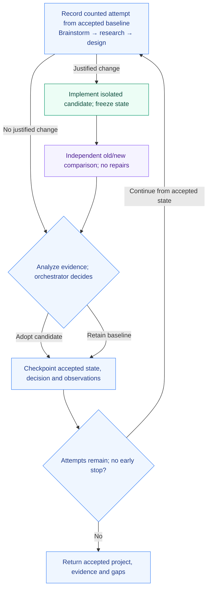

# Design loop

Develop an endgoal through bounded cycles, starting with the smallest useful working proof of concept. Each candidate faces an independent comparison against the accepted version; failures inform the next increment without replacing the baseline.

Use it for a new CLI, a prototype needing another capability, or an existing project whose next increment needs research and testing.

> **Experimental:** the standalone loop has not been validated end to end. Bundled trials specify intended behavior, not completed tests.

## Try two cycles

After [installation](#install-and-dependencies), paste this into Codex:

```text
$design-loop:design-loop Build a local shopping-list CLI in this workspace.
It must add, list and remove items and persist them between commands.
Use Python's standard library. Run N=2 cycles, starting with the smallest
working PoC. Put the project, usage instructions, comparison evidence and
checkpoint in ./shopping-list-run/.
```

In Claude Code, use `/design-loop:design-loop`. All library skills are manual-only.

Supply an endgoal, starting workspace or artifacts, and output directory. Optional inputs include success criteria, constraints, task domains and scoped model/effort choices; unspecified settings use host defaults. Empty workspaces are valid. Existing uncommitted and relevant untracked work belongs to the baseline.

## How it works



Design fixes acceptance criteria, required existing behavior and comparison conditions before implementation. A fresh tester inspects exact old/new states and keeps raw evidence. Adoption requires supported acceptance criteria and preserved required behavior; otherwise the baseline remains accepted.

Failed stages retain evidence and mark dependent work unexecuted. Analysis uses partial evidence when possible; missing analysis means retain. Corrections belong to later bounded cycles. Checkpoints preserve attempt counts, stage results and state identities; resumption continues the same attempt's first unfinished stage.

## Components and bounds

| Workflow | Responsibility |
| --- | --- |
| [design-loop](skills/design-loop/SKILL.md) | Bound cycles, checkpoint and decide adoption |
| [brainstorm-research](skills/brainstorm-research/SKILL.md) | Compose brainstorming, then research |
| [brainstorm-options](skills/brainstorm-options/SKILL.md) | Propose scoped increments and questions |
| [research-options](skills/research-options/SKILL.md) | Investigate uncertainties |
| [design-increment](skills/design-increment/SKILL.md) | Define scope, acceptance and comparison |
| [implement-increment](skills/implement-increment/SKILL.md) | Build a reproducible candidate |
| [test-increment](skills/test-increment/SKILL.md) | Compare independently without repairs |
| [analyze-iteration](skills/analyze-iteration/SKILL.md) | Recommend adopt/retain and next steps |

Components also work independently with their declared inputs and the [handoff contract](references/design-loop-contract.md). Composition stays in the caller; production staffing follows core execution rules and scoped settings. There is one independent comparison per cycle, with no extra final review or hidden repair loop.

`N` counts attempted cycles, including the first PoC and failures; it defaults to 3. An attempt is recorded durably before its first work. Run through N unless the caller stops, a resource bound is reached, required capability or authorization is missing, or explicit stop-on-goal applies. Goal attainment alone does not end the run.

Research defaults to 3 focused lookups and 5 relevant sources per invocation, starting with supplied/local material. Callers may override those bounds. Resumption preserves consumed attempts and caller constraints.

## Results

Receive the accepted project, usage instructions, initial-to-final evidence, adopt/retain decisions, attempted/completed counts, gaps and checkpoint path. Identifiable baselines, candidates and handoffs remain in your workspace, outside the installed library.

## Install and dependencies

From an Orchflows checkout with Python 3.11+:

```sh
python scripts/orchflows.py setup --example shared
python scripts/orchflows.py setup --example design-loop
```

Setup preserves existing library copies. Register/install both packages from the home catalog using core `docs/hosts.md`, then start a new host session. Setup installs neither transitive dependencies nor project tools; copying alone does not establish native availability.

- Core `orchflows` 0.12.0+.
- `shared` 0.4.0+ and native independent review for full cycles and standalone `test-increment`; other leaves do not require comparison.
- Task-specific research, implementation and test tools, plus reproducible snapshots. No project runtime or research service is bundled.
- [Design-iteration guidance](guidance/design-iteration.md) and applicable task domains, resolved through [library context](references/library-context.md).

## Evaluation status

The [trial request](trials/request.md) and [expected behavior](trials/expected-behavior.md) specify future validation. Packaging checks do not establish behavior; actual run outputs stay outside the library.

On 2026-09-17, an isolated standalone `test-increment` trial used shared comparison and one native reviewer. Both versions ran four fixed cases; results separated an intended improvement from an empty-input regression, without repair or adoption. This tested resolved-file composition, not full cycles or native skill-name registration.
