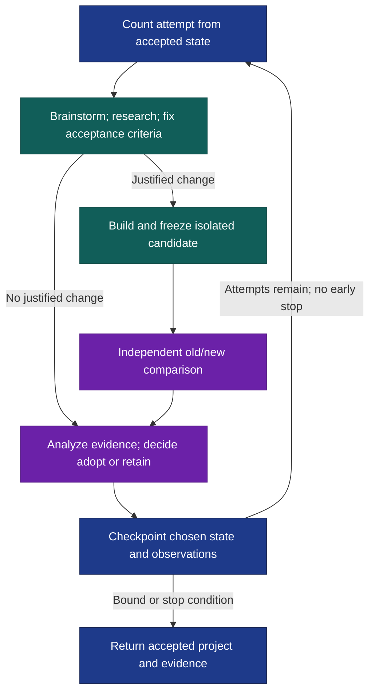

# Design loop

A project can get larger without getting better. Design loop grows an endgoal through small increments, starting with the smallest useful working proof of concept. Each candidate is compared independently with the accepted version; failed ideas inform the next cycle while the baseline stays intact.

**Experimental:** full standalone cycles have not been validated end to end.

After [installation](#install), try two cycles in Codex:

```text
$design-loop:design-loop Build a local shopping-list CLI in this workspace.
It must add, list and remove items and persist them between commands.
Use Python's standard library. Run N=2 cycles, starting with the smallest
working PoC. Put the project, usage instructions, comparison evidence and
checkpoint in ./shopping-list-run/.
```

In Claude Code, use `/design-loop:design-loop`. All components are manual-only. Supply an endgoal, workspace/artifacts and output directory; optional inputs include criteria, constraints, domains and scoped model/effort. Empty workspaces are valid; existing uncommitted and relevant untracked work belongs to the baseline.

## One increment, one comparison



Design fixes the acceptance criteria, existing behavior to preserve and comparison conditions **before implementation**. A fresh tester inspects exact old/new states, records raw evidence and makes no repairs or adoption decision. The coordinator adopts only when evidence supports the criteria and required prior behavior. Missing analysis means retain.

There is one independent comparison round per implemented cycle, no extra final review and no repair loop. Ordinary checks and fixes belong to implementation; corrections after comparison belong to later bounded cycles. The [handoff contract](references/design-loop-contract.md) keeps baselines, candidates and evidence identifiable.

## What a cycle costs

`N` defaults to **3 attempted cycles**, including the first PoC, failures and attempts that justify no change. Each attempt is recorded before brainstorming. Run through N unless the caller stops, a resource bound is reached, required capability or authorization is missing, or explicit stop-on-goal applies. Reaching the goal alone does not shorten the run.

Research defaults to at most **3 focused lookups and 5 relevant sources per invocation**, starting with supplied/local material. Callers can override these bounds.

Failures preserve evidence and mark dependent stages unexecuted; analysis uses partial evidence when possible. Resumption verifies saved identities, reconciles unfinished work and continues the same attempt's first unfinished stage without resetting N. Repeating completed stages requires a new or extended caller run.

The [main workflow](skills/design-loop/SKILL.md) returns the accepted project, usage, initial-to-final changes/evidence, decisions, attempted/completed counts, gaps and checkpoint path. Its brainstorming, research, design, implementation, testing and analysis [components](skills/) also work independently with declared inputs.

## Install

From the Orchflows **source checkout**, with Python 3.11+:

```sh
python scripts/orchflows.py setup --example shared
python scripts/orchflows.py setup --example design-loop
```

Complete any reported [host installation steps](https://github.com/DanMcInerney/orchflows/blob/main/docs/hosts.md#register-and-refresh) for both packages, then start a new session. Setup preserves copies; it installs neither transitive dependencies nor project tools. Requires **Orchflows**; full cycles and standalone testing also require **shared** and native independent review. [Library context](references/library-context.md) covers task tools, snapshots and guidance.

**Validation limit:** a standalone testing trial separated an intended improvement from a regression without repair or adoption. It tested resolved-file composition, not full cycles or skill-name registration. The [full-loop trial](https://github.com/DanMcInerney/orchflows/blob/main/example-workflows/design-loop/trials/request.md) remains a specification.
