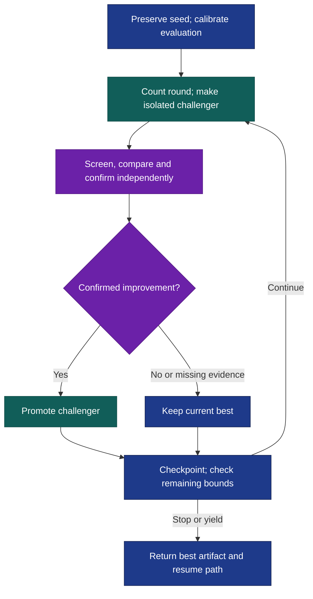

# Evolve

Make a game faster without losing its feel, or revise a poster without losing its message. Evolve creates challengers to an artifact, compares actual outputs, and keeps only independently confirmed improvements. Give it an existing artifact or a creation brief; it can infer evaluation when no metric exists.

After [installation](#install), try this in Codex:

```text
$evolve:evolve Improve this game's FPS while preserving gameplay and
visual quality. Run three rounds with one challenger per round. Save the
best version, measurements, decisions and resume checkpoint in
./evolve-runs/game-fps/.
```

In Claude Code, use `/evolve:evolve`. Invocation is manual. Creation and inspection tools depend on the artifact: code, writing, images, audio and workflows need different evidence.

## A challenger has to earn its place



The [evaluation contract](skills/evolve/references/evaluation.md) separates requirements from qualities to improve. Subjective promotion needs two fresh judges with reversed presentation order. Metric promotion needs matched measurements, required checks and, when candidates could influence the measurement, a fresh audit. Ties, regressions, missing evidence and unconfirmed wins retain the current best. Judges compare without repairing candidates.

An evaluator repair creates a new revision and requires re-evaluating the current best and contenders; scores across revisions are not comparable progress. A [harness experiment](skills/evolve/references/harness.md) instead tests the working instructions, tools or search policy. It replaces an ordinary round and uses reserved cases plus fresh, matched executions. Adoption needs confirmed output improvement, preserved requirements and acceptable recorded cost. Later contradictory validation restores the predecessor. Harness proposals cannot change purpose, evaluation, promotion rules, budgets or checkpoint ownership.

## Bounded search, resumable state

Defaults are **three rounds, one challenger per round**. Each artifact or harness attempt counts before proposal or production, including failures and interruptions. Seed creation, calibration and evaluator repair consume resources without adding or resetting rounds. After three informative rounds without promotion, the approach changes or the failure is investigated.

An explicit continuous request removes the total round cap; execution still stops for caller limits, interruption or blocked capability. A target stops work only when requested as a stop condition. Continuation requires host support; otherwise Evolve returns a checkpoint and the gap.

The result includes the best artifact, improvements, evaluation and harness revisions, evidence, observed resource use, stop reason and resume path. The chosen directory—or `evolve-runs/<run-id>/`—retains originals, alternatives, experiments, an append-only journal and checkpoint. [Resumption](skills/evolve/references/state.md) reconciles in-flight work and preserves consumed bounds; it does not duplicate uncertain work or reset attempts.

## Install

From the Orchflows **source checkout**, with Python 3.11+:

```sh
python scripts/orchflows.py setup --example evolve
```

Setup preserves existing library copies. Complete any reported [host installation steps](https://github.com/DanMcInerney/orchflows/blob/main/docs/hosts.md#register-and-refresh), then start a new session. Requires **Orchflows**, native child delegation and task-specific creation/inspection tools; see [library context](references/library-context.md). No scoring service is required.

**Validation limit:** bundled [trials](https://github.com/DanMcInerney/orchflows/blob/main/example-workflows/evolve/trials/) specify expected behavior, not observed results. [Research lessons](references/research.md) do not validate this implementation. Sustained gains on unseen tasks at matched cost remain unestablished.
