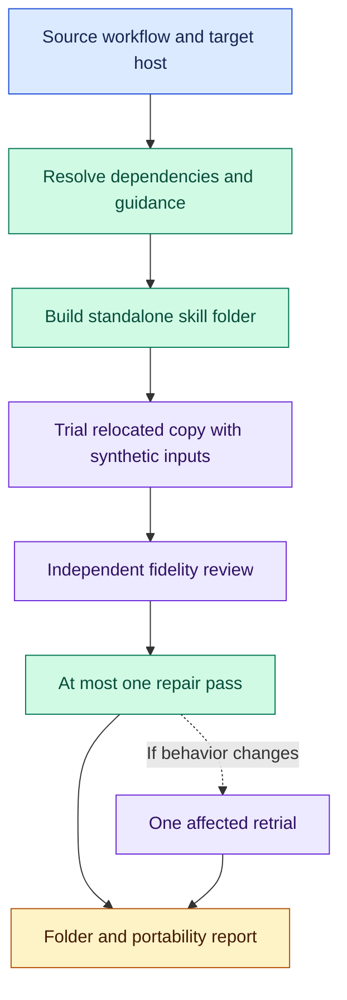

# Export Workflow: take the process with you

A workflow can depend on more than its `SKILL.md`: shared guidance, scripts, other workflows, and rules for independent review. Export Workflow follows those dependencies and builds one native skill folder that runs without an Orchflows installation. A portability report says what was preserved, changed or left unverified.

After [installation](#install), try:

```text
$export-workflow:export-workflow
Export social-search:social-search for Codex into ./exports/social-search.
Preserve supported source scopes and configurable runtime inputs. Trial it
with synthetic search/source fixtures and simulated external effects.
Include a portability report identifying changes and validation gaps.
```

Use `/export-workflow:export-workflow` in Claude Code. Supply a source path or library/skill identity; the target defaults to the current host and `exports/<skill-name>/`. Source files stay untouched. Without an update request, the exporter chooses an unused destination.

## Portability includes behavior



Dependencies are bundled once, paths rewritten and licenses retained. Native delegation replaces Orchflows calls while preserving supported independence, scoped guidance/settings, handoffs, decisions and stopping bounds. Runtime inputs remain configurable; the trial question does not become the exported skill's permanent job.

The relocated copy runs in a fresh top-level session with only the export, ordinary synthetic inputs and declared prerequisites. External effects are simulated. After the trial and its required judgments finish, one independent review compares the export with the source and trial evidence. At most one repair pass follows; changed behavior gets one affected retrial, with no second review.

## What you receive

The installable folder has `SKILL.md` and its required resources. A sibling report records source revision plus a saved diff of local changes, library and guidance order, target host, bundled dependencies, external prerequisites, behavior changes, reviewed/delivered identities and validation limits. Trial outputs stay outside the installable folder.

Tools, runtimes and authentication remain prerequisites; export provisions none. Single-file or single-agent requests can require disclosed losses. Missing required behavior makes the export incomplete. Simulated trials establish local behavior, not live integration. Source changes require re-export; installation and verified native registration are separate steps. The [export contract](skills/export-workflow/references/export-contract.md) defines fidelity and these limits.

## Install

Run from a complete Orchflows checkout with Python 3.11+:

```sh
python scripts/orchflows.py setup --example shared
python scripts/orchflows.py setup --example export-workflow
```

Complete any reported [host installation steps](https://github.com/DanMcInerney/orchflows/blob/main/docs/hosts.md#register-and-refresh), then start a new session. Setup preserves existing library copies and installs no runtime dependencies. The skill is manual-only by default.

Requires **core and shared**, native child delegation, filesystem access, source dependencies and bounded-trial tools. Setup does not install transitive dependencies; update an older shared copy before refreshing host registration. See [library context](references/library-context.md). The [trial request](trials/request.md) and its evaluator-only acceptance criteria are specifications, not observed passes.
