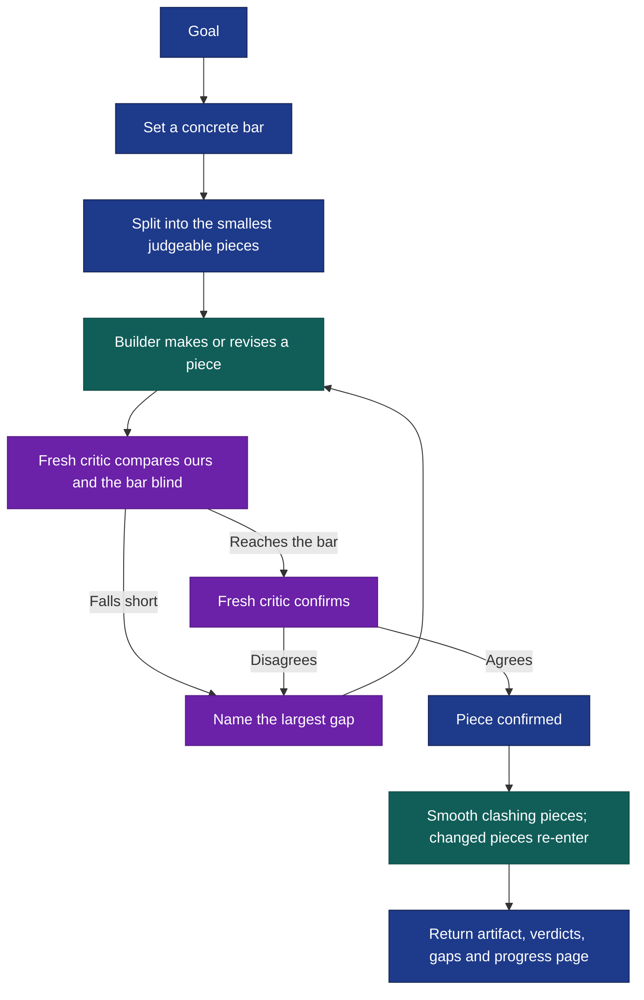

# Gauntlet Loop

Give an agent a goal and a bar it cannot talk its way around. It splits the work, gives every piece its own builder and a separate harsh critic, and keeps each piece looping until ours beats the real reference in a blind comparison, or until you stop it. This packages [Matt Shumer's Gauntlet Loop](https://somethingbig.ai/gauntlet-loop), the method behind [Claude of Duty](https://github.com/mshumer/Claude-of-Duty), as an Orchflows workflow.

After [installation](#install), try this in Claude Code:

```text
/gauntlet-loop:gauntlet-loop Build a landing page for a local climbing gym.
Judge it against linear.app, stripe.com and vercel.com. Save the site and
the progress page in ./gauntlet-runs/climbing-gym/.
```

In Codex, use `$gauntlet-loop:gauntlet-loop`. Invocation is manual. Leave the bar out and the lead finds one first.

## Split, build, judge, repeat



The [workflow](skills/gauntlet-loop/SKILL.md) keeps Shumer's rules:

- **Goal, not implementation.** The lead chooses the architecture, the pieces and the order. Callers state the destination.
- **A real bar.** A named reference the critic can inspect beside ours: screenshots of the product you admire, paragraphs with the clarity you want, a test suite, a latency target. "Make it amazing" is not a bar. It need not be reachable; Claude of Duty never beat Call of Duty, but chasing it kept the run from settling for "pretty good for AI".
- **Small pieces.** "Make this tree hold up against the tree in the reference" is a problem an agent can attack repeatedly; "make the game better" is not.
- **The builder never grades itself.** Each round's critic is fresh, sees the actual output and the bar with labels stripped, and never sees the builder's reasoning. Judgment runs through [`shared:compare-candidates`](https://github.com/DanMcInerney/orchflows/blob/main/example-workflows/shared/README.md).
- **No arbitrary last round.** Loops continue until ours reaches the bar, you stop the run or a bound you supplied is reached.
- **Watch without interrupting.** A live progress page in the output location shows each piece evolving.
- **Optional smoothing.** When pieces clash, one fresh agent reconciles the whole; anything it changes is judged again.

Two additions keep the loop honest. A win that one verdict could get wrong must survive a fresh confirmation, reversed order for judged comparisons and a matched re-run for noisy measurements, because one judge's preference can be position bias and one timing can be noise; a deterministic result, such as a passing test suite, stands. And a stalled piece changes approach and shows the stall on the progress page instead of counting as done. Threshold bars such as a test suite or "as good as" are reached by matching them.

## Bounds and settings

By default there is no round limit; a run stops when every piece is confirmed, when you stop it or when every remaining piece is blocked by a missing capability. Supply time, cost or round bounds to cap it; round bounds count build-and-judge rounds per piece unless you say otherwise. Shumer runs serious loops at maximum effort (ultracode in Claude Code); pass effort as a scoped setting if you want it, since the workflow saves none. Long runs record every round so a later session can resume without redoing judged rounds.

## Install

From the Orchflows **source checkout**, with Python 3.11+:

```sh
python scripts/orchflows.py setup --example shared
python scripts/orchflows.py setup --example gauntlet-loop
```

Setup does not install dependencies transitively, so install `shared` too. Complete any reported [host installation steps](https://github.com/DanMcInerney/orchflows/blob/main/docs/hosts.md#register-and-refresh), then start a new session. Requires **Orchflows**, native child delegation and independent review, plus tools to render, run and inspect the artifact and to fetch references; see [library context](references/library-context.md). [Gauntlet guidance](guidance/gauntlet.md) supplies the builder's and critic's criteria.

**Validation limit:** the [trials](https://github.com/DanMcInerney/orchflows/blob/main/example-workflows/gauntlet-loop/trials/) specify expected behavior, not observed results. This workflow has not been run end to end. Shumer's published results come from his own prompt, not from this packaging.
