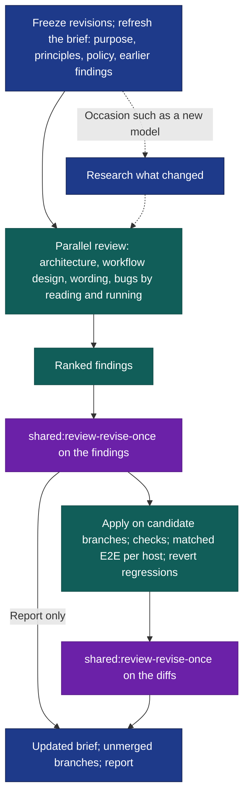

# Orchflows Review

A library of workflows drifts. Rules get restated in five places, a workflow grows a gate that no longer changes outcomes, a host changes underneath a documented fact, and a check that only ever ran on one host quietly fails on another. Orchflows Review first learns what Orchflows is for and how it is meant to be designed. It then reviews the library against that: its architecture, each workflow's design, the wording, and bugs found by reading and by running. Finally it applies a reviewed findings list on unmerged branches.

After [installation](#install), try this in Claude Code from your Orchflows checkout:

```text
/orchflows-review:orchflows-review Review Orchflows and my libraries.
```

In Codex, use `$orchflows-review:orchflows-review`. Invocation is manual. Name an occasion, such as "a new model shipped", to add research on what changed. Add "report only" to stop after the reviewed findings.

## Understand, review, then change



The [workflow](skills/orchflows-review/SKILL.md) is scaffolding. The judgment lives in [`orchflows.maintenance` guidance](guidance/orchflows.maintenance.md), which specializes core `orchflows`:
- It prefers the least mechanism, and principles over checklists.
- It writes for capable future models. A mistake only weaker models make is caught by a test or recorded as a host fact, not answered with more instructions.
- It trusts running over reading.
- Deliberate policy stays, and in your libraries your taste is policy.

**The brief.** The run keeps a brief, by default in `artifacts/orchflows-review/` in your Orchflows home. It records the purpose, principles and policy, and every finding so far with its fate. Each run starts by reconciling that record with what you merged and the declines you give, either in the request or as notes in the brief. A declined idea comes back only with new evidence. `artifacts/` is ignored scratch; supply a tracked output location to keep the brief across machines.

**How changes are tested.** The coordinator runs the unit tests and a baseline E2E pass over the cases in scope on each available host with the runner's default models, and reviewers probe edge inputs. Many bugs only appear when the library runs. After changes, the affected E2E cases rerun, matched against the review's own baseline runs, and changes that regress are reverted. The run uses its own workflow and guidance as loaded at start, even when it changes them.

**What you get back.** An unmerged local branch per affected repository, and a report of what changed and why, with checks, E2E results per host and gaps. Uncommitted changes stay out of the branches, and manifest versions stay unchanged. Merging and pushing belong to you.

## Install

From the Orchflows **source checkout**, with Python 3.11+:

```sh
python scripts/orchflows.py setup --example shared
python scripts/orchflows.py setup --example orchflows-review
```

Setup preserves existing copies and does not install transitive dependencies. Complete any reported [host installation steps](https://github.com/DanMcInerney/orchflows/blob/main/docs/hosts.md#register-and-refresh), then start a new session.

**Requirements:** **Orchflows**, **shared**, native child delegation, and an authenticated Claude Code or Codex CLI for E2E runs. See [library context](references/library-context.md). E2E runs use the runner's default models and consume your host usage.

**Validation limit:** the bundled [trials](https://github.com/DanMcInerney/orchflows/blob/main/example-workflows/orchflows-review/trials/) specify expected behavior, not observed runs. A general model-upgrade predecessor ran once on 2026-09-22; its findings were merged in [#223](https://github.com/DanMcInerney/orchflows/pull/223).
