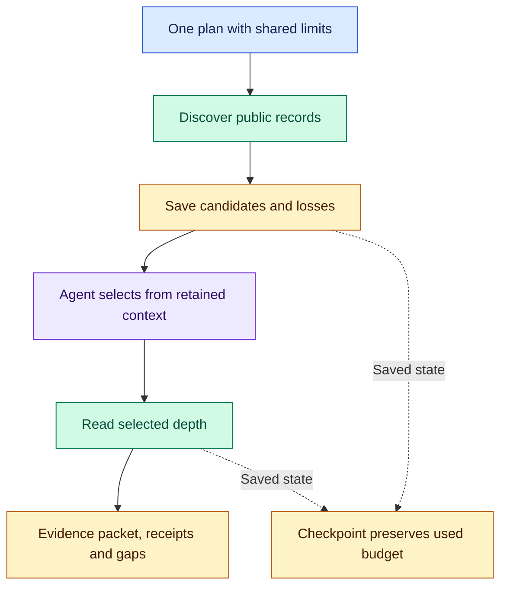

# Research Acquire: make source reads count

An interesting search result creates a choice: read deeper, or spend the remaining budget elsewhere. Research Acquire makes that choice explicit. Discover public records, select the ones worth inspecting, and save evidence, receipts and resume state under one set of limits. It runs in the current agent, with **no child agents**; the caller interprets the evidence.

After [installation](#install), try:

```text
$research-acquire:research-acquire
Collect Hacker News evidence about SQLite in production from the last
30 days. Discover up to 10 stories, then select at most 2 discussions
worth reading, with up to 20 records each. Use one plan capped at 3 steps,
8 requests, 50 records, and 120 seconds of active acquisition.
Save inspected evidence, selection reasons, receipts, and resume state
in research/sqlite-hn. Report coverage gaps.
```

Use `/research-acquire:research-acquire` in Claude Code. Supply a question, sources, date window, limits and output location.

## Discover, choose, inspect



The agent chooses depth reads from retained text and context, explaining relevance and omissions. Requests, pacing and limits are shared across discovery, depth and resume. Completed steps make no further requests. An interrupted read without a durable result stays uncertain, retains its budget reservation and is not replayed.

Bounds are ceilings. Active-work limits do not guarantee total wall time; a completed packet establishes neither complete coverage nor an answer.

## What it can read

Routes use public access without credentials. The [source operations reference](skills/research-acquire/references/selection-routes.md) defines exact syntax, depth operations and limits.

| Source | Operations |
| --- | --- |
| Reddit | Archive discovery, listings/search, selected submissions and sampled comments |
| Hacker News | Story/comment search, discussion trees and items |
| GitHub | Anonymous repository search/details, issues and releases |
| Crossref/arXiv | Metadata, available abstracts and selected original-page reads |
| Web | Known HTTPS documents and extracted prose; host tools own discovery |
| RSS/Atom | Supplied feeds, entries and selected articles |
| X via FxTwitter | Known post IDs and returned conversation material through a third party |
| YouTube | Channel feeds; separate optional caption reader for known videos |

Abstracts remain abstracts; captions are speech; sampled comments remain a sample. These routes exclude JavaScript rendering, X search, automatic feed discovery and guaranteed complete conversations.

## Keep the evidence directory together

| Artifact | Contents |
| --- | --- |
| `packet.json` | Records, relationships, step outcomes and losses |
| `summary.json` | Packet hash, counts, timings, limits and gaps |
| `candidates.json`, `selection.json` | Available choices and selection reasons |
| `checkpoint.json`, step artifacts | Identities, reserved budgets and saved results |

Resume uses unchanged plan/output paths. Changed identity or corrupt state refuses reuse; new scope needs a separate plan within remaining caller bounds. See the [acquisition method](skills/research-acquire/references/acquisition.md). The separate [YouTube reader](skills/research-acquire/references/source-inspection.md) saves a receipt and, when retained, a caption sidecar with timing.

## Install

Run from an Orchflows checkout with Python 3.11+:

```sh
python scripts/orchflows.py setup --example research-acquire
```

Complete any reported [host installation steps](https://github.com/DanMcInerney/orchflows/blob/main/docs/hosts.md#register-and-refresh), then start a new session. Setup preserves existing user-owned copies and installs no runtime dependencies. The skill allows model invocation so workflows such as Social Search can load it by name; its description limits selection to workflows that name it and explicit user requests.

The backend needs **Python 3.9+ and standard library**. Optional captions need `yt-dlp` in the same interpreter:

```sh
python -m pip install yt-dlp
```

## Inspect or extend

Start with the [skill](skills/research-acquire/SKILL.md), [acquisition](skills/research-acquire/references/acquisition.md) and [routes](skills/research-acquire/references/selection-routes.md). [Protocol](skills/research-acquire/references/protocol.md) owns direct APIs/manual manifests. Mechanics and offline checks live in the skill's `scripts/` and `tests/`.

From the skill directory, set `PYTHONPATH` to its absolute `scripts/` path:

```sh
python -m unittest discover -s tests -t .
python scripts/acquire_fixture.py --output <scratch>
```

The fixture exercises parsing, selected depth and resume without live access. These checks establish neither live availability nor research quality. The manual [trial request](https://github.com/DanMcInerney/orchflows/blob/main/example-workflows/research-acquire/trials/hacker-news-resume/request.md) exercises live Hacker News selection and resume; it and its evaluator-only acceptance criteria are specifications, not observed passes. [Library context](references/library-context.md) states dependencies for agents.

Backend adapted from [recent-search](https://github.com/DanMcInerney/orchflows/tree/945546721732aa564a086ee9543803b38017e1c3/example-workflows/recent-search) under its [MIT license](LICENSE).
