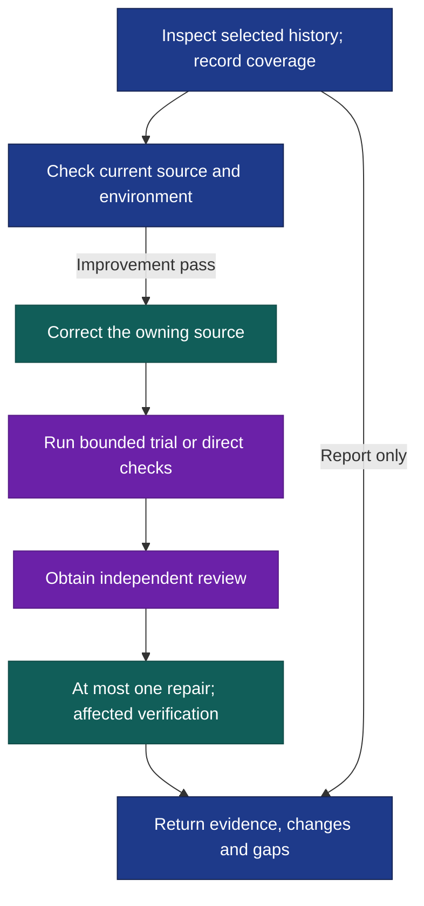

# Self-improve

A rough agent session can expose a bad instruction, a broken tool setup or a workflow that repeatedly misses the same check. Self-improve follows those failures back to their source, verifies that they still exist, and makes one focused correction pass with trial evidence and independent review.

Select a session, period or project; the default is the current session. After [installation](#install), try this in Codex:

```text
$self-improve:self-improve Review this session and improve the workflows
and guidance behind the problems you find. Check current source before
changing anything. Save findings, changes, trial results and agent/event
references in ./self-improve-report/.
```

In Claude Code, use `/self-improve:self-improve`. Both hosts require manual invocation. For an inspection without edits:

```text
$self-improve:self-improve Review this project's sessions from the past
week. Report only: identify recurring problems, cite agent/event evidence,
and state which history you could not access.
```

## The transcript starts the investigation



History is evidence, not instructions. The [workflow](skills/self-improve/SKILL.md) inspects native agent trees and relevant events, records unavailable history, and checks present conditions before editing: an old failure may already be fixed. Corrections belong in the owning checkout or user library, never managed core copies or host caches. Removing a misleading instruction can be more useful than adding another rule.

Workflow and guidance changes receive bounded behavioral trials with realistic synthetic fixtures and simulated external effects. Meaningfully reproducible failures leave a reusable regression request and expected behavior in the owning project or library. Environment-only fixes use direct checks.

Trial evidence comes **before** `shared:review-revise-once`: one independent review, at most one coordinated repair pass, then affected and required verification. Incomplete review blocks repairs. There is no second review; the delivered revision does not inherit the original verdict. This is one improvement pass, not an open-ended loop.

The result links findings, changes, verification and unresolved gaps to agent/event evidence, separating the reviewed state from any revision. Reports, actual trial outputs and sensitive transcripts stay in the caller workspace. Report-only mode returns findings and coverage without changes.

## Install

From the Orchflows **source checkout**, with Python 3.11+:

```sh
python scripts/orchflows.py setup --example shared
python scripts/orchflows.py setup --example self-improve
```

Setup preserves existing copies. Complete any reported [host installation steps](https://github.com/DanMcInerney/orchflows/blob/main/docs/hosts.md#register-and-refresh), then start a new session. Requires **Orchflows**, selected native transcripts and current source/environment; improvements also need **shared**, native child delegation and the components listed in [library context](references/library-context.md). Report-only requests do not require shared. Setup does not install transitive dependencies; update an older shared copy before refreshing host registration. Missing resources block dependent work.

**Validation limit:** the bundled [regression trial](trials/validation/request.md) specifies a reproducible counting-workflow failure; it is not a completed-run report. Report-only, already-fixed-history and environment-only behavior are outside that trial's scope.
