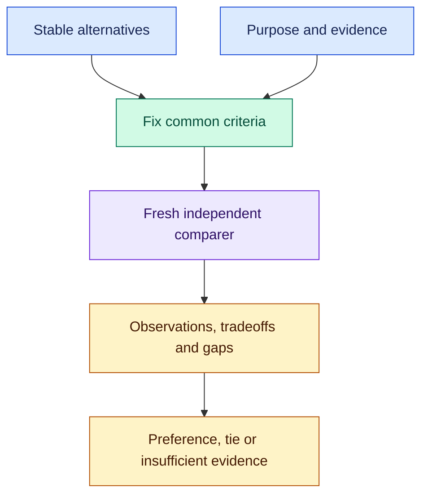

# Shared: compare before you choose

Two supplier proposals can quote different prices for different things. Two code changes can pass different tests. `compare-candidates` gives a fresh reviewer the same criteria and stable alternatives, then returns the evidence for a choice—including when there is no defensible winner.

After [installation](#install), try:

```text
$shared:compare-candidates
Compare proposals/alpha.pdf and proposals/beta.pdf against brief.md.
Evaluate first-year total cost, delivery dates, and support coverage.
Separate missing evidence from failed requirements. Keep both proposals
unchanged. Save the comparison and supported preference in decisions/vendors.
```

Use `/shared:compare-candidates` in Claude Code. Supply at least two candidate states, your purpose, common criteria, relevant evidence, bounds and an output location. The skill resolves ordinary missing criteria from the request and guidance, labels assumptions, and fixes the comparison basis before review.

## One comparison, one independent judgment



The [comparison skill](skills/compare-candidates/SKILL.md) calls core `orchflows:orch-review` once. Its comparer made none of the candidates and may create isolated evaluation artifacts, but cannot edit, repair or adopt an alternative. Requested blinding, isolation and disclosure order remain part of the assignment.

The result preserves requirement failures, regressions, conflicting evidence and unavailable checks. A preference is a recommendation; adoption and any further confirmation remain with the caller.

## Use the result in a larger process

A personal decision brief can compare alternatives, draft a recommendation from that evidence, then explicitly use core `orchflows:orch-review-revise-once` for one review and at most one repair. Your guidance owns the report's priorities and voice. Shared supplies comparison, with no bundled domain criteria or runtime.

## Install

Run from a complete Orchflows checkout with Python 3.11+:

```sh
python scripts/orchflows.py setup --example shared
```

Complete any reported [host installation steps](https://github.com/DanMcInerney/orchflows/blob/main/docs/hosts.md#register-and-refresh), then start a new session. Setup preserves existing user-owned library copies. Requires **core 0.12.0+ and native independent review**; see [library context](references/library-context.md). The skill is manual-only by default.

[Trial scenarios](trials/README.md) exercise comparison through real consumers. The automated comparison pilot timed out before delivery; it is inconclusive. Executing supplied files does not establish native registration.
