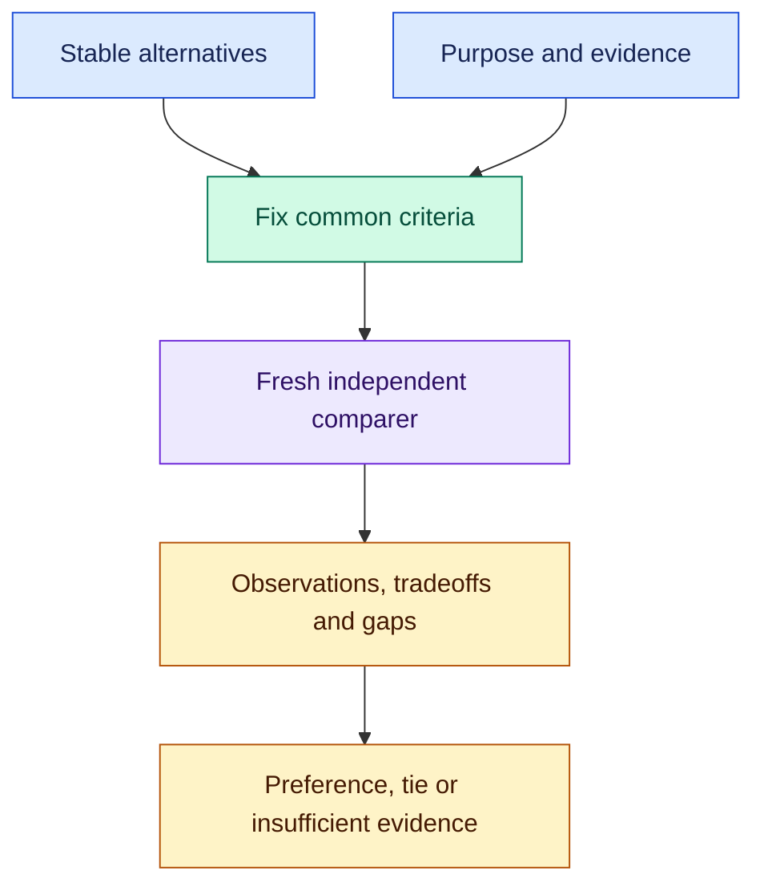

# Shared: comparison and bounded revision

Reusable processes for comparing alternatives and improving an existing result. `compare-candidates` returns evidence for a choice; `review-revise-once` reviews one candidate, repairs it at most once and checks the result. Both compose with core primitives and other workflows.

Two supplier proposals can quote different prices for different things. Two code changes can pass different tests. `compare-candidates` gives a fresh reviewer the same criteria and stable alternatives, then returns the evidence for a choice—including when there is no defensible winner.

After [installation](#install), try:

```text
$shared:compare-candidates
Compare proposals/alpha.pdf and proposals/beta.pdf against brief.md.
Evaluate first-year total cost, delivery dates, and support coverage.
Separate missing evidence from failed requirements. Keep both proposals
unchanged. Save the comparison and supported preference in decisions/vendors.
```

Use `/shared:compare-candidates` in Claude Code. Supply at least two candidate states, your purpose, common criteria, relevant evidence, bounds and an output location. The skill resolves ordinary missing criteria from the request and guidance, labels assumptions, and fixes the comparison basis before review.

## One comparison, one independent judgment



The [comparison skill](skills/compare-candidates/SKILL.md) calls core `orchflows:orch-review` once. Its comparer made none of the candidates and may create isolated evaluation artifacts, but cannot edit, repair or adopt an alternative. Requested blinding, isolation and disclosure order remain part of the assignment.

The result preserves requirement failures, regressions, conflicting evidence and unavailable checks. A preference is a recommendation; adoption and any further confirmation remain with the caller.

## Review and revise once

The [revision workflow](skills/review-revise-once/SKILL.md) calls `orchflows:orch-review` once on an existing stable candidate. Supply the candidate, requirements, source evidence, guidance, repair scope, required checks and output location:

```text
$shared:review-revise-once
Review drafts/recommendation.md against brief.md and sources.md.
Repair factual errors and unsupported claims at most once. Run the
required source checks even if no repairs are needed. Save the original
review, delivered recommendation, changes and checks in decisions/review.
```

Incomplete independent review blocks repairs. After review, at most one coordinated repair pass follows, then affected and required verification. The original verdict applies only to the inspected state; a revision does not inherit it. The workflow adds no second review or release authorization.

## Use the results in a larger process

A personal decision brief can apply `shared:compare-candidates`, draft a recommendation from that evidence, then apply `shared:review-revise-once`. Your guidance owns the report's priorities and voice. Shared supplies the processes, with no bundled domain criteria or runtime. Core's Build and Dynamic workflows use core primitives directly and do not depend on this library.

## Install

Run from a complete Orchflows checkout with Python 3.11+:

```sh
python scripts/orchflows.py setup --example shared
```

Complete any reported [host installation steps](https://github.com/DanMcInerney/orchflows/blob/main/docs/hosts.md#register-and-refresh), then start a new session. Setup preserves existing user-owned library copies; update an existing copy from the source library before refreshing its host registration. Requires **core and native independent review**; see [library context](references/library-context.md). Both skills allow model invocation so other workflows can load them by name; their descriptions limit selection to workflows that name them and explicit user requests.

[Trial scenarios](https://github.com/DanMcInerney/orchflows/blob/main/example-workflows/shared/trials/README.md) exercise comparison through real consumers. Executing supplied files does not establish native registration.
