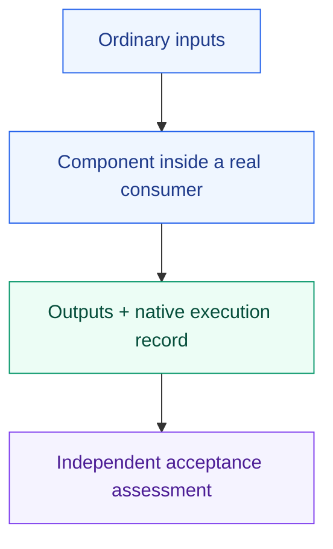

# Small components need real consumers

These scenarios test whether reusable procedures still work when called alone, nested inside another workflow or incorporated into a newly built personal library.

| Scenario | What it probes | Execution |
| --- | --- | --- |
| [Small comparison](compare-small/request.md) | Independent comparison of stable alternatives, evidence and no adoption | E2E case `shared/compare-small` |
| [Nested composition](composition/request.md) | One coordinator, one brief review and separate internal/campaign guidance | Manual trial |
| [Build a personal library](build-personal/request.md) | Component discovery, fresh reuse, native entrypoint loading and independent guidance reuse | Manual trial |
| [Design comparison](design-comparison/request.md) | A design-loop component consumes comparison without extra review or adoption | Manual trial |
| [Office decision](office/request.md) | Personal guidance, comparison and bounded revision | Manual trial |



From an Orchflows checkout, with an authenticated Claude Code CLI:

```sh
python tests/e2e/run.py --case shared/compare-small --output ../e2e-shared
```

For manual trials, use a fresh unrelated workspace, complete declared dependencies and only the request's inputs. Withhold authoring history and sibling `expected-behavior.md` files from the executing agent. Keep outputs outside packages; record revisions, native child identities, staffing, reviewed/delivered states, checks, interventions and gaps. Registration, native execution and resolved-file composition are separate claims.

These scenarios are test specifications, not behavioral passes; a full run of one does not validate all consumers or hosts.
