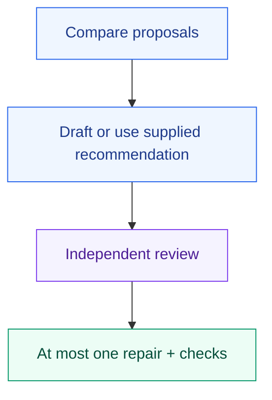

# Your decision process belongs in a library

A small personal library showing how to combine shared processes with your own guidance. The [workflow](skills/decision-brief/SKILL.md) compares proposals, drafts or accepts a supplied recommendation, then independently reviews and revises it at most once. The [guidance](guidance/decision-brief.md) owns reporting style and evidence quality.

> Use personal:decision-brief to compare these proposals against my criteria and deliver a reviewed recommendation.

Requires Orchflows core 0.10.0+, shared 0.3.0+ and native child delegation. Resolve both dependencies before starting; copying this fixture does not install or register them. For an isolated trial, copy this complete folder to the supplied home's `libraries/personal/`. Do not replace an existing personal library with it. All skills are manual-only by default.

Supply the question, proposals, decision criteria, optional draft and output location. Staffing follows core execution rules. Return the comparison, original review, delivered memo, verification and remaining gaps. No purchase, message, approval or extra review is part of this process.
