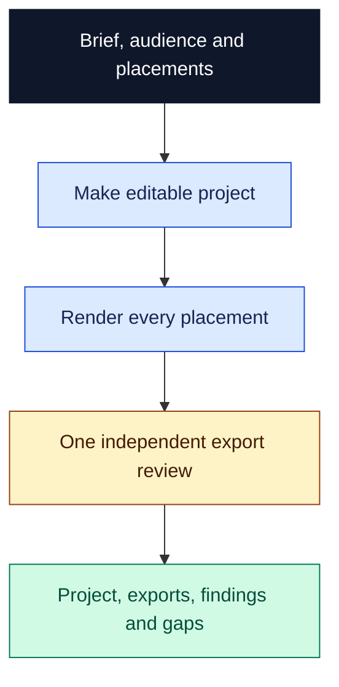

# Short video

Make a short film you can reopen, rerender and check against its brief. This library takes a subject and audience through an editable project, actual exports and one independent review of the encoded files. Use it for an explanation, product demonstration, joke or story that needs to work at a specific length and viewing size.

## Try it

```text
$short-video:short-video
Create a 25-second animated explanation of Moon phases for curious beginners.
Open with a visual puzzle and resolve it clearly. Deliver 9:16 and 1:1
versions with readable captions in ./moon-phases, plus editable source
and render instructions. Use intentional silence; no narration or music.
```

Claude Code uses `/short-video:short-video`. Entry points are manual-only. Supply subject, audience, intent, placements, constraints, assets, supporting facts and an output location; the maker chooses unspecified creative details from the brief.

## From brief to reviewed export



Each film gets separate outputs. Independent films may run concurrently; each film's review covers all placements and their coherence. A fresh nonmaker receives the original brief and stable exports identified by path and byte size. There is no research gate, outline review or repair loop. Further work needs another request; publishing is outside this workflow.

Delivery includes source/assets, playable exports, file identities, dependencies, reopen/render instructions and timestamped findings. Review covers opening and payoff, pacing, captions, sound and the brief's factual claims. It reports decoding, sampled frames, watched motion and heard audio separately. Full audiovisual acceptance requires motion viewing and listening when sound exists; unavailable playback leaves a partial review.

| Entry point | Use |
| --- | --- |
| [short-video](skills/short-video/SKILL.md) | Make, then independently review each film once |
| [make-short-video](skills/make-short-video/SKILL.md) | Produce source and exports without independent review |
| [review-short-video](skills/review-short-video/SKILL.md) | Review existing exports once, without repairs or a prior-maker requirement |

[Video guidance](guidance/short-video.md) covers creative quality; [marketing guidance](guidance/short-video.marketing.md) adds product relevance and supported claims. [Library context](references/library-context.md) defines dependency and guidance selection.

## Setup and limits

Run from a complete Orchflows core checkout with Python 3.11+:

```sh
python scripts/orchflows.py setup --example short-video
```

Setup preserves existing library copies and installs no media tools. Complete any reported [host installation steps](https://github.com/DanMcInerney/orchflows/blob/main/docs/hosts.md#register-and-refresh), then start a new session.

Requires core, native child delegation, authoring/export tools and access to exported media. Optional [Remotion](references/remotion.md) requires Node.js/npm or Bun, React, compatible Remotion packages, renderer/browser/font/media dependencies and a lockfile in the caller workspace. Missing rendering blocks production; missing playback limits review.

The native [corrupt-export pilot](trials/corrupt-export/request.md) timed out before a completed review. Full export review remains unverified. The broader [trial request](trials/request.md) and [acceptance criteria](trials/expected-behavior.md) describe expected behavior, not observed quality or popularity.
