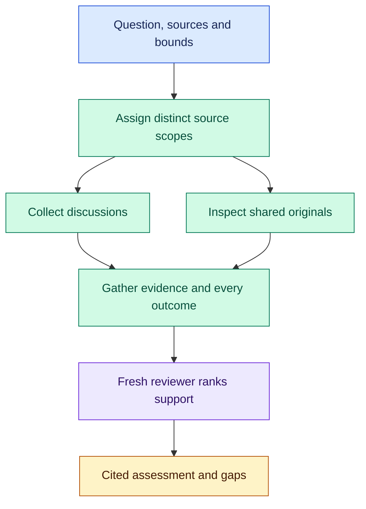

# Social Search: follow the evidence across sources

Ten posts repeating one study are still one study. Social Search divides a question across public sources, preserves what researchers actually inspected, and gives a fresh reviewer the whole collection. You get a ranked, cited assessment with disagreements and coverage gaps intact.

After [installation](#install), try:

```text
$social-search:social-search
Investigate what developers report about running SQLite in production.
Search Hacker News, Reddit, and original technical writeups from the last
30 days. Give shared original-source checks one owner. Explain the strongest
evidence and disagreements. Spend at most 20 minutes including review.
Save the assessment and collection evidence in research/sqlite-production.
```

Use `/social-search:social-search` in Claude Code. Change the question, dates, sources, bounds and output directory. An assignment can cover a site, a web scope, supplied feeds or related sources together.

## Collect separately, judge together



The coordinator launches independent collection assignments within capacity and provider limits. Shared original-source checks have one owner; other researchers contribute distinct evidence. Existing evidence can fill part of the scope, so collection focuses on what is missing.

Time limits include collection, evidence writing, gathering and the final review. At the handoff deadline, unfinished work stops; useful partial material survives and missing assignments become gaps. One fresh assessor then ranks the gathered evidence without collecting more or changing it.

| Entrypoint | Result |
| --- | --- |
| [social-search](skills/social-search/SKILL.md) | Collection plus one independent assessment |
| [search-site](skills/search-site/SKILL.md) | Evidence for one bounded source assignment |
| [rank-evidence](skills/rank-evidence/SKILL.md) | Independent assessment of evidence already supplied |

## A claim you can trace

Each collection writes `results.md` with original URLs, inspected support, qualified dates, available engagement and coverage limits. A search snippet is a lead. An abstract supports claims about its contents, not uninspected methods. Sampled discussion establishes experiences or viewpoints, not prevalence; engagement and reliability stay separate. The [evidence contract](references/evidence.md) defines these distinctions.

Adapt [research guidance](guidance/research.search-site.md) and its site specializations to your question. [Library context](references/library-context.md) owns guidance selection and dependencies.

## Install

Run from a complete Orchflows checkout with Python 3.11+:

```sh
python scripts/orchflows.py setup --example social-search
```

Complete any reported [host installation steps](https://github.com/DanMcInerney/orchflows/blob/main/docs/hosts.md#register-and-refresh), then start a new session. Setup preserves existing user-owned library copies and installs no runtime dependencies. Skills are manual-only by default. Requires **core, native child delegation and public search/read tools**.

Optionally run `python scripts/orchflows.py setup --example research-acquire` for bounded acquisition and optional YouTube captions; register that library too. It owns its runtime requirements.

[Trial specifications](trials/request.md), including [web/feeds/Lemmy](trials/web-feeds-lemmy/request.md) and [papers/discussion](trials/papers-and-discussion/request.md), describe expected behavior, not observed passes. Adapted from [recent-search](https://github.com/DanMcInerney/orchflows/tree/945546721732aa564a086ee9543803b38017e1c3/example-workflows/recent-search) under the retained [MIT license](LICENSE).
