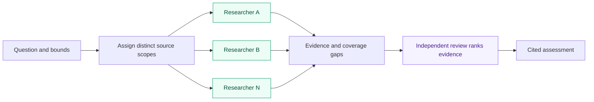

# Social Search

Give Social Search a question and public sources. Researchers collect distinct evidence in parallel; a fresh reviewer ranks its support. Receive a cited assessment, source material and remaining gaps.

Use it to investigate product reception, compare developer experiences, or follow a claim from its paper into public discussion.

## Try it

After [installation](#install), paste this into your agent:

```text
Use social-search:social-search to investigate what developers report about
running SQLite in production. Search Hacker News, Reddit, and original
technical writeups from the last 30 days. Give shared original-source checks
one owner. Rank the strongest evidence, explain disagreements, and link the
inspected sources. Spend at most 20 minutes including review. Save the report
and collection evidence in research/sqlite-production.
```

Change the question, dates, sources, time limit and output directory. Assign a site, web scope, feed set or related sources together.

## Why this is useful

- **Clear ownership.** Researchers divide unmet scope; shared originals get one owner.
- **Independent judgment.** A fresh reviewer ranks support, provenance, limitations and corroboration.
- **Preserved context.** Findings retain dates, inspected support, discussion context and engagement. Posts citing one study remain one underlying study.
- **Visible gaps.** Partial, blocked and empty searches remain distinct; failed access cannot establish absence.

## How it works



The orchestrator assigns collection through `search-site` → `orch-work`, gathers actual outcomes, then requests one whole-result assessment through `rank-evidence` → `orch-review`. Time limits include collection, handoff and assessment.

Supply existing evidence to collect only missing scope, or invoke assessment directly. The reviewer neither collects nor changes evidence.

| Entrypoint | Use it for |
| --- | --- |
| [social-search](skills/social-search/SKILL.md) | Collect and assess a bounded question |
| [search-site](skills/search-site/SKILL.md) | Collect one source assignment |
| [rank-evidence](skills/rank-evidence/SKILL.md) | Assess evidence you already have |

## What you get

A ranked, cited assessment and `results.md` per collection assignment, linking support, original URLs, qualified dates, available engagement and coverage limits. The [evidence contract](references/evidence.md) defines the handoff.

Reach and reliability remain separate. Sampled discussion establishes experiences, not prevalence. Sources and access determine coverage.

## Install

From a complete Orchflows checkout with Python 3.11+:

```sh
python scripts/orchflows.py setup --example social-search
```

Register the home and install core plus `social-search` using core `docs/hosts.md`; start a new session. Setup preserves user-owned copies; update those before refreshing an existing install.

All skills are manual-only. Use `$social-search:social-search` in Codex or `/social-search:social-search` in Claude Code; substitute a leaf name for standalone use.

Requires core 0.11.0+, native child delegation and public search/read tools. Optional `python scripts/orchflows.py setup --example research-acquire` adds acquisition tools and YouTube transcripts; register that library too. It owns its dependencies/routes; generic feeds require 0.4.0+. Setup installs no runtime dependencies.

## Make it yours

[Research guidance](guidance/research.search-site.md) defines collection/assessment criteria, with Reddit, Hacker News, GitHub, X, YouTube, web, feed and Lemmy specializations. Unfamiliar sites use general criteria. [Library context](references/library-context.md) resolves guidance, dependencies and outputs.

Trial specifications cover [sites](trials/request.md), [web/feeds/Lemmy](trials/web-feeds-lemmy/request.md) and [papers/discussion](trials/papers-and-discussion/request.md); they are expectations, not observed results.

Adapted from [orchflows recent-search](https://github.com/DanMcInerney/orchflows/tree/945546721732aa564a086ee9543803b38017e1c3/example-workflows/recent-search) under the retained [MIT license](LICENSE).
