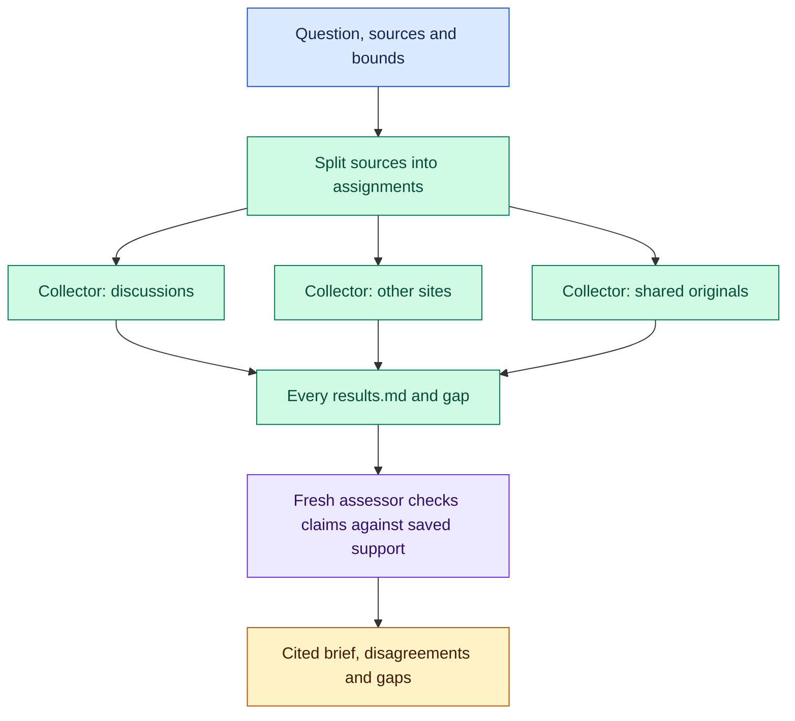

# Social Search: what people are saying, checked

Ten posts repeating one study are still one study. Social Search sends parallel collectors across Reddit, Hacker News, X, YouTube, GitHub, prediction markets and the web, keeps what each one actually read, and hands everything to a fresh assessor who collected none of it. You get a cited brief whose quotes, attributions and engagement numbers trace to saved evidence, with disagreements and coverage gaps intact.

After [installation](#install), try:

```text
/social-search:social-search
Research what people have said in the last 30 days about running SQLite in
production. Use Reddit, Hacker News, GitHub and the web. Save a cited brief as
report.md: main findings and disagreements, linked to the specific posts and
comments, with dates and engagement, plus what you could not cover.
Finish within 20 minutes.
```

In Codex, use `$social-search:social-search`. Change the question, window, sources, bounds and output location. Supply earlier evidence and collection covers only what is missing; supply enough and it goes straight to the assessor.

## Collect in parallel, judge once



The coordinator groups sources that share discussions, gives each original that several sources discuss one owner, and launches every collector before gathering any. Time limits cover collection, handoffs and the final review. At the handoff deadline unfinished collectors stop, useful partial evidence survives and missing assignments become gaps. The assessor writes the brief from that evidence alone, without collecting more.

## A claim you can trace

Each collector writes `results.md` with original URLs, the excerpts it inspected, qualified dates, item-level engagement and its coverage limits. A search snippet is a lead, not support. Sampled discussion shows experiences and viewpoints, not prevalence, and engagement stays separate from reliability. The [evidence contract](references/evidence.md) defines these rules.

## Reaching the discussion

Native web search finds leads; reading the discussion itself takes direct routes. The [public access](references/access.md) reference lists keyless routes that answered when last checked: Hacker News through Algolia, Reddit through the Arctic Shift archive and reddit.com's RSS and HTML partials, GitHub through `gh` or REST, X posts through FxTwitter, YouTube through `yt-dlp`, Polymarket through its public API and Lemmy through instance APIs. Origins throttle and change; collectors record refusals as gaps. X has no keyless search, so X coverage starts from web-search leads.

Adapt the [collection guidance](guidance/research.search-site.md) and its site specializations to your question. [Library context](references/library-context.md) owns guidance selection and dependencies.

## Install

Run from a complete Orchflows checkout with Python 3.11+:

```sh
python scripts/orchflows.py setup --example social-search
```

Complete any reported [host installation steps](https://github.com/DanMcInerney/orchflows/blob/main/docs/hosts.md#register-and-refresh), then start a new session. Setup preserves existing user-owned library copies and installs no runtime dependencies. The entrypoint is manual-only. Requires **core, native child delegation, public search/read tools and a shell for direct HTTP**. YouTube reads need `yt-dlp` on `PATH`; `gh` widens GitHub access when authenticated.

## Limits

On 2026-09-23 this workflow and /last30days 3.11.1 answered two last-30-days questions, one on uv adoption and one on Nvidia's Hugging Face deal. Both ran on Claude Sonnet 5 with the same tools. Blind Opus graders checked claims against their sources and scored each brief out of 40. Social Search scored 29 and 32. /last30days scored 10 and 25 on one run and 25 and 23 on another. Each Social Search brief cost about $1.50 and took 8 to 9 minutes; each /last30days brief cost about $1 and took 4 to 5 minutes. Two topics with one grader per comparison is a small sample, and results depend on which origins answer that day.

[Trial specifications](https://github.com/DanMcInerney/orchflows/blob/main/example-workflows/social-search/trials/request.md), including [web/feeds/Lemmy](https://github.com/DanMcInerney/orchflows/blob/main/example-workflows/social-search/trials/web-feeds-lemmy/request.md) and [papers/discussion](https://github.com/DanMcInerney/orchflows/blob/main/example-workflows/social-search/trials/papers-and-discussion/request.md), describe expected behavior, not observed passes. Adapted from [recent-search](https://github.com/DanMcInerney/orchflows/tree/945546721732aa564a086ee9543803b38017e1c3/example-workflows/recent-search) under the retained [MIT license](LICENSE).
