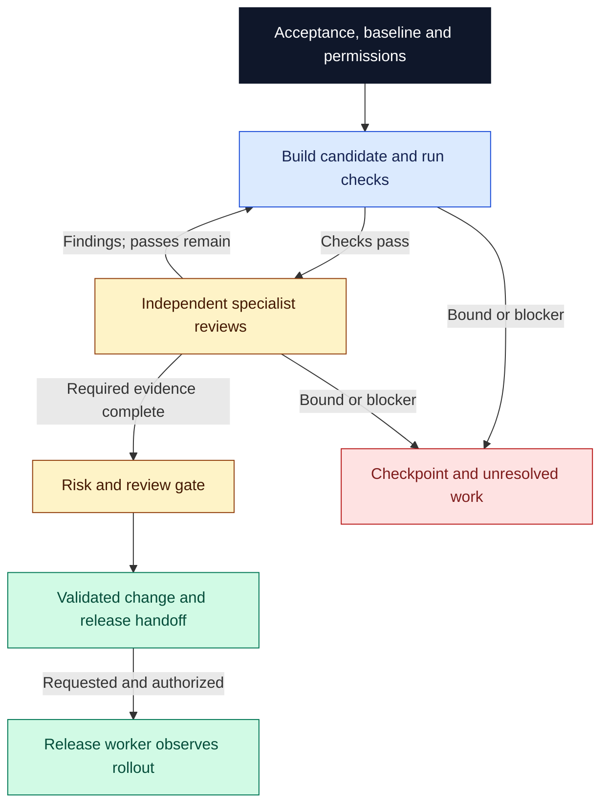

# Software Factory

Use Software Factory when a code change needs a verifiable handoff: what changed, what was checked, what remains risky, and what may be released. It builds the change, checks the exact candidate, gathers independent specialist reviews and returns a reconstructible patch with a release plan. A requested, authorized release gets its own worker and observed rollout.

## Try it

```text
$software-factory:software-factory
Add CSV export to this application. Preserve filtering and tenant isolation.
Use P=2 candidate passes. Return the reviewed change, complete patch, check
evidence, findings and release plan in delivery/csv-export.
```

Claude Code uses `/software-factory:software-factory`. Entry points are manual-only. Supply the outcome and workspace; optionally set outputs, bounds, policy, release target, guidance or model/effort. Unspecified model/effort stays unset.

## A bounded path to release



The default is **P=3 candidate passes, including the first**. Each attempt consumes a pass before work. `orch-work` builds; after checks pass, fresh `orch-review` children review the frozen candidate once per applicable lens: correctness always, plus affected data, infrastructure, cloud and security. Gather every required judgment before repairs. Failed checks or findings feed a remaining pass; revised candidates repeat required checks and all applicable reviews. No extra final review or nested repair loop follows.

Checks, required CI, reviews and approvals identify the candidate. The saved patch must reconstruct it from its baseline, including additions and deletions. Automatic low-risk review acceptance requires explicit project opt-in; otherwise prepare a human-review handoff. Failed checks or missing required evidence block readiness.

Release authority is separate. One worker verifies validated inputs, baseline signals, rollback and stop criteria, then observes each rollout stage. Changed inputs need revalidation within remaining passes. Failures stop advancement; rollback requires existing authorization and recovery verification. Missing telemetry means incomplete observation.

Stop at the requested endpoint, exhausted bounds, caller stop or missing required capability/decision. Resuming preserves consumed passes. Return artifacts, evidence, findings, risk, actual external actions, gaps and a checkpoint with stop reason. [Delivery guidance](guidance/software-delivery.md) and the [run contract](references/run-contract.md) define the details.

| Entry point | Outcome |
| --- | --- |
| [software-factory](skills/software-factory/SKILL.md) | Validated change and handoff; optional authorized rollout |
| [observe-production](skills/observe-production/SKILL.md) | Bounded read-only comparison and proposed work |
| [investigate-incident](skills/investigate-incident/SKILL.md) | Timeline, tested hypotheses and ranked mitigations |

Observation starts no fix or subscription; recurrence needs a requested host schedule. Investigation grants no mitigation authority.

## Setup and limits

From a complete Orchflows core checkout with Python 3.11+:

```sh
python scripts/orchflows.py setup --example software-factory
```

Setup preserves existing library copies and installs no project tools. Complete any reported [host installation steps](https://github.com/DanMcInerney/orchflows/blob/main/docs/hosts.md#register-and-refresh), then start a new session.

Requires core 0.11.0+, native children and project build/check tools. CI, release, flags and telemetry are needed by dependent stages; no scheduler, service adapters or production access are bundled. See [library context](references/library-context.md).

Inspired by [The Pragmatic Engineer's software-factory account](https://newsletter.pragmaticengineer.com/p/openai-software-factory). The [trial specification](trials/expected-behavior.md) defines acceptance requirements.
