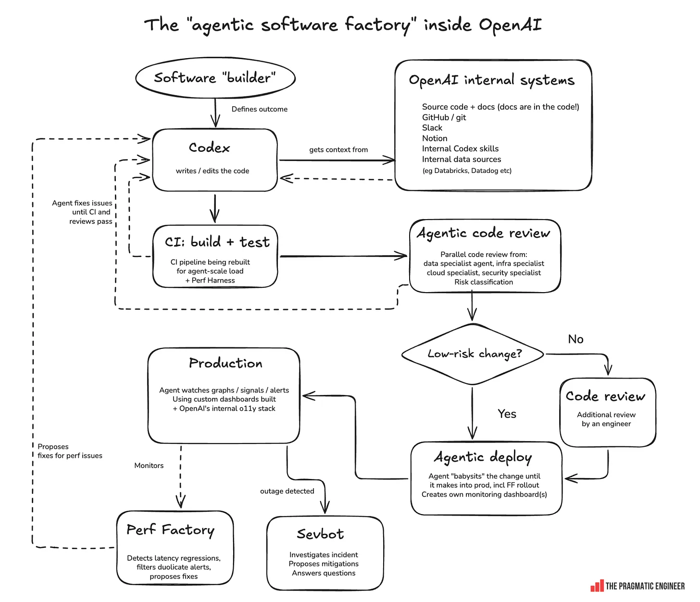
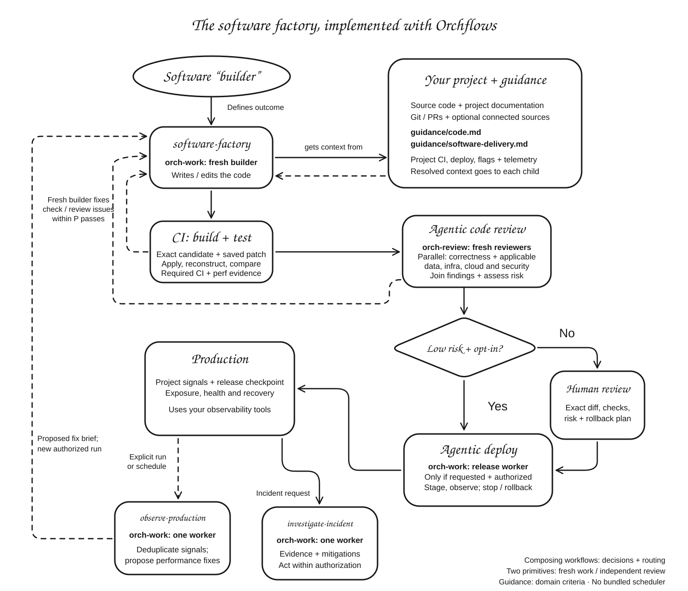

# Software Factory

Build a software change, check the exact candidate, obtain independent specialist reviews and return a release handoff. Findings feed a bounded repair loop. A requested, authorized release uses a separate worker for observed rollout.

## Try it

```text
$software-factory:software-factory
Add CSV export to this application. Preserve filtering and tenant isolation.
Use P=2 candidate passes. Return the reviewed change, complete patch, check
evidence, findings and release plan in delivery/csv-export.
```

Claude Code: `/software-factory:software-factory`. Delivery defaults to three candidate passes, including the first; the coordinator chooses staffing and stops at the requested endpoint or bound. Observation and incident investigation are separate requests.

## Flow and ownership

Inspired by Gergely Orosz's [Inside OpenAI's agentic software factory](https://newsletter.pragmaticengineer.com/p/openai-software-factory), *The Pragmatic Engineer*, September 15, 2026. The user-supplied original diagram is credited to The Pragmatic Engineer. This library adapts the process to your tools; OpenAI's internal systems are not included.

| Original design | Orchflows implementation |
| --- | --- |
| [](assets/openai-factory-original.png) | [](assets/orchflows-factory.svg) |

Open either image or the [comparison page](assets/comparison.html) for detail.

1. Record acceptance, checks, review lenses, starting state and existing permissions.
2. Build through `orch-work`; verify tests, required CI and applicable performance. A complete patch must reconstruct the exact candidate, including additions/deletions, from its recorded baseline using the saved patch bytes.
3. Freeze the candidate. Fresh `orch-review` children cover correctness plus affected data, infrastructure, cloud and security concerns.
4. Feed failed checks/findings into remaining passes. Revised candidates repeat required checks and all applicable reviews; exhaustion returns unresolved work.
5. Route risk. Automatic low-risk acceptance needs explicit project opt-in; otherwise prepare a concrete human-review handoff. Required failures/evidence gaps still block readiness.
6. Release only when requested and authorized. One owner verifies validated inputs, baseline, rollback and stopping criteria, then observes rollout stages. Failures stop advancement; already-authorized rollback includes recovery verification. Missing telemetry is not health.

`orch-work` and `orch-review` are the only primitives; composing skills run in the caller. [Delivery guidance](guidance/software-delivery.md) owns artifact integrity, review criteria and risk. The [run contract](references/run-contract.md) owns identity, evidence, authority and resume state; the project supplies source, tools, CI, policy and telemetry. Changed release inputs need new validation; a reviewed workspace alone does not prove a usable patch or authorize deployment.

| Entrypoint | Outcome |
| --- | --- |
| [software-factory](skills/software-factory/SKILL.md) | Checked change, reviews, risk decision and optionally authorized observed rollout |
| [observe-production](skills/observe-production/SKILL.md) | Read-only bounded comparison, deduplicated signals and proposed performance work |
| [investigate-incident](skills/investigate-incident/SKILL.md) | Timeline, tested hypotheses, ranked mitigations and specifically authorized operations |

Observation starts no fix; recurrence needs a requested host schedule. Investigation alone authorizes no mitigation. Missing capabilities/decisions return a checkpoint and gap. The package includes no scheduler, service adapters or production access.

## What the output-quality comparison found

We tested version 0.1.0 at commit `1a04d85254455012b9f73e2bced43218f9f755f5` against a fresh single agent on two tasks. Each pair received identical source and product prompts, the same model/effort (`gpt-6-astra`, `xhigh`), tools and a 45-minute limit. Workflow agents could delegate; controls could not use Orchflows or delegate. Independent acceptance suites were prepared before the builds. Candidates were frozen before external grading.

The [published comparison](https://github.com/DanMcInerney/orchflows/tree/main/benchmarks/software-factory/2026-09-16) includes **all four implementations**, their tests and documentation, exact task prompts, independent evaluators, saved scores, reviewer reports, handoffs, original patches and simulated release evidence. The applications and evidence live outside the installable library.

### Authenticated webhook inbox

Tenant isolation, SQLite persistence, idempotency, concurrency and pagination.

| Measure | Software factory | Single agent |
| --- | ---: | ---: |
| Independent acceptance checks | 28/28 | 28/28 |
| Build + handoff time | 25.6 min | 17.2 min |
| Agent contexts, including coordinator | 6 | 1 |
| Output tokens | 76,085 | 31,283 |
| Uncached input tokens | 362,300 | 102,156 |
| Cached input tokens | 5,376,640 | 772,992 |
| Delivered patch | Complete; applies | Complete; applies |
| Release outcome | Human security review required | Human security review required |
| Implementation | [Code and tests](https://github.com/DanMcInerney/orchflows/tree/main/benchmarks/software-factory/2026-09-16/runs/webhook-inbox/workflow/project) | [Code and tests](https://github.com/DanMcInerney/orchflows/tree/main/benchmarks/software-factory/2026-09-16/runs/webhook-inbox/single/project) |
| Run evidence | [Handoff and artifacts](https://github.com/DanMcInerney/orchflows/tree/main/benchmarks/software-factory/2026-09-16/runs/webhook-inbox/workflow/artifacts) | [Handoff and artifacts](https://github.com/DanMcInerney/orchflows/tree/main/benchmarks/software-factory/2026-09-16/runs/webhook-inbox/single/artifacts) |

### Fast log archive

Preserve the search API/CLI, freshness and concurrency; exceed a 5× warm-search target and handle a failing staged-release simulation.

| Measure | Software factory | Single agent |
| --- | ---: | ---: |
| Independent acceptance checks | 31/31 | 31/31 |
| Build + handoff time | 42.4 min | 16.4 min |
| Agent contexts, including coordinator | 10 | 1 |
| Output tokens | 118,011 | 27,110 |
| Uncached input tokens | 762,299 | 117,821 |
| Cached input tokens | 13,387,264 | 1,337,856 |
| Warm-search speedup over reference | 374.7× | 620.8× |
| Exploratory nested-JSON probe | Pass after review-driven repair | API and CLI crash |
| Original delivered patch | Fails on LF baseline | Tracked files only |
| Simulated release checks | 8/8; rollback and recovery verified | 8/8; rollback and recovery verified |
| Implementation | [Code and tests](https://github.com/DanMcInerney/orchflows/tree/main/benchmarks/software-factory/2026-09-16/runs/log-archive/workflow/project) | [Code and tests](https://github.com/DanMcInerney/orchflows/tree/main/benchmarks/software-factory/2026-09-16/runs/log-archive/single/project) |
| Run evidence | [Handoff, reviews and artifacts](https://github.com/DanMcInerney/orchflows/tree/main/benchmarks/software-factory/2026-09-16/runs/log-archive/workflow/artifacts) | [Handoff and artifacts](https://github.com/DanMcInerney/orchflows/tree/main/benchmarks/software-factory/2026-09-16/runs/log-archive/single/artifacts) |

Times include coordination and handoff. Output tokens include reasoning; cached input can be reused across many calls. Counts are recorded usage, not dollar costs. The [full report](https://github.com/DanMcInerney/orchflows/blob/main/benchmarks/software-factory/2026-09-16/REPORT.md) links the underlying scores and measurements.

The nested-JSON probe is **separate from the fixed acceptance score**. It was chosen after workflow review found the problem, before inspecting the control's final result, then applied identically to the frozen reference and both candidates. The reference and workflow passed; the control raised `RecursionError` in its API and CLI. This is evidence for that specific review benefit, not a general quality ranking.

Both log implementations exceeded the 5× warm-search target (374.7× workflow, 620.8× single agent in short paired query loops). Both stopped the local release simulation at a failing 50% rollout, rolled back and verified recovery. These were synthetic signals, not a live production deployment.

Handoff quality had a separate defect: the workflow log patch failed to apply to the clean LF baseline because its export changed line endings, although its Git candidate was valid. The single-agent log patch was explicitly tracked-only, so its new benchmark and test files required the full candidate and manifest. Version **0.1.1** adds reconstruction evidence to the guidance, correctness review and checkpoint contract. The original benchmark artifacts and scores remain unchanged.

A targeted trial of the revised guidance packaged the same log candidate without changing its source. The new saved patch reconstructed the exact candidate tree with both LF and CRLF checkouts, reversed to the baseline, and passed all 17 application tests in the candidate and reconstructed checkouts. The old patch's failure was reproduced on the LF baseline; it does apply to a CRLF checkout. This validates the exercised handoff, not a rerun of the full delivery comparison.

The workflow used 2.4× and 4.4× the output tokens, respectively. There was one run per approach per task, not equal compute or a statistical experiment. A Windows SQLite cleanup bug in the webhook evaluator was corrected without changing assertions and the same corrected evaluator graded both arms. These results do not establish visual polish, game appeal, virality, live deployment reliability or overall maintainability. Published evidence preserves the original scores and source; machine-specific paths in supporting documents are made portable, with changes recorded in the archive manifest. Private host transcripts, duplicate worktrees and generated bulk data are excluded.

## Install and use

From a complete Orchflows checkout with Python 3.11+:

```sh
python scripts/orchflows.py setup --example software-factory
```

Follow core `docs/hosts.md` for registration/installation; start a new session. Setup preserves user-owned library copies, so apply intended updates there before refreshing. All entrypoints are manual-only on Codex/Claude. Substitute a leaf name for standalone use; following a file by path does not register a command.

Example operational requests:

> Ship this approved fix to staging under the repository rollout policy. Its documented rollback is authorized if the error threshold is breached. Observe the full window and record the release ID.

> Use software-factory:observe-production to compare the hour after v42 with baseline, deduplicate latency alerts and propose measured fixes.

> Use software-factory:investigate-incident to explain checkout errors from 14:00–14:20 UTC and rank mitigations.

Supply outcome/workspace and optional bounds, outputs, release target, policy, guidance or model/effort preferences; unspecified settings remain unset. Requires core 0.11.0+, native children and project build/check tools. CI, release, flags and telemetry are needed only by dependent stages; setup installs none. See [library context](references/library-context.md), [trial request](trials/request.md) and [acceptance](trials/expected-behavior.md).
