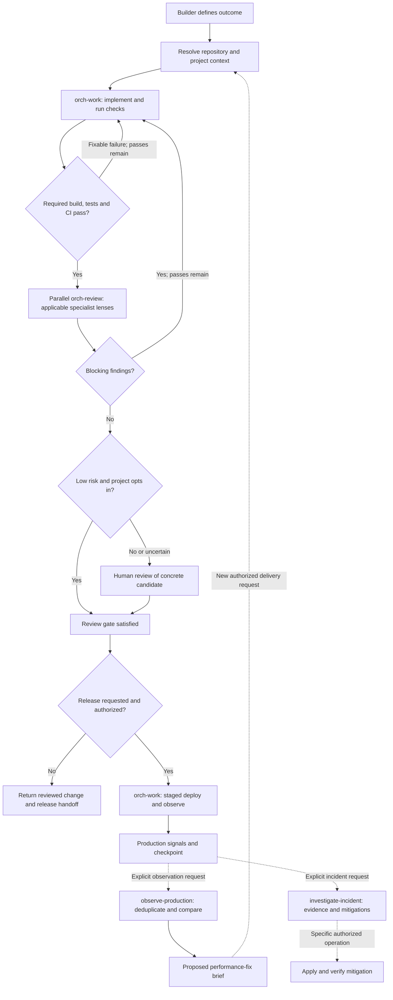

# Software factory

Turn a software outcome into a checked change, specialist reviews and, when requested and authorized, an observed release. Production observations can supply the next change brief; incident investigation can prepare a mitigation.

Inspired by the user-supplied diagram and [Inside OpenAI's agentic software factory](https://newsletter.pragmaticengineer.com/p/openai-software-factory), Gergely Orosz, September 15, 2026. The publicly accessible factory section was read during authoring. This is a portable Orchflows adaptation, not OpenAI's internal implementation. In particular, automated low-risk review requires project opt-in, deployment has its own authorization, and incident investigation does not itself authorize mitigation.



Any unavailable required capability, missing decision or exhausted bound returns the checkpoint and gap. A failed candidate is never promoted because attempts ran out. Release failures halt rollout and use a prepared rollback only within existing authorization.

## Workflows and bounds

| Workflow | Result | Fresh children |
| --- | --- | --- |
| [software-factory](skills/software-factory/SKILL.md) | Implementation, check evidence, reviews, risk decision and optional observed rollout | Per pass: 1 builder and 1–5 reviewers; optional 1 release worker |
| [observe-production](skills/observe-production/SKILL.md) | Bounded telemetry analysis, deduplicated signals and proposed regression briefs | 1 worker |
| [investigate-incident](skills/investigate-incident/SKILL.md) | Evidence, incident answers and proposed or specifically authorized mitigation | 1 worker |

Delivery defaults to three candidate passes, including the initial attempt, with at most `6P + 1` child calls (19 by default). Correctness review is mandatory; data, infrastructure, cloud and security reviews are selected by affected surfaces and supplied actual project context. Reviewers are independent of the builder and do not repair. Every revised candidate receives new applicable reviews. Stop when the requested endpoint is reached; the cap is not a target.

The operational workflows do not automatically start new delivery runs. Recurring observation uses a caller-requested host scheduler and a saved checkpoint. This package adds no daemon, workflow engine or service adapters.

## Install and use

From an Orchflows checkout:

```sh
python scripts/orchflows.py setup --example software-factory
```

Then register or refresh the `software-factory` library using core's host installation instructions. Setup copies this library into the Orchflows home once and preserves an existing copy. Install through the host and start a new session as needed for discovery. All three skills are manual-only on both Codex and Claude Code.

Example requests:

> Use software-factory:software-factory to add a CSV export to this application. Preserve its current filtering behavior. Use P=2 passes and leave a reviewed change with test evidence and a release plan.

> Use software-factory:software-factory to ship this approved fix to staging using the repository's rollout policy. You may use its documented rollback if the error-rate threshold is breached. Observe the full policy window and record the release identifier.

> Use software-factory:observe-production to compare the last hour after release v42 with its recorded baseline. Deduplicate latency alerts and prepare fix briefs for supported regressions.

> Use software-factory:investigate-incident to investigate the checkout errors between 14:00 and 14:20 UTC. Explain likely causes and rank possible mitigations.

Supply an outcome, workspace and optionally the run directory, bounds, target environment, project policy, domain guidance and scoped model/effort preferences. Unspecified model settings stay with the host. The [run contract](references/run-contract.md) describes handoffs, evidence and resumption.

## Dependencies and validation

Require Orchflows core 0.7.0+, native child delegation and the target project's implementation/check tools. CI, Git hosting, deployment, feature flags and telemetry are needed only for requested stages that depend on them. No particular vendor, access credential or OpenAI internal system is assumed. See [library context](references/library-context.md).

The [trial request](trials/request.md) and [expected behavior](trials/expected-behavior.md) define portable checks. Local trial results and limitations are recorded separately in the repository's reports; live production integrations require project-specific validation.
