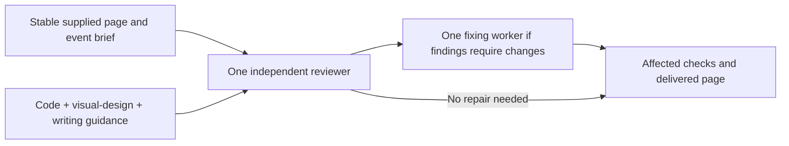

# Next-stage workflow study

Prepared September 20, 2026. **No native executions in this round.** The user selected Codex with API authentication. No API key was available in the checked process/user environment or saved Codex authentication; subscription usage was exhausted. Preparation and offline scorer tests are not model experiments. No Claude substitution, login change or subscription fallback was made.

The [earlier pilot](gate-results.md) remains the observed evidence. This round addresses its gaps: no actual joined code/design/writing reviewer, process hints in the research-to-code request, incomplete successful Build journeys, and an unexpectedly broad direct-check exception.

Preparation validation: all 30 new offline controls passed in 5.0 seconds. The full suite ran 211 tests in 46.1 seconds: 210 passed, one platform skip. All three packet hashes verified; the two cost conditions have identical scenario bytes and differ in exactly one runtime file, Dynamic's skill. No packet contains an execution directory. Scorer controls include both accepted variations and deliberate wrong outputs; they do not measure model performance.

A subsequent [structure review](structure-review.md) shortened the source instructions and clarified guidance authoring. The already-frozen packets retain their earlier wording; their preparation does not validate that later revision. Record the actual instruction hashes when executing either version.

## Predictions before execution

Predictions describe plausible plans, not a required answer key. Correct alternative boundaries are acceptable when their dependencies and review coverage make sense. Case-root predictions and checks stay outside target fixtures.

| Case | Predicted structure | What would be informative |
| --- | --- | --- |
| `mixed-review` | Supplied page → one review using code, visual-design and writing criteria → one fixing worker → checks | Does a single reviewer actually cover the broken schedule link, poor contrast and unsupported claims? Do repairs wait for its completed report? |
| `research-code-plain` | Resolve conflicting export documentation → research review → independent adapter production → joined code review; conditional fixer at either gate | Does an ordinary outcome request produce a useful evidence checkpoint without being told to research/review first? One integrated unit can also work if it resolves sources correctly and reviews the resulting behavior. |
| `survey-brief` | Analysis → review → joined narrative/charts/tables → review; conditional fixes | Are denominators stable enough to hand off, or is one integrated report review simpler? Guidance count does not decide this. |
| `api-migration` | One compatible API/client/test result, with one code review if gated | Does the model avoid copying the earlier contract-first ceremony into a tiny local change with no separate deployment? The current direct-check exception may apply. |
| `release-direct` | One joined writing result containing notes and migration checklist | Do two related files stay together? Are missing migration facts preserved as unknowns? This case tests ordinary skill discovery as well as execution. |
| `release-build` | Author recipe → complete synthetic trial(s) and their judgments → one authoring review → conditional fixer; then fresh runtime consumers | Does the generated recipe express the same joined task, expose real inputs, and work on one matched and two unseen releases? Does authoring review really wait? |

`mixed-review` intentionally requests independent review. Other task prompts specify outputs and constraints without gate, guidance or staffing hints. The Build authoring prompt explicitly permits native model transport and asks for trial identities because missing transport/evidence obscured the earlier attempts.

For the mixed page, the predicted graph is:



This is a prediction, not an observed workflow visualization. Review receives the whole candidate, requirements, source facts and the applicable criteria from all selected domains, including their Review sections. Coordinator planning guidance does not automatically belong in that task review. A browser screenshot alone does not establish keyboard behavior; source checks alone do not establish rendered readability.

## Matched comparisons and bounds

The release pair shares the exact representative input and output contract. Compare direct-task artifacts with the saved workflow's **representative** fresh reuse, then inspect changed and sparse reuse separately. Those two unseen inputs test generalization, not an identical-input comparison. Track authoring cost separately from runtime cost. Later harness reuse never retroactively satisfies Build's trial-before-authoring-review dependency.

The main suite selects six cases under the current production instructions. Each direct case has 480–900 seconds; Build has 900 seconds for authoring, 480 per runtime consumer and 2100 overall. Three runtime consumers may overlap within the harness pool; inner trials and children are additional native sessions. Two harness slots and a 5400-second suite deadline bound the main run. These caps do not promise completion, and missing evidence remains inconclusive.

The cost probe compares two tiny requests under two conditions: the exact typo correction and existing `core/explicit-dynamic` arithmetic case. Use one harness slot, a 1200-second suite deadline and the same configured model/effort per condition. That is four additional case attempts, not a full cross-product of every task and policy. Record ordering and elapsed time; one sample per cell cannot establish typical overhead or reliability.

The isolated `review-every-unit` condition removes only Dynamic's direct-check exception. It leaves unit selection, one reviewer, conditional one-worker repair, guidance and Build unchanged. The source checkout retains the exception. Predict equal correct outputs, zero reviewers for these tiny tasks under current policy and one reviewer/no fixer under the variant. Whether added review is worth its cost remains unanswered. Do not count absent usage records as zero cost or root counters as verified totals across descendants.

## Evidence to inspect

For every completed case, compare prediction with actual planning, native dispatch, artifact state and timing. Record meaningful differences rather than mark a different valid graph wrong. For every gate inspect:

- The candidate and scope, requirements, selected guidance and what the reviewer actually received/read. Filenames or claimed compliance alone are insufficient.
- Maker/reviewer/fixer identities, completed review before repair, and completed required judgments before dependent work. A fresh authoring child is not a separate top-level workflow trial.
- Original review findings, the repaired state, affected checks and unresolved gaps. Count repair passes across resumes; do not create a new unit merely to reset a limit.

Inspect code behavior, release claims/attribution, survey denominators and qualified conclusions, and actual rendered pages. The offline checkers deliberately do not certify arbitrary prose meaning, rendered appearance or native instruction following. Candidate tests and explanations also need inspection. The mixed-page and survey trials need rendering evidence; unavailable browser/image capabilities are a gap, not success inferred from HTML.

Preserve trial IDs and complete logs for Build's nested native sessions, which are not necessarily descendants in native history. Verify API authentication, configured model availability, the selected compatible executable for both outer and nested calls, and trusted model-service transport before attempting the full authoring journey. Do not retry with different models, weaken TLS validation or change hosts silently. Native evaluator calibration is still outstanding from the previous round.

## Preparation and execution

`next_stage.py` freezes the core package, every selected case including predictions, file hashes and the exact policy diff in a new directory outside the checkout. Targets receive only their fixtures and ordinary requests. The preparation receipt records zero native executions **at preparation time**; any later execution is reported separately under `execution/summary.json`. This is context separation, not a claim of security isolation from a shell-capable target.

```powershell
python -B tests/e2e/next_stage.py --suite next-stage --output ../orchflows-next-stage-current-20260920
python -B tests/e2e/next_stage.py --suite next-stage-cost --output ../orchflows-next-stage-cost-current-20260920 --jobs 1 --deadline 1200
python -B tests/e2e/next_stage.py --suite next-stage-cost --condition review-every-unit --output ../orchflows-next-stage-cost-review-20260920 --jobs 1 --deadline 1200
```

These commands prepare only. To launch, use a new output directory, add `--execute --executable <compatible-codex-executable>`, and provide an existing API key through `CODEX_API_KEY` or `OPENAI_API_KEY` in that process's environment. The runner forwards it only through the process environment, without writing it to manifests, arguments or authentication files. It refuses execution without a key before preparing or launching anything. Presence is not proof of working authentication; API/model availability has not been tested. Compare source/scenario hashes with the preregistered packet before interpreting a later run as this experiment.

## Provisional design interpretation

The smallest useful shared concept remains **a coherent result and its consequential handoffs**. A gate judges that result using all applicable criteria. Domains help find boundaries but neither domain count nor file count is a universal unit rule. Keep that judgment in `orchflows.md`; keep execution versus reusable authoring obligations in Dynamic and Build respectively. No `orchflows.dynamic-workflow` or `orchflows.build-workflow` guidance file is justified by these cases.

Two questions remain open rather than becoming new rules: whether every unit should always incur independent review, and how much authoring validation belongs before its authoring review. Trial reviews judge produced task artifacts; authoring review judges the reusable process and evidence of reuse. They are distinct scopes, even if removing one would save a session. A blocked trial must not become an apparently certified workflow. The current trial-before-review rule remains in force for this study.

Existing named examples keep their selected contracts: the 3D game has meaningful playtest handoffs, design-loop has explicit iterative comparison, and software-factory has its own specialist reviews. Applying Dynamic defaults on top would add accidental work. These examples were structurally inspected in the earlier round, not newly executed here. The broader 31-family scenario bank also remains mostly unexecuted.

Final authoring review of the production changes remains pending. [Build](../../skills/orch-build-workflow/SKILL.md) explicitly requires: “If a required trial or judgment cannot complete safely, stop with the draft and validation gap; do not start authoring review.” The selected native trials are incomplete; fixture/scorer development does not fulfill that dependency.
